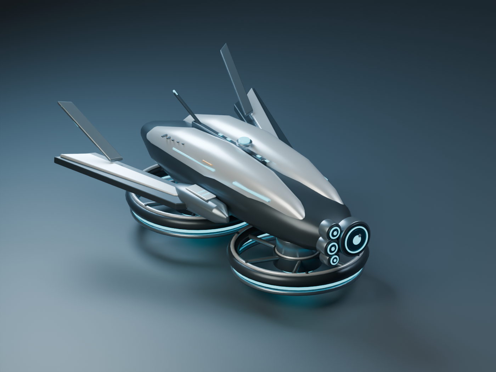

# Drone Survivors

A Rust/Bevy prototype, currently featuring a playable 3D drone combat arena.
Configured using the [Bevy setup guide](https://bevy.org/learn/quick-start/getting-started/setup/).

## Development

Install Rust through rustup and the Xcode command line tools on macOS. The
project's `rust-toolchain.toml` selects nightly Rust and installs rustfmt,
Clippy, rust-analyzer, and the WebAssembly target. Enable rust-analyzer in your
editor to use the installed language server.

```sh
cargo dev
```

The test arena opens immediately. Fly relative to the drone's heading:

| Keys | Control |
| --- | --- |
| **W/S** or **Up/Down** | Pitch forward/backward |
| **A/D** or **Left/Right** | Turn left/right |
| **Q/E** | Bank left/right |
| **Space** / **either Shift** | Boost/reduce rotor thrust |
| **R** | Restart the encounter at the center, level and stationary |
| **Escape** | Quit |

Pitching and banking redirect rotor thrust to accelerate the drone horizontally.
Both reduce upward lift, so expect to lose altitude unless you add thrust.
Release pitch/bank controls to smoothly level out; momentum remains and drag
gradually slows the drift. Tilt in the opposite direction to brake. Turning
changes where the nose points and where tilted thrust pushes, while existing
momentum keeps its world direction.

Space boosts thrust and Shift reduces it. Releasing both restores the thrust
needed to hover **when level**; it does not immediately stop a climb or descent,
or recover lost altitude. Opposing keys cancel on each control axis and duplicate
bindings add no extra input. Pitch and bank share a 30-degree total tilt limit,
and all directions share a maximum horizontal speed of 420 world units/second.
Vertical motion is independent of that speed limit. Flight tuning values are
grouped in `FlightConfig` in `src/arena/flight.rs`.

The scout reaches full tilt in 0.125 seconds, turns at up to 240 degrees/second,
and has three times the original horizontal thrust acceleration. Space/Shift
retain their original level-flight vertical acceleration; pitching or banking
still costs altitude.

The full rotated drone stays inside the ground, ceiling, and side walls. Contact
removes velocity into the surface while preserving motion along or away from it.
The 960 × 540 arena has a 300-unit
ceiling, and the drone starts 90 units above ground (measured at its center).
An angled camera keeps the full flight volume visible as the window is resized.
A ring on the ground and a vertical guide show the drone's ground position.

Three orange flying chasers pursue the drone at every altitude using the same
thrust, gravity, and momentum model. They start at rest, turn and bank to steer,
and brake as they approach. Sharp changes of direction require them to redirect
their momentum. Their 260-unit/second horizontal speed cap and slower tilt/turn
response give the scout an advantage in speed and agility. The basic
weapon automatically fires yellow projectiles at the nearest enemy within
400 world units, aiming at its current position. Shots travel straight and
can miss; each disappears after its first hit, after one second, or on leaving
the arena. Keep moving to avoid contact.

The HUD shows hull health and remaining enemies. Contact deals 25 damage,
followed by a shared 0.75-second invulnerability window. At zero health, gameplay
freezes and **R** starts a fresh encounter. R also restarts during combat or
after clearing the arena, restoring health, enemy positions, and weapon timing.
There are no waves or respawns between restarts. Balance values are provisional
and grouped in `CombatConfig` in `src/combat.rs` for playtesting.

See [the control smoke check and playtest notes](docs/playtests.md).

This alias enables Bevy's dynamic linking for faster iterative builds. Dev
builds optimize project code at level 1 and dependencies at level 3. Native
macOS builds also enable nightly generic sharing and use Apple's default
linker. The first build after changing compiler or optimization settings
rebuilds the engine and can take several minutes.

```sh
cargo fmt --check
cargo test
cargo clippy --all-targets
```

## Scout drone model

The combat player uses an original Blender scout: split silver armor over a
black chassis, three compact hover rotors (one under each wing and one under
the nose), cyan lights, a four-lens sensor
cluster, swept fins, and two small equipment housings. This is a visual asset;
XP gain, terrain immunity and core-slot passives are not implemented yet.



- Game asset: `assets/models/scout_drone.glb` (self-contained, six material meshes).
- Editable source: `art/scout/scout_drone.blend` (named parts and studio setup).
- Rebuild script: `tools/build_scout_drone.py` (tested with Blender 5.2.1).

Run from this checkout so Bevy finds `assets/`. Include that directory alongside
any distributed executable. The model uses +Y up, -Z forward and fits the existing
70 × 30 × 90 collision envelope. The model is 2.5× its original size for arena
readability; rotor diameter is 38% smaller relative to the body. Restarting an
encounter retains the loaded model.

To regenerate the Blender source, GLB and studio preview (overwriting those files):

```sh
/Applications/Blender.app/Contents/MacOS/Blender --background --factory-startup \
  --python tools/build_scout_drone.py
```

On other platforms, use your Blender executable in place of the macOS path.
The script recreates the model from its parameters; edits made directly in the
`.blend` must be exported separately to preserve them. Export only the drone mesh
objects as a GLB with +Y up, excluding the studio floor, camera and lights.

## Release builds

```sh
cargo build --release
```

Release builds use one codegen unit and thin link-time optimization. Dynamic
linking is enabled only by `cargo dev` or an explicit feature flag, so the
release command does not require shipping `libbevy_dylib`. For the `log` crate,
trace logging is compiled out in development; release builds retain only
warning and error logging.

## WebAssembly

```sh
cargo build --target wasm32-unknown-unknown --profile wasm-release
```

The `wasm-release` profile inherits the release optimizations, optimizes for
size, and strips debug information. This produces a raw Wasm artifact; a
playable browser app will also need web packaging when the game is implemented.

For an additional size optimization pass, install Binaryen (`brew install
binaryen` on macOS), then run:

```sh
wasm-opt -Os \
  target/wasm32-unknown-unknown/wasm-release/drone-survivors.wasm \
  --output target/wasm32-unknown-unknown/wasm-release/drone-survivors.optimized.wasm
```

When adding web packaging, apply this pass to the final packaged Wasm file.

## Platform choices

The Bevy guide recommends the default Apple linker on macOS; LLD and Mold are
alternatives for other platforms, not additional optimizations to stack here.
Cranelift is intentionally disabled because the guide reports crashes with
Bevy on macOS and no Wasm support. LLVM remains the code generation backend.
