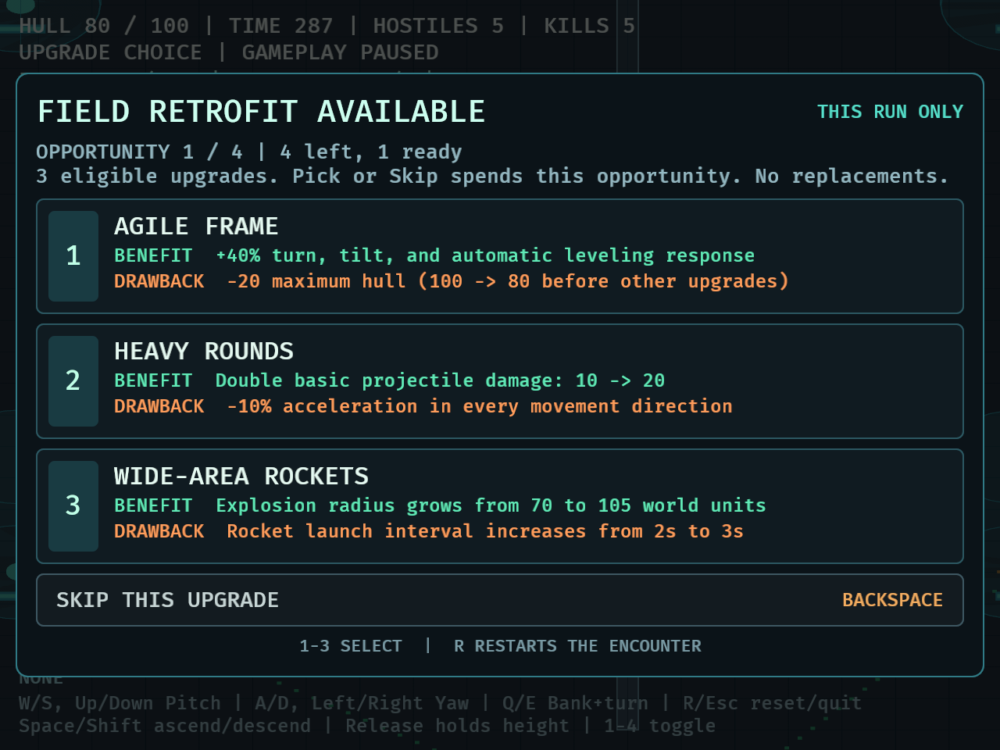

# Drone Survivors

A Rust/Bevy prototype, currently featuring a playable 3D drone combat arena.
Configured using the [Bevy setup guide](https://bevy.org/learn/quick-start/getting-started/setup/).

## Development

Install Rust through rustup and the Xcode command line tools on macOS. The
project's `rust-toolchain.toml` selects nightly Rust and installs rustfmt,
Clippy, rust-analyzer, and the WebAssembly target. Enable rust-analyzer in your
editor to use the installed language server.

```sh
cargo dev
```

Normal launch opens the campaign menu. Choose **New campaign** (N) or
**Continue campaign** (Enter) to reach the operations hub. Choose **Mission briefing** (Enter),
then **Launch mission** (Enter) to start the selected objective.
**Choose mission** (C) opens the campaign selection screen.
**Backspace** returns from briefing or selection to the hub. New campaigns start with four empty
module slots. Buy and arrange modules in the hub before launch; module toggles
and temporary upgrades work in combat. Basic shooting, flight, and mission entry
are free, including with an empty loadout.
Hub and briefing story text is provisional.

Success or failure opens results showing active time, kills, and resource rewards. Choose
**Return to hub** (Enter) to launch again. Completed attempts and individual mission victories
save with the campaign and survive application restarts.
Each launch restores the Scout, battery, chargers, hazard cycle and encounter,
including all temporary upgrades and pending choices. A restart during combat
or an upgrade choice starts a fresh attempt with the same mission and loadout without recording
a result for the interrupted attempt. R does nothing in the hub, either shop, mission selection, briefing or results.

The existing `--validate` modes still enter their combat fixtures directly,
except the dedicated `missions`, `campaign`, `passives`, and `shop` menu fixtures.

## Combat catalog test arena

```sh
cargo dev -- --validate catalog
cargo dev -- --validate catalog --seconds 90
```

This isolated arena opens a scenario/loadout selector. **Left/Right** or the
scenario buttons cycle Flight practice (no enemies), Single pursuer (one chaser),
Small swarm (three waves of five), Fast pursuer, Double-impact rammer,
Mixed pursuers (two waves with one of each type), Slowing beam, Module jammer,
and Mixed control, Collision bomb, Mothership, and Mixed ordnance. **1-4** or the slot buttons cycle each slot
through empty, the four campaign modules and the catalog-only Repulsor, skipping
types equipped elsewhere.
**Enter** or Launch starts a fresh round. The default round lasts **60 active
seconds**; `--seconds` accepts 1–600. A short limit can finish before later waves.

In a round, **1-4** toggle modules, **R** restarts, **Tab** returns to setup and
**Escape** quits. Setup and Restart buttons also work with the mouse. During an
upgrade choice, R still restarts and Tab/Arena setup returns; the redundant Restart
button hides to leave room for the upgrade panel. The selector pauses gameplay.

Launch, restart and return restore the drone, hull, battery, charger reserves,
hazard cycle and run upgrades. Normal flight, damage, spawn warnings, energy and
naturally earned upgrades remain active. This mode installs no campaign or save
systems and awards no campaign resources. Repair, full Repulsor pushback behavior and
additional upgrades are tracked by the remaining DRO-22 child issues; campaign
introduction remains gated on human playtests.

For the explicit native UI fixture:

```sh
DRONE_CATALOG_SMOKE=1 DRONE_CAPTURE_DIR=/tmp/catalog cargo dev -- --validate catalog
DRONE_CATALOG_SMOKE=1 DRONE_CAPTURE_MINIMUM=1 DRONE_CAPTURE_DIR=/tmp/catalog cargo dev -- --validate catalog
```

The fixture drives synthetic keyboard input and grants 50 XP solely to display
the upgrade panel. It checks transitions/text bounds, captures screenshots at
1120×720 or 640×480 and exits. Ordinary arena play has no synthetic pilot or XP.

### Fast pursuers and double-impact rammers

These enemies appear only in their catalog scenarios. Ordinary campaign waves
and the original arena scenarios still use orange chasers.

- **Fast pursuer:** cyan body and paired fins, 20 hull, 350u/s horizontal speed
  cap (ordinary chaser: 260u/s). Change heading or altitude and use cover.
- **Rammer:** magenta armor, 80 hull. Within 280u and clear sight it brakes for a
  full one-second **yellow warning**, then charges along the marked direction
  with a 420u/s cap. Dodge sideways or use cover; it does not retarget a charge.
  A **red ring/line** marks the charge and a **blue ring** marks harmless retreat.
  It must retreat for at least 1.2 active seconds and reach 180u separation before
  another full warning. A missed charge also retreats, without spending an impact.
- **Two yellow pips** show remaining impacts. A hull hit or shield block spends
  one; shared invulnerability rejects the hit but still forces retreat. After
  the second accepted impact it breaks apart without awarding a kill, XP or loot.
  Shooting it instead uses ordinary kill rewards. Approach, warning and retreat
  contact are harmless. All tuning is provisional.

```sh
DRONE_VARIANT_SMOKE=1 DRONE_CAPTURE_DIR=/tmp/variants cargo dev -- --validate catalog
DRONE_VARIANT_SMOKE=1 DRONE_CAPTURE_MINIMUM=1 DRONE_CAPTURE_DIR=/tmp/variants-small cargo dev -- --validate catalog
```

This opt-in native fixture selects all three new scenarios, suppresses auto-fire,
and repositions each single enemy once after production spawn-warning activation.
It observes the rammer's natural warning/charge/retreat/two-impact cycle, checks
restart and mixed spawning, captures screenshots and exits. No hull damage, kills
or XP are granted. These checks do not replace human balance/counterplay testing.
[DRO-35 evidence and remaining human checks](docs/playtests/dro-35-enemy-variants.md).

### Slowing beam and module jammer

The catalog also offers **Slowing beam**, **Module jammer**, and **Mixed control**
(both plus a fast pursuer). These enemies have 40 hull, approach to 240 units,
and warn for 1.2 active seconds. Breaking clear sight or moving beyond 320 units
cancels a warning; destroying the source also prevents its attack, including a
lethal projectile or hazard hit on the delivery frame. New beams begin slowing
movement on the following frame after damage resolves. Shield blocks
contact damage but does not block control attacks. All tuning is provisional.

- **Cross emitter / BEAM:** a 2-second beam reduces horizontal speed and
  acceleration to 60%. Multiple beams do not multiply this penalty. Break sight
  or range to end it immediately. Vertical controls and steering stay available.
- **Antenna / JAM:** the warning names one equipped slot, preferring enabled
  modules, then the lowest slot. The pulse locks that slot OFF for 3 seconds,
  with zero module drain/effects. The target stays fixed through the warning.
  Locks cannot stack or refresh; after expiry there are 3 seconds of jam immunity.
  **Press the slot key again to enable it** after recovery, with the usual battery
  threshold. A delivered lock still expires normally if its source dies.

Yellow expanding rings and thin lines warn; solid lines mark active attacks;
small blue rings mark 3-second enemy recovery. HUD text names each phase and
jam target. Locks and enemy timers pause during upgrade selection; R and arena
return clear them. Basic fire remains free. Campaign content is unchanged.

```sh
DRONE_CONTROL_SMOKE=1 DRONE_CAPTURE_DIR=/tmp/control cargo dev --locked -- --validate catalog
DRONE_CONTROL_SMOKE=1 DRONE_CAPTURE_MINIMUM=1 DRONE_CAPTURE_DIR=/tmp/control-small cargo dev --locked -- --validate catalog
cargo test --locked control_keyboard_escape -- --nocapture
```

The native fixture selects the new scenarios using synthetic input, suppresses
basic auto-fire, and repositions each single source once while resetting its
attack phase. It observes production warnings, slowing, lock expiry and manual
reactivation. The escape test compares idle with ordinary banking input at
30/60/144 Hz; neither is human acceptance. See [DRO-36 evidence](docs/playtests/dro-36-control-enemies.md).

### Collision bombs and motherships

Select **Collision bomb**, **Mothership**, or **Mixed ordnance** in the catalog
arena. These enemies and the experimental Repulsor remain excluded from campaign.

A red spiked carrier attaches one bomb on collision and is consumed without kill
credit. Avoid contact or shoot it first. Attachment deals no immediate damage;
a second carrier cannot stack or refresh the **three-second fuse**. The HUD and
red attachment show the countdown. Detonation attempts **25 hull damage once**,
using normal shield and invulnerability rules. Upgrade choices pause the fuse;
restart, return and terminal outcomes clear it.

Cycle a catalog slot to **REPULSOR** and toggle it with that slot's **1–4** key.
While powered it pulses immediately when ready, then every **two seconds**, removing
an attached bomb before detonation. It drains **8 energy/second**, uses the standard
activation threshold, and cannot pulse while jammed or depleted. Toggling cannot
reset its cooldown. A ready pulse wins a simultaneous fuse expiry. This initial
Repulsor only dislodges bombs; its broader module behavior belongs to DRO-39.

The white faceted mothership has **100 hull**, a **120-unit speed cap**, and
approaches to **350 units**. Every **six active seconds** it attempts one launch,
with a **1.2-second warning** on the launch ring, spawn site and HUD. It cycles
through chaser, fast pursuer, rammer, slower, jammer and bomb carrier. Pending
launches count toward the shared **30-enemy cap**; blocked or crowded sites are
rejected. Destroying the parent immediately cancels its pending launch; existing
children remain. Motherships never spawn more motherships.

```sh
DRONE_ORDNANCE_SMOKE=1 DRONE_CAPTURE_DIR=/tmp/ordnance cargo dev --locked -- --validate catalog
DRONE_ORDNANCE_SMOKE=1 DRONE_CAPTURE_MINIMUM=1 DRONE_CAPTURE_DIR=/tmp/ordnance-small cargo dev --locked -- --validate catalog
```

This opt-in fixture uses synthetic keys and contact positioning, suppresses basic
fire, and fires one synthetic lethal projectile to check parent cancellation.
It validates presentation and production rules, not difficulty or human acceptance.
[DRO-37 evidence and limits](docs/playtests/dro-37-bombs-mothership.md).

## Campaign mission selection

All **12 missions** are playable placeholders using the **same arena layout,
waves, charger locations and hazards**. Each act has a distinct resource profile
(see Exploration below). Each has its own completion record.
Mission **02 is reconnaissance**, mission **03 is cargo extraction**; the other
ten retain the five-minute survival objective.

| Act | Introduction | Branches, either order | Finale |
| --- | --- | --- | --- |
| 1 | 01 | 02 and 03 | 04 |
| 2 | 05 | 06 and 07 | 08 |
| 3 | 09 | 10 and 11 | 12 |

Only mission 01 starts unlocked. Win the introduction to unlock both branches;
win both branches to unlock the finale; win the finale to unlock the next act.
All 12 distinct victories complete the campaign. Failure or R restart never
unlocks missions or erases prior completion. Every unlocked mission can be
replayed for free, even after campaign completion, earning the same rewards:
collected loot plus 10 salvage and 1 component on success, or 25% of collected
loot rounded down on failure. Replays do not increase distinct completion count.

Press **C** in the hub to see all missions and prerequisites. **Arrow keys** cycle
unlocked missions; clicking an unlocked card selects it. Locked cards explain
their prerequisites. **Enter** opens the selected mission's briefing, and a fresh
Enter launches. **Backspace** returns to the hub. The hub's Mission briefing
shortcut uses the selection you last made. Briefings and results identify the
mission; R restarts the active mission. Menus pause gameplay.

Progress saves between missions; secret discoveries also save immediately during play.
Continue resumes in the hub. The ten survival missions
total 50 minutes before pauses/retries; reconnaissance and extraction have no
time limit. The roughly 90-minute campaign target awaits authored content.

```sh
DRONE_CAPTURE_DIR=/tmp/dro17-normal cargo dev -- --validate campaign
DRONE_CAPTURE_DIR=/tmp/dro17-compact DRONE_CAPTURE_MINIMUM=1 DRONE_CAMPAIGN_REVERSE=1 cargo dev -- --validate campaign
```

This opt-in native fixture uses ordinary menu actions with **synthetic success
timers/objective progress and fatal hull** to exercise all 12 missions, locked selection, restart,
completion and replays. The second run reverses the branch order in every act.
It checks text bounds at each captured screen and exits after about 65 seconds
(default timeout 90). It grants no loot or funds; 13 synthetic wins yield 130
salvage/13 components across 14 results. This validates campaign behavior and
presentation, not combat balance. [DRO-17 evidence](docs/playtests/dro-17-campaign.md).

## Two-mission vertical slice

After a win, the hub lists unlocked unfinished missions. A completed selection's
Enter action is labeled **Replay mission briefing**. Use **Module shop (M)** to
buy a module: **Up/Down** selects, **B** buys, and **1-4** equips it in a slot.
Then return to the hub and **Choose mission (C)**. Completing mission 01 unlocks
mission 02 reconnaissance and mission 03 cargo; branch choice remains yours.

```sh
cargo test --locked vertical_slice_probe -- --ignored --nocapture
```

This opt-in agent probe completes fresh mission 01 → reward → purchase/equip →
save/reload → mission 02 loops with Overdrive and Shield, plus an empty-loadout
control. It runs production gameplay at fixed 30 Hz without rendering, using
scripted keyboard steering and isolated temporary saves. No wins, funds, health,
XP or objective progress are granted. It is an accelerated agent check; **human
validation is deferred**, and content expansion remains behind that later gate.
[Results, comparison, native screenshots and human checklist](docs/playtests/dro-21-vertical-slice.md).

## Reconnaissance and cargo extraction

After completing mission 01, choose either branch from the mission screen:

- **Mission 02:** visit all three cyan **SCAN** beacons, then reach extraction.
- **Mission 03:** collect all three orange **CARGO** pickups, then reach extraction.
  Cargo is objective progress, separate from salvage and components.

Fly within **70 units in 3D** of each beacon/pickup, with clear line of sight.
They sit at **height 90**, the default launch altitude. Proximity triggers
collection/scanning automatically; there is no interaction key or dwell time.
Sites can be visited in any order and count only once. Scanned sites turn green;
collected cargo disappears. The HUD shows progress and the nearest remaining
site's compass bearing, direct distance in world units and target height. North
is toward the top of the arena; guidance points toward the destination, so use
the existing passages/detours around walls.

The extraction rings are gray and marked **LOCKED** until all three targets are
complete, then turn green and **READY**. Reach within **95 units in 3D** to
succeed. Visiting extraction early does nothing; return after completing the
objective. The HUD then points toward extraction. Neither mission ends at the
five-minute survival deadline: elapsed time continues. Both reuse the existing
finite waves; after five minutes no new bursts arrive, but surviving enemies
remain. Zero hull fails, including on the frame of extraction.

Upgrade choices pause objective progress. R discards the attempt, resets all
sites/cargo, and restores the same mission/loadout. Success/failure, rewards,
unlocks and autosave use the shared lifecycle. Existing completed missions in
version-1 saves remain completed, with the new objective used on replays.

Native fixture (synthetic positions/death, mission 01 unlocked and spawning
suppressed; validates rules and presentation, not difficulty):

```sh
DRONE_CAPTURE_DIR=/tmp/dro19-normal cargo dev -- --validate objectives
DRONE_CAPTURE_DIR=/tmp/dro19-compact DRONE_CAPTURE_MINIMUM=1 cargo dev -- --validate objectives
```

## Exploration, regions, and secrets

The placeholder arena layout is shared across all acts. Reusable content pieces
assemble the same six chargers and three cache locations. Briefing summaries
and runtime resources use the same profile data:

| Act / region | Chaser salvage chance | Components per cache | Energy per charger |
| --- | --- | --- | --- |
| 1 / Scrapyard | 50% for 1 salvage | 1 | 200 |
| 2 / Ruins | 25% for 1 salvage | 2 | 200 |
| 3 / Power station | 25% for 1 salvage | 1 | 300 |

All three caches are optional and award **30 XP once per attempt**, in addition
to their components. Descend near their purple rings to collect automatically;
there is no interaction key. The normal standalone 30-XP pickup remains.

- **Northwest cache:** permanently discovers the Reserve battery blueprint.
- **Southeast cache:** permanently opens a secret route to the current act's
  finale (mission 04, 08, or 12), without completing the branch missions first.
- **Central cache:** XP and region resources.

Discoveries save immediately, even if the mission later fails or restarts.
Repeating a discovery grants that attempt's XP/components again, without
stacking the campaign unlock. Secret access never marks missions complete.
The ordinary unlock path remains available; all 12 distinct victories are
still required to finish the campaign.

Once the blueprint is discovered, open **Upgrades (U)** in the hub and press
**B** or click **Reserve battery**. It costs **20 salvage + 1 component** and adds
**25 maximum battery capacity**, after permanent passive bonuses and before
run-upgrade modifiers. Only one purchase can be active. It survives successful
missions and normal application reloads. **Defeat or R restart forfeits the
purchased bonus immediately**; the blueprint stays unlocked so you can buy it
again. Ordinary passive ranks and owned modules remain permanent. Restart
otherwise keeps its existing abort behavior (discard unbanked loot, no result).

Native validation (isolated fixture; no campaign save access):

```sh
DRONE_CAPTURE_DIR=/tmp/dro20-normal cargo dev -- --validate exploration
DRONE_CAPTURE_DIR=/tmp/dro20-compact DRONE_CAPTURE_MINIMUM=1 cargo dev -- --validate exploration
```

The fixture flies to the northwest cache using production keyboard controls;
other transitions use disclosed synthetic setup. It checks discoveries, region
briefings, purchase/forfeit rules, shortcut selection, and text bounds. It is a
navigation and presentation check, not a combat-balance playtest.

## Campaign save and resume

The game uses one local, versioned save slot. **Continue campaign** (Enter)
restores the bank, permanent passive ranks, owned modules, four-slot loadout,
mission completion, selection, discovered blueprints/routes, active Reserve battery
purchase and completed attempt history, then returns to the
hub. **New campaign** (N) creates a fresh campaign. From the hub, click
**Campaign menu** or press **N** to return to these choices.

A new campaign replacing an existing or invalid save requires a separate
confirmation: **Enter** archives the original and starts over; **Backspace**
cancels. Missing saves are normal. Invalid or incompatible saves show recovery
instructions and remain untouched until replacement is explicitly confirmed.
**R** retries reading after you fix/move the file. Unreadable files must be made
readable or moved aside before replacement can preserve them.

Purchases, loadout edits, mission selection and settled results save immediately
between missions. Secret blueprints/routes and forfeiture of Reserve battery on
restart also save immediately during play. The active attempt itself is not
saved: quitting in combat loses that attempt's unbanked loot and temporary upgrades. Continue returns to the last
saved campaign in the hub, ready for a fresh launch. Reloading never re-applies
mission rewards. Validation modes continue to use isolated, session-only state.

On macOS the slot is `~/Library/Application Support/Drone Survivors/campaign.json`.
Other native Unix platforms use `$XDG_DATA_HOME/drone-survivors/campaign.json`
(or `~/.local/share/drone-survivors/campaign.json`). Set **DRONE_SAVE_PATH** to
choose a different file, including for isolated playtesting:

```sh
DRONE_SAVE_PATH=/tmp/drone-save-test/campaign.json cargo dev
```

Writes use a synced temporary file and atomic replacement. The prior snapshot
is retained as `campaign.previous.json`; confirmed resets archive the original
as `campaign-replaced-*.json` in the same folder. To recover a previous/archived
save manually, quit the game, preserve the current file and copy the chosen
backup to `campaign.json`, then reopen. This build reads schema version 1 and
rejects unsupported versions rather than guessing a migration.

If saving fails, progression pauses with **Retry / R**. The transaction remains
in memory and retry does not charge or pay it twice. Resolve the displayed file
error before retrying; quitting loses changes since the last successful save.
If another app instance has changed the slot, quit and reopen to load it. Saves
are limited to 16 MiB; an oversized file must be moved aside manually.

[DRO-18 checks and native evidence](docs/playtests/dro-18-save-resume.md).

## Module shop and loadout

Choose **Module shop / loadout** in the hub or press **M**. All four existing
modules are available from the start; a purchase permanently unlocks one type for this
campaign. Prices are provisional for later balance playtesting.

| Module | Salvage | Components |
| --- | ---: | ---: |
| Overdrive | 10 | 0 |
| Shield | 15 | 0 |
| Mobility | 15 | 0 |
| Rockets | 25 | 1 |

Select a module by clicking its catalog entry or pressing **Up/Down**. Press **B**
or click **Buy** to purchase it with banked resources. Buying does not equip it.
Press **1–4** or click a slot to assign the selected owned module; use
**Shift+1–4** or that slot's **Remove** button to clear it. Assignments, moves and
removals are free. Moving an equipped type clears its old slot and replaces the
destination; both types remain owned. A type cannot occupy more than one slot.
**Backspace** returns to the hub. Each action requires a fresh press or click.

The shop shows ownership, affordability, effects, drain and tradeoffs. Briefing
shows the actual equipment and potential drain if all equipped modules are ON,
plus battery capacity and charger supply/net rate including permanent passives.
Temporary effects from earlier attempts are excluded. Charger supply requires a
nonempty reserve; modules start OFF, and empty slots consume no power. There is
no power-budget restriction on launch. Ownership and arrangement survive results
and replay; R keeps the active attempt's loadout. Ownership and arrangement save
automatically and survive quitting.

Native purchase/loadout fixture (synthetic funds and completion time, not balance evidence):

```sh
DRONE_CAPTURE_DIR=/tmp/dro16-native cargo dev -- --validate shop --seconds 40
DRONE_CAPTURE_DIR=/tmp/dro16-native DRONE_CAPTURE_MINIMUM=1 cargo dev -- --validate shop --seconds 40
```

## Permanent passive tree

From the hub, choose **Permanent upgrades** or press **U** to open **Upgrades**. Click a node or press
its number **1–9** to buy one rank with banked resources. **Backspace** returns to
the hub. Each node has five ranks; the first rank unlocks the next node below it.
Branches are independent, and there is no respec/refund in this prototype.

| Branch | Node | Bonus per rank / maximum |
| --- | --- | --- |
| Offense | Projectile damage | +10% / +50% basic projectile damage |
| Offense | Fire rate | +10% / +50% basic shots per second |
| Offense | Targeting range | +10% / +50% target range and projectile lifetime |
| Resilience | Hull capacity | +20% / +100% maximum hull |
| Resilience | Contact armor | 10% / 50% less enemy contact damage |
| Resilience | Post-hit protection | +10% / +50% damage invulnerability duration |
| Energy efficiency | Battery capacity | +20% / +100% battery capacity |
| Energy efficiency | Reserve efficiency | 5% / 25% less charger reserve per energy delivered |
| Energy efficiency | Charging speed | +20% / +100% energy delivered per second |

Rank 1–5 costs are **10/20/30/40/50 salvage** and **0/0/1/1/2 components** for
every node. Costs and balance values are provisional. The screen shows current
and next bonuses, price, prerequisite, and affordability. A fresh press purchases
one rank; insufficient funds, locked nodes, and maxed nodes leave the bank intact.

Bonuses add against the original base value: five battery ranks mean 200 capacity,
not five compounded increases. Fire rate divides the firing interval by its rate
multiplier. Integer damage/hull increases round down; contact damage rounds up,
so armor does not erase a small nonzero hit. Armor affects enemy contact only;
post-hit protection extends the existing shared window for contacts, hazards and
shield blocks. Charger reserve efficiency also covers power supplied to running
modules, without changing battery drain or charger recovery.

Purchases apply on the next launch and survive completed missions and R restarts
across application restarts. Temporary XP effects layer on top and clear on
restart: a full battery tree plus Interceptor gives 150 capacity during that
attempt, returning to 200 on restart. Purchased ranks save automatically. All nine passives work without
requiring a particular equipped module.

Native purchase/lifecycle check (synthetic funds, XP and outcome, not balance evidence):

```sh
DRONE_CAPTURE_DIR=/tmp/dro15-native cargo dev -- --validate passives --seconds 45
DRONE_CAPTURE_DIR=/tmp/dro15-native DRONE_CAPTURE_MINIMUM=1 cargo dev -- --validate passives --seconds 45
```

[Fixed encounter comparison and native evidence](docs/playtests/dro-15-passive-tree.md).

Fly relative to the drone's heading:

| Keys | Control |
| --- | --- |
| **W/S** or **Up/Down** | Pitch forward/backward |
| **A/D** or **Left/Right** | Turn left/right |
| **Q/E** | Bank into a coordinated left/right turn |
| **Space** / **either Shift** | Ascend/descend; release to hold height |
| **1–4** | Toggle the corresponding equipped module |
| **R** | Restart the encounter at the center, level and stationary |
| **Escape** | Quit |

Pitching and banking redirect rotor thrust to accelerate the drone horizontally.
Automatic altitude assistance maintains your height while pitching or banking.
Release pitch/bank controls to smoothly level out; momentum remains and drag
gradually slows the drift. Tilt in the opposite direction to brake. Q/E also turns
the nose gradually into the visible bank, up to 90 degrees/second. A/D takes direct control of yaw
while held, including counter-steering against a bank. Opposing yaw keys
(A+D, Left+Right, or mixed aliases) hold heading even while banked. Releasing Q/E levels the
drone and fades its assisted turn. Turning
changes where the nose points and where tilted thrust pushes, while existing
momentum keeps its world direction.

Space commands ascent and either Shift commands descent, with the same vertical
response whether level, pitched, or banked. Release vertical controls to stop
climbing or descending immediately and hold the height at release. Opposing
Space/Shift inputs also enable altitude hold. Ground, ceiling, and obstacle
clearance may adjust that height; the drone then holds the reachable height
instead of pulling back toward the contact surface. Opposing keys cancel on each control axis and duplicate
bindings add no extra input. Pitch and bank share a 30-degree total tilt limit,
and all directions share a maximum horizontal speed of 420 world units/second.
Vertical motion is independent of that speed limit. Flight tuning values are
grouped in `FlightConfig` in `src/arena/flight.rs`.

The scout reaches full tilt in 0.0625 seconds and reverses full tilt in 0.125
seconds. Direct yaw turns at up to 240 degrees/second. Horizontal rotor thrust
is 2.5 times the previous scout tuning; passive drag and the speed cap are
preserved. At 300 units/second, opposite pitch stops the baseline scout in
about 0.72 seconds over 121 units, or about 1.02 seconds over 164 units with
Heavy armor plus Heavy rounds. These are unobstructed fixture measurements;
terrain contact and player timing affect actual stopping. Space/Shift
retain their original level-flight vertical acceleration and drag, now independent
of pitch or bank. Horizontal momentum still persists when controls are released.
See [the handling measurements and playtest checklist](docs/playtests/dro-29-scout-handling.md).

The full rotated drone stays inside the ground, ceiling, and side walls. Contact
removes velocity into the surface while preserving motion along or away from it.
The 1920 × 3240 arena has a 300-unit
ceiling, and the drone starts 90 units above ground (measured at its center).
An angled camera follows the scout horizontally at a fixed viewing scale. It keeps
threats readable as you travel instead of shrinking the whole arena into view.
Edge labels point toward off-screen named chargers and incoming spawn warnings;
nearby charger names and warnings are grouped by direction. The compact HUD
keeps the central flight area clear at 640×480.
A ring on the ground and a vertical guide show the drone's ground position.

Orange flying chasers arrive in timed bursts and pursue the drone at every altitude using the same
thrust, gravity, and momentum model. They start at rest, turn and bank to steer,
and brake as they approach. Sharp changes of direction require them to redirect
their momentum. Their 260-unit/second horizontal speed cap and slower tilt/turn
response give the scout an advantage in speed and agility. The basic
weapon automatically fires yellow projectiles at the nearest enemy within
400 world units, aiming at its current position. Shots travel straight and
can miss; each disappears after its first hit, after one second, or on leaving
the arena. Keep moving to avoid contact.

The five-minute encounter starts with three quiet seconds, then five enemies
every eight seconds.
Pressure increases through larger bursts and shorter intervals:

| Active time | Enemies per burst | Interval |
| --- | --- | --- |
| 0–30 seconds | 5 | 8 seconds; first warning at 3 seconds |
| 30–105 seconds | 7 | 8 seconds |
| 105–165 seconds | 8 | 6 seconds |
| 165–225 seconds | 9 | 5 seconds |
| 225–300 seconds | 11 | 4 seconds |

Each stage ends with at least six seconds without new spawn warnings. The
schedule requests 447 enemies in 50 bursts before spawn rejection or skipped
bursts. Surviving is intended to take a few attempts; that difficulty target
still needs human playtesting.

Warnings use 120 perimeter locations across the long sides, ends, and three
altitudes. Spawn candidates still require safe body clearance and a connected route.

Only enemy numbers increase. Chaser health, damage, movement, and behavior stay
constant. Pink rings warn of incoming enemies for 0.75 seconds. Spawns are
cancelled if their position becomes unsafe; living enemies and pending warnings
share a cap of 30. Rejected spawns are discarded. Lulls leave surviving enemies
in play, and existing warnings may still finish. Nearby chasers steer apart
while retaining their physical flight.

The HUD shows hull, time remaining, living enemies, kills, and the current phase
or spawning lull. Chasers take two 10-damage hits to kill. Hits briefly flash the
affected enemy; a small amber burst marks a kill. Contact deals 10 hull damage,
followed by 0.75 seconds of shared invulnerability. The HUD flashes red on damage
and shows cyan **HULL PROTECTED** during that protection window.

At zero hull, the mission fails. Survive until 5:00 to succeed; remaining enemies
do not need to be cleared. Both outcomes freeze gameplay and open mission results.
R restarts during combat or lulls, clearing enemies, shots,
warnings, effects, kills, timers, and flight momentum. Balance values are
provisional and grouped in `CombatConfig`, `WaveConfig`, and `FeedbackConfig`.

### Resources and rewards

New campaigns start with **0 salvage and 0 components**. Each chaser has a
**50% chance to drop 1 salvage in Act 1**, or **25% in Acts 2 and 3**. Gold salvage rests on the ground (or low cover)
until collected or the attempt ends. Fly within **100 world units in 3D** with
clear line of sight to attract it; once attracted it follows at 900 units/second.
There is no interaction key or despawn timer. Solid cover blocks collection.

Three purple caches each contain **1 component** (or **2 in Act 2**) and
**30 run XP**, collected once per attempt within **50 world units in 3D**
with clear line of sight. Fast crossings count along the actual flight path. Look near the northwest and southeast spawn
perimeter, and inside the central electrical passage. Descend to reach them;
the passage cache is exposed to the hazard cycle. These fixed locations are
reachable testing placeholders for later handcrafted maps, and reset each attempt.

The HUD shows **unbanked** collection; the hub shows your campaign bank.
Success immediately banks all collection **plus 10 salvage and 1 component**.
Failure banks **25% of each collected resource, rounded down**, without a bonus.
For example, 19 salvage and 3 components pay 29/4 on success or 4/0 on failure.
Previously banked resources are never lost on failure. Replayed successes pay
normally. **R discards all unbanked collection**; uncollected pickups award nothing.
Upgrade choices freeze attraction and collection, and terminal outcomes take
precedence over collection in the same frame.

Every completed attempt has one stable breakdown of collected, lost, bonus,
banked, and resulting balances. Settled results and balances save together;
loading a campaign never credits a result again. Entry and basic equipment remain free. Resource
math uses checked, atomic transactions; an arithmetic-limit failure leaves the
bank unchanged and is shown in results.

### Mission lifecycle validation

```sh
DRONE_CAPTURE_DIR=/tmp/dro13-normal cargo dev -- --validate missions
DRONE_CAPTURE_DIR=/tmp/dro13-compact DRONE_CAPTURE_MINIMUM=1 cargo dev -- --validate missions
```

This explicit native UI fixture drives hub/briefing navigation, launch, restart
from an upgrade choice, success, failure, hub returns, and a final fresh launch.
It injects **50 XP**, **19 salvage/3 components** for success and **7/3** for
failure, advances the timer to **300**, and forces one failure to exercise both
result screens. It checks that the bank becomes **29/4**, then **30/4**, and
that subsequent launches preserve the bank while clearing collection. It verifies two completed records and retained
prior success, captures named screens when a directory is supplied, and exits
after approximately 32 seconds. These overrides are confined to this fixture;
it is evidence of lifecycle and presentation, not normal-play survival or balance.
`--seconds` bounds the fixture (default 36); a shorter limit may stop it before
the complete sequence. Ordinary gameplay installs none of these fixture systems.

### Energy and charging

Four interchangeable module slots start equipped and switched off:

| Key | Module | Powered benefit | Drain |
| --- | --- | --- | --- |
| **1** | Weapon overdrive | Double basic firing rate | 10 energy/s |
| **2** | Shield | Block one direct hit; recharge in 5 powered seconds | 8 energy/s |
| **3** | Mobility | +25% horizontal acceleration and speed cap | 8 energy/s |
| **4** | Rocket launcher | Automatic rocket every 2 seconds, 20 splash damage within 70 units | 10 energy/s |

The battery starts full at 100. Each module requires at least 10 stored energy
to switch on, with no activation fee. Enabled modules drain continuously,
including when there is no target, while stationary, or while the shield is
ready/recharging. Holding a number key does not repeatedly toggle it.

The shield starts with one ready block. Blocking prevents the whole direct hit
and grants the ordinary 0.75-second contact protection window. Its recharge
advances only while powered; switching off or depletion pauses progress.
Toggling never restores a block. Mobility changes horizontal thrust acceleration
and the speed limit from 420 to 525, preserving vertical flight and handling.
Its state is applied on the next movement update, including restoring the normal
speed cap when disabled. Enemy flight is unchanged.

Blue rockets aim automatically at the nearest enemy within 400 units. They fly
straight at 500 units/second and explode on the first enemy hit, damaging each
enemy within the 70-unit 3D impact radius once, including the struck enemy.
There is no player splash damage. Misses expire after 1.5 seconds or leave the
arena. Switching off prevents new launches; existing rockets finish normally.
Rocket cooldown continues while off, so toggling cannot grant extra shots.
Weapon overdrive affects only basic fire.

At zero energy all modules switch off; basic automatic fire and every normal
flight control remain available. Charging never reactivates modules automatically.
Press the corresponding key when enough energy is available. Death/survival
freezes power; a new launch or combat restart restores full energy, all modules off, a ready shield, and clears
rockets, cooldowns and feedback.

Six cyan charging fields form three pairs: NW/NE in the north, LEFT/RIGHT
in the center, and SW/SE in the south. Each pair is at x = ±560; the outer
pairs are 1080 units north/south of the center. Enter a field
with the drone's center below its visible top ring (height 160) to gain
25 energy/second. Fly and fight freely while charging; leaving stops recharge.
Fields have radius 90 and provide no protection. Each has a separate **200-energy
reserve** in Acts 1 and 2, or **300 energy in Act 3**. Charging uses up that reserve only when energy actually reaches the
battery or sustains enabled modules; full-battery overdrive still costs the field
10/s. A depleted field supplies nothing.

Leave a field for **eight uninterrupted active seconds** to begin recovery at
10 reserve/second. Returning resets that delay, so briefly crossing the boundary
cannot refill it. Occupied fields never recover, even with modules off. Partial
reserves can be used immediately; an empty field takes 28 seconds away to refill
(38 seconds in Act 3).
Overlapping fields share the same 25/s delivery ceiling and never double charge.
The HUD shows all six named reserves and recovery status before arrival; each field
also has a shrinking reserve indicator. Choices and outcomes pause recovery;
R restores all six reserves. All four modules drain 36/s, so even charging produces a
net loss of 11/s. Rockets alone leave a net gain of 15/s at a charger.

The HUD shows each slot's key, state and current/configured drain, shield
readiness/recharge progress, shared battery, total drain and signed net charging.
Failed activation identifies the affected slot. Any module can occupy any slot,
and empty slots are safe; a type cannot be duplicated. This prototype uses a fixed
loadout; purchasing and player-controlled rearrangement belong to DRO-16.
Numeric defaults live in `ModuleConfig` in `src/modules.rs` and `EnergyConfig`
in `src/energy.rs`, alongside `ChargerConfig`, and remain provisional playtest values.

### Obstacles, hazards, and routes

Low blocks provide cover and can be flown over. The tall divider reaches the
ceiling: use its central electrical passage or follow the green dotted detour.
Gold dots mark the shorter crossing between the central chargers. The detour avoids the
field, but enemies can follow either route.

The full-height electrical field repeats **3 seconds open → 1 second warning →
1 second active**. Warning beams flash before becoming continuous during damage.
Each active window can deal 10 damage once to each exposed drone, including
chasers. A ready powered shield blocks one event; hazard and enemy contact share
the usual protection window. Waiting, mobility, shielding, or luring pursuers
through the field can change which route is useful. Neither route requires power.
R resets the cycle; upgrade choices, death, and survival freeze it.

Solid terrain stops the entire rotated drone and enemy bodies while allowing
sliding. Both weapons target visible enemies; bullets stop at cover, rockets
explode on it, and solid cover blocks splash damage. Enemy pilots use a small
authored route graph while retaining their normal thrust and momentum.

### Experience and temporary choices

Kills award 4 XP throughout the encounter to offset the denser opening.
One green exploration pickup at the far side
of the arena grants 30 XP when the drone's center enters its visible 30-unit
sphere; it can be collected once per run. Each run has **four upgrade
opportunities**. Picking or skipping permanently spends one, so a completed build
contains at most four of the six benefits. There are no replacements or respecs.

Choices require **50, 200, 500, and 1,000 cumulative XP**, with no time gates.
Individual costs are 50, 150, 300, and 500 XP; excess XP carries over. Faster kills
unlock choices earlier. A slower run can finish with fewer than four upgrades.
The HUD shows remaining opportunities, XP toward the next one, and acquired
upgrades. If all four have been earned, it shows queued choices instead of
promising a fifth reward. After the fourth pick/Skip or an empty eligible pool,
it immediately shows **Build complete** with the acquired upgrades. XP remains
an internal statistic; no more levels or choices are granted.

An earned opportunity pauses the encounter and offers up to three eligible
upgrades. Select with a fresh **1–3** press or click a card. **Backspace** or
**Skip this upgrade** spends the opportunity without an effect; skipped and
unchosen cards can return during later opportunities. Every modal states the
remaining budget and the consequence of Skip; the fourth is labeled **Final
opportunity**. Resolve queued choices one at a time, releasing the selection
key/mouse button between offers. Empty pools resume automatically. The prototype
uses a fixed offer seed for repeatable playtests. Numeric XP pacing is provisional;
see [DRO-31 evidence](docs/playtests/dro-31-progression.md).

| Upgrade | Benefit | Drawback |
| --- | --- | --- |
| Interceptor | +30% horizontal acceleration and speed cap | −25% battery capacity |
| Agile frame | +40% turn, tilt and leveling response | −20 maximum hull |
| Heavy armor | +50 maximum hull | −25% acceleration in all movement directions |
| Heavy rounds | Double basic projectile damage | −10% acceleration in all movement directions |
| Rapid shield | Powered recharge 5s → 2.5s | Shield drain 8 → 12 energy/s |
| Wide-area rockets | Explosion radius 70 → 105 | Launch interval 2s → 3s |

Each upgrade can be taken once. Shield/rocket choices require the corresponding
equipped module. Acceleration penalties include climbing, descending and braking;
neutral hover, angular handling and speed caps are preserved unless another
selected upgrade changes them. Percentage modifiers multiply, while hull changes
add: both armor and heavy rounds give 67.5% baseline acceleration; armor plus
agile frame gives 130 maximum hull. Heavy rounds preserves firing rate and free
basic fire at an empty battery.

Additional maximum hull adds the same amount to current hull. Reduced maximum
hull or battery capacity clamps the current value. Module power state, shield
blocks, and remaining cooldown/recharge fractions survive a choice. Already
launched shots keep their original damage and explosion radius.



The selection screen freezes all gameplay time, including energy, charging,
protection, spawning and projectiles. Selecting cannot toggle a module or consume
the next queued choice with held input. **R** restarts even during a choice,
restoring baseline stats, XP, pickup, modules and the encounter. Death or victory
on a threshold frame takes precedence over selection. All tuning is provisional.

### Charger-camping balance comparison

```sh
cargo test --locked camping_balance_probe -- --ignored --nocapture
```

This opt-in 30 Hz simulation compares the previous and current waves/XP at both
chargers, with overdrive and overdrive-plus-shield builds, plus a moving keyboard
pilot. It uses the actual terrain/hazard and normally earned upgrade choices.
Historical wave/XP profiles use effectively unlimited test-only charger reserves
with the current arena geometry. All live profiles now use the current
four-opportunity progression; historical recorded results used their original
progression rules. Earlier recorded results describe their original
geometry and are retained as historical evidence. Camping fixtures start at a charger; the harness does not hold their position,
refill health, or grant XP. Output includes outcomes, choice times, energy,
peak population and spawn accounting. It is not a rendering benchmark or a human
playtest; surviving camping probes leave the experiential gate pending.

For the charger-only comparison on the current waves and XP:

```sh
cargo test --locked charger_depletion_probe -- --ignored --nocapture
```

This compares all four camps plus a pilot alternating chargers with power
conservation, using finite versus effectively unlimited test-only reserves. It
reports actual reserve delivery, sampled powered time, visits, choices, and
outcomes. [Earlier results](docs/playtests/dro-32-charger-depletion.md) and
[current arena measurements](docs/playtests/dro-30-arena.md).

### Arena flight-room comparison

```sh
cargo test --locked arena_pressure_probe -- --ignored --nocapture
cargo test --locked arena_room -- --nocapture
```

The first probe uses ordinary combat and skips naturally earned upgrades to
compare central camping, a fixed moving pilot, and a central charger relay.
It reports threat distance, population, damage positions and outcomes without
granting health or XP. It does not test every strategy across the long arena.
The second measures sustained lanes and banked curves using production flight
at 30/60/120 Hz. See [DRO-30 evidence and the human checklist](docs/playtests/dro-30-arena.md).

### Repeatable native validation

```sh
cargo dev -- --validate manual --seconds 600
cargo dev -- --validate survival
cargo dev -- --validate idle
cargo dev -- --validate routes --seconds 40
cargo dev -- --validate chargers --seconds 110
cargo dev -- --validate mobile
cargo dev -- --validate armored
cargo dev -- --validate choices
cargo dev -- --validate stress --enemies 150 --seconds 30
```

Manual records a human-controlled run without driving the drone, choosing
upgrades, granting XP, or changing gameplay. It logs module changes, charging,
route crossings, upgrade resolutions, and spawn pressure. Use `--seconds 600`
to leave time for reading upgrade choices; the limit includes wall time. R
restarts and clears the observations for the new attempt. Completed results print
immediately on death or survival, before the two-second exit delay. Save terminal output
alongside the human observations in [the playtest checklist](docs/playtests/dro-12-checklist.md).

Survival uses a repeatable keyboard pilot with collision avoidance; it does not
change health, damage, movement physics, or the authored waves. Idle applies no
pilot input and exercises stationary combat/death. These runs print progress and
exit two seconds after an outcome, or after the sampling limit plus warm-up.
R and Escape remain available. A human handling/readability playtest is still
needed alongside these repeatable checks.

Routes is a separate fixture with authored waves disabled. It uses ordinary
keyboard flight with every module off to traverse the shortcut in both directions,
then the detour in both directions. It waits for an open window and reports each
trip's travel and waiting time. It does not override hull or move the drone by
writing its position. The corresponding tests repeat at 30/60/144 FPS with an
empty battery and recharge disabled in the test fixture.

Chargers is an explicit UI fixture with authored waves disabled. It flies normally
to the left field, powers overdrive until the reserve empties, waits two seconds,
then conserves power while taking the detour to the right field and visiting
NE, SE, SW, LEFT and NW. It applies no
health, energy, reserve, or XP overrides. R restarts the fixture. It checks native
presentation and route behavior, not encounter difficulty.

To capture hazard and charger states during native validation:

```sh
DRONE_CAPTURE_DIR=/tmp/drone-captures cargo dev -- --validate idle --seconds 20
DRONE_CAPTURE_DIR=/tmp/drone-captures DRONE_CAPTURE_MINIMUM=1 cargo dev -- --validate idle --seconds 20
```

Use `--validate chargers --seconds 110` with the same capture environment to save
in-use, depleted, recovery-delay and recovering charger states automatically,
plus a named capture on the first visit to each field.
Only the chargers validation mode writes charger-state images; other modes
retain their existing hazard captures.
The second command uses the minimum 640 × 480 logical window. These environment
options are ignored during ordinary play. Keep the macOS session unlocked for
usable window captures; locked-session captures may be black.
Mobile and armored use the same normal encounter and pilot, selecting only
naturally earned upgrades through ordinary choice controls. Mobile prefers
Interceptor, Agile frame, and Rapid shield; armored prefers Heavy armor,
Heavy rounds, and Wide-area rockets. Other offers are skipped. Each resolution
logs its time and chosen effect; the final report includes acquired upgrades
and battery capacity. Survival, idle, routes, and stress skip earned choices so those
existing scenarios continue.

Choices is an explicit UI preview: it starts with 1,000 synthetic XP (four queued opportunities) at 640×480,
leaves choice/Skip input to the player, and saves a native screenshot to
`/tmp/dro10-choices.png` after one real second of selection. It defaults to a
60-second sampling limit; `--seconds` can shorten it. Synthetic XP and the
preview window size are confined to this mode.

Stress is a separate workload: it disables authored waves, places 150 chasers in
a fixed grid, enables player invulnerability, and replaces kills to maintain the
requested population. Real pursuit, separation, projectiles, damage to enemies,
and feedback remain active. Stress spawning deliberately bypasses normal warnings
and clearance; it is not the playable encounter. Only stress accepts `--enemies`.

All validation modes report wall-clock median/p95/p99 frame times and hitches over
33.3 ms, actual enemy-count range, projectile peak, hit/kill/damage counts, and
physical resolution. The first five seconds and frozen terminal states are
excluded. `--seconds` bounds the post-warm-up run (1–600 seconds). Normal launch
installs no validation systems or gameplay overrides.

See [the control smoke check and playtest notes](docs/playtests.md).

This alias enables Bevy's dynamic linking for faster iterative builds. Dev
builds optimize project code at level 1 and dependencies at level 3. Native
macOS builds also enable nightly generic sharing and use Apple's default
linker. The first build after changing compiler or optimization settings
rebuilds the engine and can take several minutes.

```sh
cargo fmt --check
cargo test
cargo clippy --all-targets
```

## Scout drone model

The combat player uses an original Blender scout: split silver armor over a
black chassis, three compact hover rotors (one under each wing and one under
the nose), cyan lights, a four-lens sensor
cluster, swept fins, and two small equipment housings. This is a visual asset;
XP gain, terrain immunity and core-slot passives are not implemented yet.


- Game asset: `assets/models/scout_drone.glb` (self-contained, six material meshes).
- Editable source: `art/scout/scout_drone.blend` (named parts and studio setup).
- Rebuild script: `tools/build_scout_drone.py` (tested with Blender 5.2.1).

Run from this checkout so Bevy finds `assets/`. Include that directory alongside
any distributed executable. The model uses +Y up, -Z forward and fits the existing
70 × 30 × 90 collision envelope. The model is 2.5× its original size for arena
readability; rotor diameter is 38% smaller relative to the body. Restarting an
encounter retains the loaded model.

To regenerate the Blender source, GLB and studio preview (overwriting those files):

```sh
/Applications/Blender.app/Contents/MacOS/Blender --background --factory-startup \
  --python tools/build_scout_drone.py
```

On other platforms, use your Blender executable in place of the macOS path.
The script recreates the model from its parameters; edits made directly in the
`.blend` must be exported separately to preserve them. Export only the drone mesh
objects as a GLB with +Y up, excluding the studio floor, camera and lights.

## Release builds

```sh
cargo build --release
```

Release builds use one codegen unit and thin link-time optimization. Dynamic
linking is enabled only by `cargo dev` or an explicit feature flag, so the
release command does not require shipping `libbevy_dylib`. For the `log` crate,
trace logging is compiled out in development; release builds retain only
warning and error logging.

## WebAssembly

```sh
cargo build --target wasm32-unknown-unknown --profile wasm-release
```

The `wasm-release` profile inherits the release optimizations, optimizes for
size, and strips debug information. This produces a raw Wasm artifact; a
playable browser app will also need web packaging when the game is implemented.

For an additional size optimization pass, install Binaryen (`brew install
binaryen` on macOS), then run:

```sh
wasm-opt -Os \
  target/wasm32-unknown-unknown/wasm-release/drone-survivors.wasm \
  --output target/wasm32-unknown-unknown/wasm-release/drone-survivors.optimized.wasm
```

When adding web packaging, apply this pass to the final packaged Wasm file.

## Platform choices

The Bevy guide recommends the default Apple linker on macOS; LLD and Mold are
alternatives for other platforms, not additional optimizations to stack here.
Cranelift is intentionally disabled because the guide reports crashes with
Bevy on macOS and no Wasm support. LLVM remains the code generation backend.
