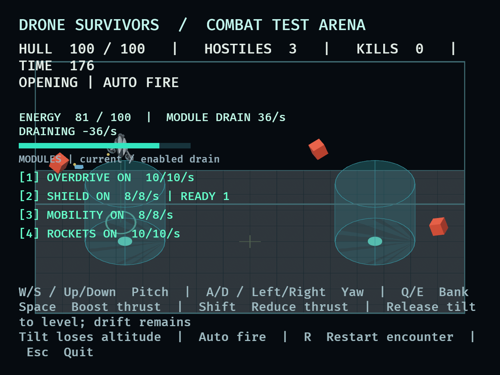
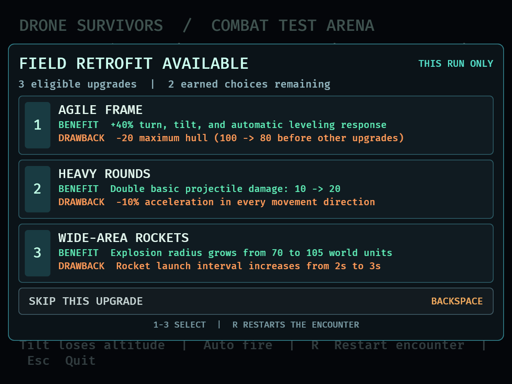
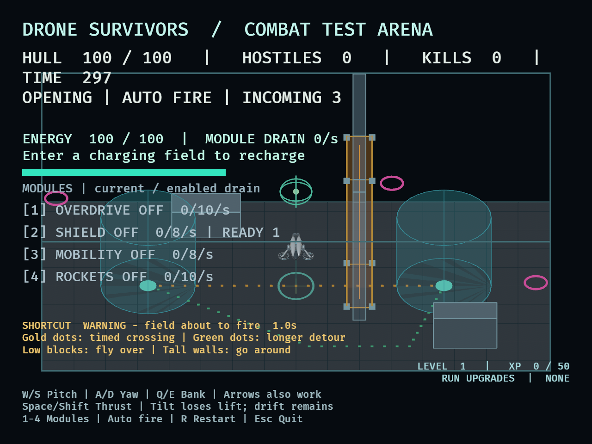
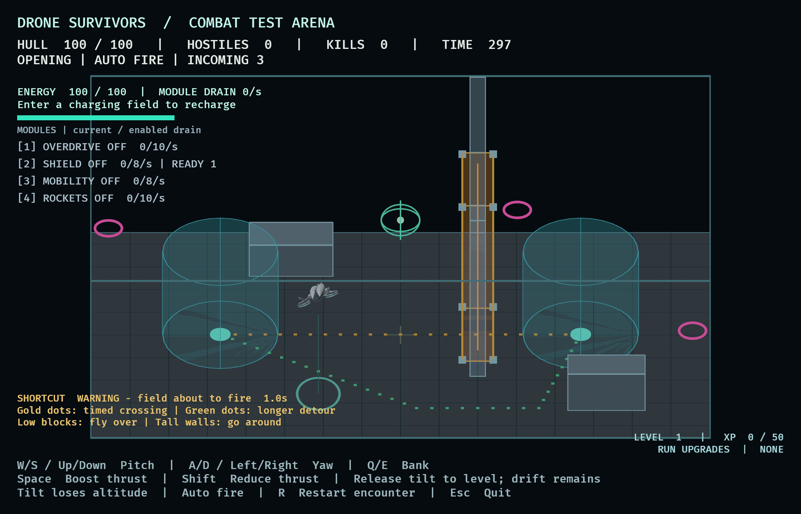

# Playtests

The latest entry describes current movement. Older entries are retained as
historical validation records and may describe superseded tuning or behavior.

## DRO-7 — Swarms and combat feedback — 2026-09-08

### Implemented encounter and final starting values

The fixed three-enemy start is replaced by a 180-second survival encounter.
Warnings occur at 3/15/27/39 seconds (three enemies), 60/70/80/90 (four), and
120/128/136/144/152 (five). Each warning lasts 0.75 seconds. Living enemies and
pending warnings share a cap of 30; unsafe activations, saturated bursts, and
missed older bursts are discarded without accumulating debt. Spawn candidates
must fit inside the arena and clear the player's rotated bounds by 120 units.

Enemy health is now 20 (two 10-damage hits), and contact damage is 10. Player
health remains 100, shared invulnerability remains 0.75 seconds, and the gun
retains its 0.5-second cadence, 650-unit/second straight projectiles, 400-unit
range, and one-second projectile lifetime. The original four-hit/25-contact
configuration killed the initial scripted pilot after 18 seconds. Two-hit
chasers improved survival, but sustained play without healing still needed a
less punishing contact value. Faster projectiles and a faster firing cadence
were explored in test-only probes and were not retained.

Separation has a 65-unit neighborhood and bounded acceleration of 160, entering
physical pilot inputs rather than directly displacing bodies. Feedback uses a
0.12-second enemy hit flash, a 0.35-second kill effect, a 0.22-second damage cue,
and a maximum of 48 simultaneous kill effects. All values remain provisional.

### Repeatable checks

1. Run `cargo dev`. The opening is quiet. Pink warning rings precede activation;
   move toward a ring and check that an unsafe activation is cancelled. Watch
   spawns from different sides and altitudes.
2. Fly through the encounter. Orange chasers pursue in 3D, bank/turn physically,
   and steer apart. Hits flash only the damaged enemy; kills create brief amber
   effects. The HUD shows time, hull, living enemies, kills, phase/lull and incoming
   warnings. A lull is not an early victory, even when no enemies remain.
3. Take contact damage. The HUD flashes red and displays cyan HULL PROTECTED
   during shared invulnerability. Multiple overlapping chasers cannot multiply
   contact damage within that window.
4. Die deliberately, then press R while holding a movement key. Repeat during
   warnings, combat, and after surviving 180 seconds. The entire run resets,
   including player attitude and momentum; held movement resumes next update.
5. Complete the full encounter. Survival freezes combat and shows SURVIVED with
   the kill count and restart prompt, even if enemies remain. Resize the window
   and check HUD/control readability. Escape quits.
6. Run the README's opt-in survival, idle, and stress commands for repeatable
   native probes. Survival synthesizes actual keyboard controls with simple
   collision avoidance; it never grants extra health or changes combat rules.
   Stress disables authored waves, grants invulnerability, bypasses normal spawn
   warnings/clearance and replenishes real killed enemies to sustain the target
   population. These overrides are not normal gameplay.

### Automated evidence and review

- All 73 tests pass. New cases cover warning duration/position, reservations and
  cap saturation, no spawn debt, unsafe activation, bounded candidate search,
  hitch behavior, terminal/reset precedence, local physical separation, exact
  kill accounting, material isolation, effect caps/expiry, HUD states, stable
  asset counts, validation options, sustained stress population and frame summaries.
- Three complete controlled-time keyboard runs at 30/60/120 Hz survived 180
  seconds with 51 kills each, remaining hull 10/10/30, and peak five live enemies.
  These are deterministic viability checks, not substitutes for human feel.
- The original damage/collision fixtures explicitly retain 25 contact damage so
  scenario tuning does not weaken those established regressions.
- Formatting, Clippy with warnings denied, and the native dynamic-linking build
  pass. The full suite runs in approximately two seconds on this machine.
- Independent read-only review found no actionable gameplay findings. Harness
  review found lost global keys and a stale terminal-exit deadline across restart;
  both have failing-then-passing regressions and are fixed. Frozen terminal frames
  are excluded from performance samples.

### Native measurement method

Apple M1 Pro, 16 GiB RAM, macOS 26.6.2 (25G83), Rust nightly 1.100.0
(cea272fa3, 2026-09-07), Bevy 0.19.1. `cargo dev` uses project optimization level
1, dependency level 3, and dynamic linking. Window size is 1120 × 720 logical /
2240 × 1440 physical pixels, with the existing presentation settings. No release
build or GPU-only timing is claimed.

Measurements are wall-clock intervals between completed gameplay/presentation
updates; they include the renderer/presentation pacing between updates. Exclude
five seconds of warm-up and all frozen terminal frames. Stress reports must show
150 actually live enemies, not 150 total spawns over time. The harness also
reports hit/kill activity and projectile count so an idle workload cannot stand
in for combat.

### Native results

| Scenario | Code commit | Active sample | Actual live enemies | Median / p95 / p99 (ms) | >33.3 ms frames |
| --- | --- | --- | --- | --- | --- |
| Initial 150 stress | 1efb3cb | 30.000 s / 1,800 frames | 150–150 | 16.670 / 16.977 / 17.475 | 0 |
| 30 stress comparison | 76a8bf6 | 30.000 s / 3,600 frames | 30–30 | 8.325 / 8.788 / 8.974 | 0 |
| Full survival | 76a8bf6 | 174.991 s / 20,999 frames | 0–5 | 8.330 / 8.792 / 8.960 | 0 |
| Repeat 150 stress | 76a8bf6 | 30.000 s / 3,600 frames | 150–150 | 8.332 / 8.852 / 9.019 | 0 |

The full native survival run ended at exactly 180 run seconds with 51 total kills
and 20 hull remaining. The sampled interval contained 100 hits, 50 kills, eight
applied player hits, and at most two simultaneous projectiles. One kill happened
during excluded warm-up.

The repeat 150-enemy stress run recorded 60 real hits and 20 kills during its
sample, with 150 live enemies maintained throughout and one simultaneous
projectile at peak. Its p95 of 8.852 ms meets the provisional <=16.7 ms target.
The playable cap remains 30 for encounter balance; 150 is only the stress target.

The first 150 run narrowly missed the strict p95 target and ran at a different
presentation cadence. It coincided with a locked-Mac UI-access failure. Later
runs measured approximately 120 updates/second, and native UI access subsequently
worked. The cause of that cadence change was not isolated; keep both results
rather than treating the first run as a density limit or hiding it. No density
reduction or visual simplification was needed for the repeat 150 run.

All command-line native runs exited successfully. Bevy emitted the existing
"Skipped event Destroyed for unknown winit Window Id" warning during shutdown;
no gameplay/runtime error was reported.

### Native visual checks and limits

The UI tool cannot target the raw Cargo executable. Visual checks used a temporary
macOS app bundle containing the same built executable, with only the Rust dynamic
library search path adjusted and an assets symlink. No packaging or bundle files
are part of this change.

Observed the scout, readable hull/time/hostile/kill HUD, orange physically banking
chasers, straight yellow shots, amber kill feedback, and advancing kill counts.
R visibly restored full hull, 180 seconds, zero kills and the quiet empty opening.
Zooming the native window retained the complete arena, HUD and control legend.
Stationary play subsequently reached the red DRONE DESTROYED state with zero
hull, 41 kills, two remaining hostiles, and 40 seconds on the frozen timer.
R visibly restored the empty opening, full hull, zero kills, and 180 seconds.
Escape terminated the game process, verified without reopening the app.
The initial locked-Mac restriction was resolved during the session.

Brief hit-flash/warning timing, invulnerability colors, sustained manual handling,
minimum-size layout, and subjective danger/readability still need a human feel
check. Those temporal rules and reset/death behavior have automated coverage;
this is not a claim that screenshot observations validate every short effect.

### Next step

Human-play the documented scenarios and adjust numeric balance if needed before
combining this with energy, modules and XP. No energy, module, upgrade, reward,
or campaign system is included in DRO-7.


## Scout response and enemy flight — 2026-09-08

### Repeatable handling and pursuit check

1. Restart with R and immediately hold W. The scout should tip forward promptly
   and accelerate before the chasers can touch it. Repeat with Q/E and with a
   turn followed by forward flight. These tests evaluate launch opportunity;
   flying into a wall and remaining there is not an evasion strategy.
2. Use brief pitch/bank inputs and counter-inputs. Tilt and leveling should feel
   quicker than the first flight version; full tilt takes 0.125 seconds, and
   maximum yaw is 240 degrees/second. Release preserves drift. Space/Shift still
   control vertical thrust, and tilt still loses altitude.
3. Watch enemies immediately after restart. They start stationary, visibly tilt,
   turn, and build speed. They should not jump straight to cruising speed or
   instantly reverse when you change direction. The scout's horizontal speed
   cap is 420 versus 260 for the pursuers.
4. Change heading sharply while moving and watch the pursuit path. Enemies must
   brake and redirect their existing momentum. Move above/below them and check
   that they adjust rotor thrust and tilt to pursue in altitude too.
5. Stay stationary after a reset. Enemies should eventually arrive and deal
   contact damage, including near the floor, ceiling, and arena walls. Arrival
   steering should reduce overshoot without snapping them to the player.
6. Check visible enemy corners at arena boundaries and during banking. Neither
   player nor enemies should clip outside. Projectiles should hit rotated enemy
   bodies and continue to disappear on their first impact.
7. Die while both sides are moving. All flight freezes; R recreates the enemies
   at their starting positions, level and stationary, and resets scout momentum.
8. Play repeated evasive encounters. Judge whether the quicker scout and slower
   enemy response create room to maneuver without making pursuit irrelevant.
   Tuning remains provisional until this human handling/balance check.

### Tuning intent

The scout's maximum speed increases from 240 to 420, with horizontal acceleration
at full neutral-thrust tilt increasing from 60 to 180 world units/second squared.
Its tilt/leveling/yaw rates are now 240/300/240 degrees/second. Both sides share
gravity and physical integration. Enemy limits are 260 horizontal speed,
20-degree total tilt, and 100/150/120-degree/second tilt/leveling/yaw rates.
The AI pilot controls thrust to pursue altitude through the same forces as the
player, requesting at most 60 world units/second of vertical pursuit velocity.
The player's altitude still requires manual management.

### Validation results

- The initial failing regressions measured the old scout at 19.572 world
  units/second after half a second, and the old enemy moving 15 units in its
  first tenth of a second. The old full-tilt response also missed 0.125 seconds.
- The updated scout measured 75.478 units/second at 0.5 seconds and 151.211 at
  one second, with full tilt reached by 0.125 seconds. An enemy moved 0.116 units
  in its first tenth of a second and 0.764 in the next, reaching 12.993
  units/second at 0.2 seconds.
- `cargo test --locked`: 54 tests passed. New coverage includes gradual enemy
  launch, turning/momentum, limits, altitude/boundary arrival, shared gravity,
  death/restart state, two-second full-hull scout evasion, and curved-path
  projectile sweeps with lifetime clipping and earliest-hit ordering.
- Formatting, Clippy with warnings denied, diff checks, and the native dynamic
  build passed. A regression caught and fixed mixed static/moving projectile
  hit fractions using different time scales when shot travel was clipped.
- Independent review found no actionable issues. A targeted temporary-copy
  moving-player probe retained full hull after two seconds of W at
  4/15/30/60/120/144 FPS. Enemy positions differed by about 1 world unit at
  30 versus 120 FPS; no material launch regression was found.

The rebuilt native binary ran in the same temporary macOS app bundle used for
the prior smoke test, without packaging changes. The orange enemy bodies visibly
banked during approach and leveled as they slowed near the scout. The HUD retained
full hull during the observed initial approach, and automatic fire removed an
enemy. Letting pursuit continue produced contact damage and the destroyed state.
R restored full hull and all three enemy starts; the new approach repeated.

Native held-key scout feel and deliberate evasive maneuvers remain a human
playtest item because the UI tool sends brief key taps. Automated held-input
tests establish launch response and the initial evasion window; this is not a
claim that final gameplay balance is settled.

## Drone flight controls — 2026-09-08

This entry introduced the current key bindings. The follow-up above revises
scout handling and enemy movement.

### Repeatable flight check

1. Run `cargo dev`. Confirm the scout starts level at (0, 90, 0), facing toward
   the back of the arena, with a legend showing pitch, turn, bank, and thrust.
   With no input or prior momentum it should hover.
2. Hold A/D or Left/Right. The nose turns without translating a stationary level
   drone. Release to retain the new heading. Repeat after accelerating: existing
   drift keeps its world direction as the nose turns.
3. Hold W/S or Up/Down to pitch forward/backward. Hold Q/E to bank left/right.
   Each tilt should accelerate toward the matching heading-relative direction
   and cost altitude at neutral thrust. Repeat after turning approximately
   90 degrees to check the direction follows the nose rather than the camera.
4. Release tilt inputs. The model smoothly levels, but continues drifting and
   descending. Opposite tilt brakes horizontal drift faster than passive drag.
   Combine W+Q, then release only Q: roll should level while pitch remains.
5. Hold Space to boost thrust and arrest a descent; continue to climb. Release:
   vertical momentum should decay without snapping to a stop. Hold either Shift
   to reduce thrust. Space+Shift restores neutral thrust while held together.
6. Hold pitch and bank together, including while turning and boosting thrust.
   The total tilt stays bounded and the drone cannot flip. All horizontal
   directions share one maximum speed; ascending does not consume that budget.
7. Approach the floor, ceiling, walls, and corners at various headings and tilts.
   The full visible drone stays inside. It can slide along a surface, tilt or
   turn near it, brake, and fly away without bouncing or building velocity into
   the surface. From the floor, level out and hold Space to take off.
8. Press opposing control pairs and duplicate aliases. Opposites cancel on each
   axis; duplicate bindings do not accelerate response or increase tilt/thrust.
9. Press R while flying. Position, heading, tilt, and momentum reset along with
   health and enemies. Hold movement during reset: reset wins that frame, then
   movement resumes. Holding R must not continuously reset the encounter.
10. Allow destruction. Gravity, movement, and leveling freeze. R restores normal
    flight. Automatic shots still target nearby enemies independently of heading.
11. Resize to the minimum window size and a wide window. The arena and controls
    should remain legible. Escape exits.

Flight parameters are grouped in `FlightConfig` in `src/arena/flight.rs`. The
approved values are starting points for evaluating acceleration, braking,
altitude management, and keyboard feel in this small arena.

### Validation results

- Baseline: 32 tests passed before implementation. Three initial regressions
  failed against the old movement code for yaw, banking, and tilt-induced altitude
  loss. A later regression caught and corrected combined tilt responding faster
  than the configured total angular rate.
- `cargo test --locked`: 42 tests passed. Coverage includes real ECS input/time,
  aliases/opposing controls, heading-relative acceleration, independent leveling,
  drift/braking, altitude loss and thrust release, speed limiting and steering,
  30/60/120/144 Hz trajectories, long frames, rotated bounds, sustained contact
  and departure in all 26 boundary directions, reset/death, and automatic aim.
- `cargo fmt --check` and `cargo clippy --all-targets --locked -- -D warnings`
  passed. The dynamic-linking native development build passed.
- Independent source review found no actionable correctness, spec-compliance,
  or code-quality issues.

The rebuilt native binary ran in a temporary macOS app bundle with its Rust
standard-library lookup path added. No packaging or asset changes are shipped.
Observed the scout, arena, updated three-line legend, auto-firing combat and
destroyed state. R restored the encounter. Resizing from 1120 x 720 content to
the 640 x 480 minimum retained the full arena and readable wrapped controls.
After Escape, the game process terminated.

The UI tool sends brief key taps; sustained yaw/pitch/bank motion was not
visibly established. Held-input handling, tilt orientation, momentum, and
boundary behavior are covered by the automated checks above. A human keyboard
playtest is still needed to judge flight feel and the provisional tuning; this
validation makes no final balance claim.

## Scout drone mesh — 2026-09-08

The scout replaces the combat player's primitive placeholder. Native Blender
5.2.1 generated the editable source, self-contained GLB and studio preview.
The export contains six material meshes, 48,844 triangles and no textures,
with a file size of 1,513,984 bytes. The revised mesh is 2.5× larger, with three rotors at 62%
of the original relative diameter: two under the wings, one beneath the nose.
The collider now has half extents (35, 15, 45), with a matching ground marker.

Final checks: `cargo test --locked` passed all 32 tests;
`cargo clippy --all-targets --locked -- -D warnings`, `cargo fmt --check` and
`git diff --check` passed. Independent read-only review found no actionable defects.

Validation covers the actual GLB's transformed vertex bounds and normals,
loading through Bevy's GltfPlugin, parenting all six mesh entities beneath the
player, and preserving entities/material/mesh assets across three encounter
restarts. The pre-export Blender bounds assertion provides a second coordinate
check. The initial geometry test correctly failed when the GLB was absent. For the
size revision, updated minimum-size and boundary tests failed against the old
model and collider, then passed after the larger export and bounds change.

Native visual inspection used the actual arena modules with temporary automatic
screenshot instrumentation. The full arena rendered the scout during combat,
at the normal camera distance, with the enlarged silhouette clearly visible. A second capture moved only the
inspection camera and hid enemies and HUD to examine the model's imported
surfaces and materials without obstruction. The capture harness is not shipped;
the normal game camera and combat behavior are unchanged. Bevy emitted its known
window-destroyed warning during clean exit.

For a manual check, run `cargo dev`, look for the silver body and cyan hover
rings, move in all three axes, approach arena boundaries, and press R repeatedly.
The complete scout should follow the player and remain present after each reset.
The studio render is in `docs/images/scout-drone.png`; native screenshots are
`docs/images/scout-arena.png` and `docs/images/scout-bevy-closeup.png`.


## DRO-6 — Basic combat — 2026-09-08

Target: native macOS / Apple Silicon, Rust nightly, Bevy 0.19.1.

### Repeatable combat smoke check

1. Run `cargo dev`. The drone starts at (0, 90, 0), with 100 hull and three
   orange chasers at fixed positions and different altitudes. Yellow shots fire
   automatically at the nearest enemy within 400 units of true 3D distance.
2. Move with WASD/arrows, Space, and Shift. Chasers follow in all three axes.
   Try the floor, ceiling, and side walls: neither body leaves the flight volume,
   and chasers can still make contact. Release input to hover.
3. Watch a shot after its target changes direction. It keeps travelling straight,
   can miss, and disappears after the first enemy hit, one second, or arena exit.
   Kill one enemy and confirm subsequent shots choose a remaining target.
4. Allow contact. Hull drops by 25, with at least 0.75 seconds before another
   hit even when several enemies overlap. Move away to avoid further damage.
5. Stand still until hull reaches zero. The destroyed prompt appears and all
   gameplay freezes. R restores full health, all three original enemy positions,
   starting altitude, and fresh weapon/damage timers. Repeat during combat;
   no previous enemies or shots should remain. Escape exits.
6. Evade long enough to kill all enemies. The clear prompt appears; movement
   remains available and R replays the same encounter. There are no waves,
   rewards, energy costs, or upgrade dependencies.

### Initial tuning

All values are grouped in `CombatConfig` in `src/combat.rs`:

| Setting | Starting value |
|---|---|
| Player / enemy health | 100 / 40 |
| Contact / projectile damage | 25 / 10 |
| Shared contact invulnerability | 0.75 seconds |
| Chaser / projectile speed | 150 / 650 world units per second |
| Fire interval / targeting range | 0.5 seconds / 400 world units |
| Projectile lifetime | 1 second |
| Chaser half-size / projectile radius | 14 / 3 world units |

These are playtest starting points. In particular, the user accepted the
invulnerability window provisionally and wants to judge it through play.

### Automated results

- `cargo fmt --check`: passed.
- `cargo test --locked`: all 31 tests passed (13 arena, 18 combat/presentation).
- `cargo clippy --all-targets --locked -- -D warnings`: passed.
- `cargo build --locked --features bevy/dynamic_linking`: passed.
- Real ECS tests cover three-axis chase and boundary contact, nearest/range/tie
  targeting, 30/120-update firing cadence, straight shots and moving-target
  sweeps, first-impact-only damage, lifetime/arena cleanup, shared contact timing,
  separation, lethal-hit ordering, frozen death, and repeated complete resets.
- Presentation checks verify one persistent HUD and no accumulation of live
  entities, meshes, or materials over repeated death/restart cycles.
- The initial test-first run produced 14 expected combat failures. Independent
  review then found target loss cancelling an active firing cooldown. A new
  regression reproduced the early extra shot; preserving the outstanding
  cooldown fixed it. Review found no other actionable issues.

### Native results and limits

`cargo dev` compiled and launched its process. For UI inspection, the same
rebuilt development binary ran in a temporary macOS app bundle with its Rust
standard-library lookup path added; no packaging changes are committed.

Observed the complete arena, orange chasers converging on the drone, the hull
counter falling in 25-point increments, an enemy kill (hostile count 3 to 2),
and the stable zero-hull destroyed state. Pressing R visibly restored 100 hull
and all three chasers at their initial positions. Escape terminated the app.
A missing dash glyph was found in the HUD during this check, replaced with an
ASCII separator, rebuilt, and visually verified in both active and dead states.

The UI tool sends brief keyboard taps. Held-key movement was not visibly
established in this smoke check; movement and altitude pursuit are covered by
the automated ECS checks. A full evasive native clear, deliberate missed-shot
scenario, projectile readability during movement, and human combat feel remain
manual playtest items. No final balance judgment is claimed.

### Next adjustment

Play the encounter with held controls and tune chase pressure, shot readability,
fire rate, and the 0.75-second damage window from observations. Ground enemies
with ranged attacks are deferred. Waves and richer feedback belong to DRO-7.

## 3D drone movement and bounded flight — 2026-09-08

Target: native macOS / Apple Silicon, Rust nightly, Bevy 0.19.1.

### Repeatable control smoke check

1. Run `cargo dev`. Confirm the mesh drone hovers over a gridded floor, with an
   open frame showing the sides and ceiling, a center marker, and the controls.
2. Use WASD and arrows to move over the X/Z plane. Space ascends; either Shift
   descends. Release input to hover. Try horizontal/vertical combinations: total
   speed stays constant. Opposing inputs cancel and duplicate bindings add no speed.
3. Hold Shift until the drone's bottom reaches the floor, then keep holding it.
   It must stop without sinking. Repeat with Space at the ceiling: the top stops
   at Y = 300. Add horizontal input while pressing into either surface, then move
   away from it. There must be no sticking, bounce, or movement through a limit.
4. Visit all side walls and corners, including while ascending/descending. The
   complete drone must remain inside the volume. The ground ring and vertical
   guide follow its X/Z position, making altitude visible.
5. Move in all three axes and press R. The drone returns to (0, 90, 0), and the
   ground ring returns to the center. Reset wins that frame; holding R does not
   repeatedly reset. Escape exits.
6. Resize wider, taller, and down to the minimum window size. The full flight
   volume and controls should remain visible. Relaunch restores the same scene.

### Automated results

- `cargo fmt --check`: passed.
- `cargo test --locked`: all 13 tests passed.
- `cargo clippy --all-targets --locked -- -D warnings`: passed.
- `cargo build --locked --features bevy/dynamic_linking`: passed.
- The movement tests drive the real gameplay plugin with keyboard resources and
  controlled time: all six directions/aliases, every two/three-axis diagonal,
  duplicate/opposing/released inputs, 30/120-update frame-rate equivalence,
  all 26 face/edge/corner directions across repeated ten-second frames, sliding
  along and leaving the floor/ceiling/side wall, and full-transform reset behavior.
- Scene tests instantiate the real scene builder and check every drone mesh's
  bounds against the movement half-extents, and every flight-volume corner
  against the camera projection at 1120 × 720, 640 × 480, 1600 × 480, and 640 × 1000.
- Test-first movement run: ten expected failures against the old 2D controller.
  A geometry regression test then caught a nose detail extending 0.1 units above
  the upper bound; repositioning the nose inside the bounds fixed it.

### Native results and limits

The development binary rendered successfully in a temporary macOS app bundle
using the same approach as the previous smoke check (only the development
library lookup path was adjusted; no packaging changes are committed).

The 3D drone, floor grid, full boundary frame, ground ring/vertical guide, home
marker, and control legend rendered. Resizing from 1120 × 720 to approximately
700 × 480 retained the full volume and readable controls. Closing the window
terminated the process successfully; relaunch restored the initial scene.
Bevy logged a window-destroyed warning on close, with exit status 0.

This session's UI automation did not produce observable gameplay keyboard input,
including Escape, on either direct or normal app launch. Native held-key movement
and reset are therefore not claimed as visually verified. Their ECS behavior is
covered by the passing tests; a human keyboard feel check remains useful.

Independent read-only source review found no actionable correctness issues.

## DRO-5 — Playable shell and test arena — 2026-09-08

Target: native macOS, keyboard input, existing Rust nightly / Bevy 0.19.1 setup.

### Repeatable control smoke check

1. Run `cargo dev`. Confirm a titled window opens with a visible arena, grid,
   center marker, placeholder drone, and control legend.
2. Move with W, A, S, D, then each arrow key. Release the keys; the drone stops.
   Try all four diagonal combinations. Their travel speed should match a
   straight direction. Combining W and Up should not add speed or skew a diagonal.
3. Hold movement toward each edge and each corner. All four rotors must remain
   inside the boundary. Move back inward to confirm the drone is not stuck.
4. Move away, press R, and confirm the drone returns exactly to the center marker.
   Repeat at least three times. Try R while holding a movement key: reset wins
   that frame, and held movement resumes on the next frame. Holding R should not
   repeatedly reset; release and press it to reset again.
5. Resize the window wider and taller. The complete arena remains visible and
   the drone's world-space bounds do not change.
6. Press Escape and confirm the application closes cleanly. Relaunch to confirm
   the same starting scene.

### Automated coverage

Seven tests drive the real gameplay plugin with keyboard input and a controlled
clock, without a display or GPU. They cover both keyboard layouts, eight movement
directions, normalized diagonals, duplicate and opposing bindings, stopping on
release, equal travel over one second at 30 and 120 updates, every edge/corner
including a ten-second update, repeated reset without entity duplication, and
reset precedence/held-key behavior.

The test-first check produced six expected failures against the stationary shell;
movement then passed five tests with two reset failures; adding reset passed all
seven tests.

### Results

- `cargo fmt --check`: passed.
- `cargo test --locked`: all seven tests passed.
- `cargo clippy --all-targets --locked -- -D warnings`: passed with no warnings.
- `cargo dev`: compiled and ran on macOS 26.6.2 / Apple Silicon without a
  reported runtime error. The UI tool cannot target a raw Cargo executable, so
  native interaction used a temporary app bundle containing that same binary
  with only its development-library lookup path adjusted; no bundle files are
  part of the repository.
- Native visual check: camera, full arena boundary, grid, center marker, drone,
  and control legend rendered correctly. Brief D input moved the drone and R
  returned it to the marker. Resizing from 1120 × 720 to approximately 700 × 480
  kept the whole arena and controls visible. Escape terminated the process;
  relaunch restored the initial scene.
- The UI tool sends very short taps, so sustained movement, all keyboard
  directions, frame-rate equivalence, every edge/corner, and repeated reset are
  verified by the automated ECS tests above. A human held-key feel check remains
  useful before tuning movement speed.
- Independent source review found no actionable correctness issues.

No known blocking gameplay defect was found. Speed (240 world units/second) and
arena dimensions (960 × 540) are initial playtest values.

### Next step

DRO-6: add the first chasing enemy, basic automatic weapon, damage, death, and
restart lifecycle. This arena currently has no combat or transient run entities;
reset restores the existing drone instead of recreating the scene.

## DRO-8 — Energy and charging — 2026-09-09

### Delivered rules and repeatable checks

Key **1** enables/disables weapon overdrive: 2× firing rate, 10 energy/s drain,
100 capacity, at least 10 energy to enable. Depletion disables overdrive and
requires a new keypress after recovery. All normal flight and basic firing stay
available. Two non-solid radius-90 charging fields at x ±280, z 0 span heights
0–160. Center containment is inclusive. Recharge is 25/s or net 15/s with
overdrive on; fields never stack, protect the player, heal, or run out.

1. Run `cargo dev`. Confirm full energy and OFF, both cylinders and top rings,
   battery meter, and key hint. Press 1: ON and DRAINING -10/s appear.
2. Remain outside fields until empty. Ordinary fire and flight remain usable.
   Press 1 below 10: the explanation appears, without enabling overdrive.
3. Enter either field below its top ring. Observe CHARGING +25/s and recovery
   without automatic reactivation. Press 1 after reaching 10: ON and +15/s.
   Fly above the ring or outside the radius: charging stops. Return to resume.
4. Let enemies pursue through a field; charging does not protect hull. At an
   outcome energy freezes. R restores full energy/OFF and clears rejection and
   charging feedback, even when other controls are pressed on the same frame.
5. Resize to 640×480; wrapped combat status pushes the energy panel downward.
   Repeat restart and toggling without duplicate nodes or HUD panels.

### Automated evidence

- Baseline: 73 tests passed before implementation.
- Final `cargo fmt --check`, `cargo test --locked`, and
  `cargo clippy --all-targets --locked -- -D warnings`: passed; 87 tests total.
- `cargo build --locked --features bevy/dynamic_linking`: passed.
- Test-first rule run produced seven expected failures; the combat run then
  reproduced missing cadence/depletion integration before implementation.
- Tests cover 30/120 Hz rates, zero/capacity clamps, inclusive radial/height
  bounds and just-outside positions, both nodes, non-stacking overlap, held
  keys, rejection threshold, manual recovery, combined charging/drain,
  target-free drain, real firing throughput, cooldown-preserving toggles,
  movement and base fire at zero, fatal/survival frame ordering, restart,
  HUD state transitions, and reusable assets/entities across restarts.
- Added integration checks show an empty drone reaching each field through real
  flight under enemy pressure. Crossing into a field is evaluated after movement;
  a 9.999-energy activation still rejects before that frame's recharge. Leaving
  the volume stops recharge immediately at the next movement sample.
- Independent read-only review and a follow-up review found no actionable
  defects. The review's narrow-window concern prompted replacing fixed energy
  HUD positioning with a shared layout column and native verification.

### Native evidence

`cargo dev -- --validate survival` completed the full authored encounter with
normal health, flight and basic weapon, with overdrive off. Result: SURVIVED,
180.000 game seconds, 10 hull, 52 total kills. At 2240×1440 physical resolution,
the 175.016-second post-warmup sample measured median 15.931 ms, p95 16.867 ms,
p99 17.048 ms, and one frame over 33.3 ms. Observed live-enemy range was 0–5.
These are compatibility observations on this machine, not a new stress benchmark.
A Bevy/winit unknown-window warning occurred during shutdown after successful
completion; no gameplay failure accompanied it.

The native development executable also ran in a temporary macOS app bundle,
with only the development-library lookup path adjusted and an assets symlink.
UI keypresses visibly enabled ON/drain, reached EMPTY, showed rejection below
threshold, restored full/OFF on restart, and exited with Escape.

Brief UI key taps did not establish held-key flight reliably. For charging
visuals, a temporary native driver compiled the current shared gameplay/scene
modules and supplied only keyboard inputs: deplete at center, fly to the left
node, explicitly re-enable overdrive, then fly to the right node. It did not
change transforms, health, battery, enemy waves, physics, or recharge rules.
Observed left-field recovery at 61/100 with OFF and CHARGING +25/s; later it
showed ON, 100/100 and +15/s. The right field subsequently highlighted around
the drone and showed ON, 100/100 and +15/s. Enemies and ordinary combat remained
active during the approaches. The temporary driver is not shipped.

At the minimum 640×480 content size, native captures show wrapped combat text
and incoming-spawn feedback above the energy panel without overlap. Both field
volumes, their occupied highlight, drone and enemies remained distinguishable.
The shared column handles further combat-text wrapping without fixed offsets.

### Remaining tuning

Values remain the approved starting points. A human playtest should judge
charger camping, how often overdrive is useful, and whether the recharge/drain
ratio creates satisfying choices throughout the final push. The automated and
native checks establish behavior and readability, not final gameplay balance.
Four-slot controls and additional powered abilities belong to DRO-9.

### DRO-8 review correction — full-battery flow display

The HUD previously displayed the nominal recharge-minus-drain rate even when
capacity clamping kept stored energy constant. At capacity inside a field it
now reads BATTERY FULL | IN CHARGING FIELD. Below capacity, +25/s or +15/s
returns; field highlighting, overdrive operation and energy arithmetic are
unchanged. The full-field +15/s observations above describe the earlier build.

A regression test reproduced the incorrect full-battery message before the
fix, then passed with overdrive both off and on. It also checks returning below
capacity, reaching capacity again, paused status and leaving the field.
`cargo fmt --check`, all 88 tests, and Clippy with warnings denied passed.


## DRO-9 — Four-slot module controls (2026-09-09)

### Scope and automated behavior

Four interchangeable slots now contain overdrive, a one-block powered-recharge
shield, horizontal mobility boost, and an automatic splash rocket launcher.
Defaults are the approved 10/8/8/10 energy-per-second drains, 5-second shield
recharge, 1.25x horizontal acceleration/cap, and a rocket every 2 seconds dealing
20 damage within a 70-unit 3D impact radius. Every module starts off.

Baseline before changes: 88 tests passed. New tests first reproduced missing
slot drain, shield activation protection, mobility acceleration and rocket
launch/splash behavior. Coverage now exercises every module's actual effect in
each of the four positions, empty slots, duplicates, independent/held/simultaneous
keys, low-energy rejection, additive charging/drain, depletion, and manual recovery.
Shield tests cover contact protection, pause/resume, partial paid time on depletion,
multiple configured blocks, and no toggle refill. Rocket tests cover nearest/tied
3D targets, impact-time moving-enemy splash, inclusive radius, one damage per target,
kill accounting, misses, cooldown continuity and frame-rate-independent cadence.
Flight tests preserve vertical response and restore the normal speed cap after
mobility is disabled. Restart/freeze and reusable visual assets are covered.

A staged power update lets contact observe same-frame shield activation/depletion;
only a continuing encounter commits battery/module changes. Movement consumes the
previous committed module state, so mobility changes apply on the next movement
integration. This preserves post-movement charging membership and existing terminal
energy freeze behavior.

### Repeatable encounter comparison

Command: `cargo test --locked compare_maximum_output_and_conservation -- --nocapture`.
Both runs use the same authored three-minute waves and the same existing keyboard
pilot at 60 updates/second, with real health, collisions and energy accounting.
From 3 seconds onward, maximum output enables all four whenever at least 50 energy
is stored; conservation enables only rockets whenever at least 20 is stored.
These input policies never write battery, health, transforms, or enemy state.

| Policy | Outcome | Run time | Hull | Kills | Final energy | Time with modules on | Time in chargers |
| --- | --- | --- | --- | --- | --- | --- | --- |
| Maximum output | Survived | 180.00s | 20 | 51 | 14.17 | 2.77s | 0.57s |
| Rocket-only conservation | Destroyed | 156.35s | 0 | 50 | 4.17 | 9.98s | 0.17s |

Maximum output exhausted the battery in about 2.78 seconds; rockets alone lasted
about 10 seconds. This confirms a real power-duration tradeoff, but the shared
pilot barely visits chargers and does not tactically manage power beyond those
simple policies. The result does not establish that maximum output is generally
stronger or that both approaches are balanced. A human charging/defense playtest
remains the next tuning step. No balance values were altered to force a win.

### Native validation and visual checks

`cargo dev -- --validate survival --seconds 30` completed a native Metal run
through 35 seconds including warmup, with hull 100 and 9 total kills. Post-warmup
samples: median 8.349 ms, p95 8.910 ms, p99 9.493 ms, one frame above 33.3 ms,
0–3 live enemies, 2240x1440 physical resolution. This is a compatibility sample,
not a new stress benchmark. The existing Bevy/winit unknown-window shutdown warning
appeared after successful completion without a gameplay error.

Temporary capture instrumentation in the native entry point supplied only number
keypresses, window resizing, screenshot requests and exit; the existing validation
pilot supplied ordinary movement. Gameplay, energy, health and waves were unchanged.
The instrumentation was removed after capture. Inspected 640x480 and 1120x720
logical-size captures with all four powered, blue rockets in flight, and subsequent
zero-energy shutdown. Each module's key/name/state/drain is readable, with the shield
ready state and the shared energy bar; wrapped combat text stays above the panel.
At minimum size the HUD occupies a substantial part of the scene but does not overlap
its own text or the bottom controls. Further HUD polish can follow human playtesting.

The first native capture exposed `-0/s` for an empty drain sum and a missing middle-dot
glyph. A failing HUD regression reproduced negative zero; the sum now normalizes to
positive zero and the separator uses ASCII. Fresh minimum-size captures verify both.
A separate ECS presentation check verifies rocket orientation leaves its position
unchanged, the impact effect has radius 70, and repeated restart reuses mesh/material
assets and clears effects.



### Final verification and review

`cargo fmt --check`, `cargo test --locked` (113 passed), and
`cargo clippy --all-targets --locked -- -D warnings` passed. A focused review of
power/shield/mobility and an independent whole-branch review found no actionable
issues. The remaining limitation is human assessment of charging routes, shield
value, rocket readability in dense combat, and high-output versus conservation
balance; the approved numeric defaults remain provisional.

## 2026-09-09 — DRO-11 obstacles, hazards, and route choices

Implemented low cover, a full-height divider, one full-height electrical shortcut,
and a longer detour between the existing chargers. The field is harmless for
3 seconds, warns for 1 second, and damages for 1 second. Each actor can receive
one 10-damage event or shield block per active window. Both weapons and rocket
splash respect solid cover; chasers retain physical flight while following a
small authored graph. Basic movement and all four module tuning values remain
unchanged.

### Automated evidence

`cargo fmt --check`, `cargo test --locked` (143 passed), and
`cargo clippy --all-targets --locked -- -D warnings` passed after review fixes.
The original baseline was 113 passing tests.

New coverage includes swept thin-wall collisions at ordinary/boosted speeds,
sliding and corners, rotated bounds, banking away from wall contact, low-cover
clearance, and floor/ceiling containment at 30/60/144 FPS plus a 100 ms hitch.
Pursuit reaches both sides within 15 seconds; a 30-enemy fixture reverses the
target and checks five-second progress intervals. Spawn warnings and activation
reject blocked, hazardous, and disconnected positions.

Weapon tests cover visible-target selection, obstacle-before-enemy impacts,
terrain rocket explosions, covered splash victims, and shooting above low cover.
Hazard tests exercise subframe crossings and active time intervals, one event per
actor/window, shared shield/contact protection, depleted shields, enemy kill
accounting, terminal freeze, and restart. Scene tests verify state text and
mesh/material/entity reuse across repeated restart.

Independent review reproduced and resolved two defects before publication:

- An instantaneous collision-correction segment produced a zero denominator in
  projectile interpolation. It now uses a finite instantaneous sweep; slab tests
  reject nonfinite inputs. Regressions cover both distant misses and real hits.
- Turn clearance padding made a player just above a low block unreachable from
  the opposite side. Final approaches use physical clearance and account for a
  banking enemy's height. Both low blocks pass at 30/60/144 FPS.

The follow-up review found no remaining actionable issues.

### Route measurements

The keyboard-only route fixture completed all four legs with 100 hull and all
modules off. Headless runs also force the battery to zero and disable recharge
only in the fixture, proving both routes remain usable without power.

Representative 60 FPS trip times (seconds; includes waiting at the shortcut):

| Starting cycle offset | Shortcut left→right | Shortcut right→left | Detour left→right | Detour right→left |
| --- | ---: | ---: | ---: | ---: |
| 0 seconds | 5.07 | 6.23 | 7.25 | 7.12 |
| 1.5 seconds | 8.55 | 6.25 | 7.23 | 7.10 |

The same four legs succeeded at 30 and 144 FPS. The open shortcut is faster, but
an unfavorable cycle makes waiting slower than taking the detour. This validates
a timing decision without requiring a shield or mobility module. It does not
establish balance under sustained swarm pressure.

A native `cargo dev -- --validate routes --seconds 65` run completed the legs in
5.14, 6.33, 7.28, and 6.98 seconds with 100 hull. The return shortcut included a
1.89-second wait. The fixture disables waves; it never teleports the scout or
changes its health. A separate ordinary-wave native run using the existing
survival pilot reached 49.97 seconds, 12 kills, and 30 hull. That pilot does not
plan around the electrical cycle, so this is a combat integration check, not a
successful three-minute route strategy or a balance claim.

### Native presentation and limitations

Inspected 1120 × 720 captures of open/warning/active states and a 640 × 480 capture.
The transparent tall walls leave the drone visible, low blocks have solid faces,
and field boundaries/emitters span the entire flight height. Dotted paths identify
the shortcut and detour. The initial captures exposed unsupported punctuation
and bottom-control wrapping; new copy uses ASCII separators and controls use a
compact three-line layout below 800 logical pixels.

Final recapture attempts returned black images while the macOS console was
locked, despite gameplay continuing normally. The final compact text adjustment
therefore still needs an unlocked-session visual check. Use the documented
`DRONE_CAPTURE_DIR` and `DRONE_CAPTURE_MINIMUM` validation options to reproduce.
No black images were accepted as visual evidence. Earlier screenshots validated
the geometry and field presentation, before the final copy/layout cleanup.

The first unlocked native idle sample (30 seconds after warmup, 2240 × 1440
physical pixels) recorded median 8.35 ms, p95 12.36 ms, p99 22.87 ms, 21 frames
above 33.3 ms, 0–3 enemies, 90 hull and 9 kills. This is a light-load compatibility
sample, not a new 150-enemy benchmark. Later locked-session frame timings are not
used as presentation/performance evidence. The existing Bevy/winit unknown-window
warning appeared only on successful shutdown; no gameplay runtime error occurred.

Remaining human checks: final compact HUD after unlock, both route choices under
sustained combat, shield/mobility timing, enemy luring, and warning readability in
dense combat. Numeric defaults remain provisional; no balance was altered to
force the old survival pilot to win on the new map.

### Review follow-up — rotation contact trace

Confirmed that rotation contact correction overwrote the first timed segment's
start with the actor's pre-correction position. A stationary banking actor then
appeared to translate throughout the step, and a focused hazard test reproduced
false exposure to a field beyond the wall after the correction had already ended.
Timed segments now retain their corrected starting position. Physical correction,
normal velocity clipping, and existing instantaneous collision segments are unchanged.

Both new regressions failed before the fix and pass afterward: stationary player
and enemy-sized bodies do not acquire timed translation from rotation correction,
and a field across the wall does not damage the corrected actor. The full suite
passes all 145 tests; `cargo fmt --check` and strict all-targets Clippy pass.

## DRO-10 — Experience and temporary choices — 2026-09-09

### Implemented behavior

Kill XP (10), a one-use green 3D exploration pickup (30), thresholds 50/75/100/…,
and six single-purchase upgrades now work in the normal three-minute arena.
Excess XP queues choices. Both mouse cards and fresh 1–3 keys select; the explicit
Skip button or Backspace spends one choice without an effect or reroll. Level and
excess XP remain earned. Empty pools resume automatically. Normal restarts use a
fixed offer seed so this prototype's choices are repeatable.

Heavy armor grants 50 hull and reduces all translational acceleration by 25%;
Heavy rounds doubles basic projectile damage with a 10% acceleration penalty.
Both include vertical response and braking. Their penalties multiply to 67.5%
baseline acceleration while preserving neutral hover. Basic fire stays free and
keeps its cadence. The other four agreed trade-offs are implemented as specified.

### Automated rules, integration, and review

`cargo fmt --check`, `cargo test --locked` (141 passed), and
`cargo clippy --all-targets --locked -- -D warnings` pass. Tests exercise XP carry,
large awards, exact-once real rocket multi-kills, pickup boundaries, eligibility
in different slots, stable/distinct offers, 1/2/3/0-card pools, Skip, queued input
release, death/restart precedence, derived stats, current hull/battery changes,
shield progress, snapshots, and baseline restoration. Flight tests compare real
horizontal/vertical/braking acceleration for both penalties.

A TimePlugin test simulates a 40-second selection pause and verifies
unchanged gameplay clock, player/enemy motion, projectile life, energy, warnings,
and protection deadlines. Resume advances only the next normal frame. Selection
keys do not toggle modules. Mouse Skip routes through the same choice system.

Independent core review caught a near-ready rocket cooldown being retimed after
the first resumed delta. The failing regression uses 0.08 seconds remaining:
a 2-to-3-second interval change must leave 0.12 seconds before a 0.1-second resume
frame. The deadline is now converted during selection; the test passes. Final
whole-feature review found no blocking or important code findings.

### Native UI inspection

`cargo dev -- --validate choices --seconds 4` rendered the actual game at
640×480 logical / 1280×960 physical pixels, with two queued choices. Three cards,
separate benefit/drawback text, eligibility/queue counts, Skip/Backspace, and
restart instructions fit without clipping. Initial native rendering revealed
missing glyphs for Unicode minus/arrows; new upgrade UI text now uses supported
ASCII characters. A second native screenshot verifies the correction:



This preview explicitly grants 140 synthetic XP and captures the rendered window;
normal launches never receive that grant. The real scene test covers offer-size
visibility and Skip presence. Automated mouse/key tests cover input behavior;
this record does not claim a human handling or usability playtest.

### Build comparison and tactical implications

Both build probes use the same unchanged keyboard pilot, normal waves, real
health, and naturally earned XP; they apply choices through normal guarded input.
They do not activate modules, so these runs demonstrate flight/hull/basic-weapon
trade-offs; powered shield/rocket effects are covered by integration tests.

The deterministic 30 Hz run chose Agile frame (17.467s), Rapid shield (62.767s),
Skip (84.767s), and Interceptor (131.333s), then died at 156.200s with 49 kills.
The armored run chose Heavy rounds (17.467s), Wide-area rockets (61.100s),
Heavy armor (83.100s), and skipped at 130.433s/154.433s; it survived 180s with
52 kills. Four and five earned choices respectively meet the provisional pacing
target.

Native Mobile independently chose Agile frame at 17.478s, Rapid shield at
62.757s, Skip at 84.607s, and Interceptor at 131.901s. It died at 155.982s with
48 kills, 0 hull and 75/75 energy. At 1120×720 logical / 2240×1440 physical pixels,
150.913 sampled seconds yielded median/p95/p99 frame times of
16.667/17.832/18.631ms, with eight frames over 33.3ms. Exit status was zero.

Native Armored independently survived 180.000s with 51 kills, 150 hull and
100/100 energy, acquiring Heavy rounds, Wide-area rockets and Heavy armor.
It selected at 17.468s/62.576s/91.310s and skipped later offers at
130.801s/154.751s. At the same 2240×1440 physical resolution, 174.949 sampled
seconds yielded median/p95/p99 frame times of 8.337/8.679/8.906ms, with no
frames over 33.3ms; exit status was zero. Frame measurements are observations
from these desktop runs, not controlled cross-build performance benchmarks.
Both native processes emitted an existing Bevy/winit unknown-window warning on
shutdown after their successful result; neither encountered a gameplay panic.

The mobile pilot's 80-hull ceiling and changed handling require a different
escape/braking approach; blindly accepting mobility improvements is not a free
win. A player can Skip those offers or adjust thrust/braking timing. Heavy rounds
makes normal 20-hull chasers die in one basic hit, and armor provides extra
survival margin at the cost of slower acceleration. These are observations and
tactical implications from fixed probes, not evidence that both builds are
balanced for human play. The next manual pass should specifically compare early
braking/altitude recovery in the mobile build and powered-module use at chargers.
Do not tune normal combat solely to rescue the existing scripted pilot.

## 2026-09-09 — DRO-11 integration with main's upgrade choices

Merged main at `711f093`, preserving terrain, hazards, route validation, and the
DRO-10 upgrade feature and native validation modes. Routes skips earned choices
through the same ordinary controls as the other baseline validation modes.
Two integration tests verify that hazard kills award XP exactly once and can open
an upgrade choice, and that a long choice pause preserves the remaining hazard
warning before resuming damage. The rotation-correction regressions remain green.

`cargo test --locked` passes all 175 tests. `cargo fmt --check` and
`cargo clippy --all-targets --locked -- -D warnings` also pass.

## DRO-12 — Five-minute combat prototype — 2026-09-10

### Scope and baseline

The approved direction preserves the existing terrain, chaser behavior/stats,
player tuning, modules, upgrades, and hazard cycle. Difficulty grows through
numbers alone after a forgiving opening. The authored five-minute schedule is
provisional until human playtests establish the desired retry curve.

The integrated main baseline was `08dd355`; all 175 tests passed before changes.
A native Armored probe using that unchanged gameplay ran for 64.973 active seconds
before its sampling limit, reaching 16 kills and 30 hull. It chose Heavy rounds
at 17.606s and Wide-area rockets at 61.198s. The old elliptical pilot did not plan
around the hazard or use modules. This was a baseline integration observation,
not evidence that its tactic should win the new scenario.

On an Apple M1 Pro (10 CPU cores), 16 GiB RAM, macOS 26.6.2 (25G83), native
`cargo dev` at 1120 × 720 logical / 2240 × 1440 physical pixels reported 59.950
sampled seconds, median/p95/p99 8.340/8.729/9.034 ms, two hitches above 33.3 ms,
and 0–4 live enemies. This light workload does not validate the playable cap.
The normal-size opening/warning/active screenshots rendered successfully; the
translucent divider, hazard boundaries, charging fields, drone, and text were
visible. An existing Bevy/winit unknown-window warning appeared on clean shutdown.

### Human acceptance

Use [the DRO-12 playtest checklist](playtests/dro-12-checklist.md) with the manual
validation mode. Save logs and observations from failed attempts as well as wins.
Two unfamiliar players are preferred; the original ticket permits two recorded
fresh human runs as a fallback. State that fallback's limits explicitly.

**Gate status: pending human evidence.** No unfamiliar-player observations or two
human wins with contrasting tactics have been supplied during implementation.
Automated runs cannot demonstrate player understanding, a first-win distribution,
or perceived benefits and drawbacks. Keep this gate pending until those checks
and any resulting tuning are completed; do not infer acceptance from passing tests.

A separate direct-executable 30-enemy stress attempt omitted the scout model
because Bevy resolved assets relative to the executable. Its frame timings are
excluded from acceptance evidence. Direct launches must set BEVY_ASSET_ROOT to
the worktree root (or use cargo dev); final measurements use the complete scene.

### Presentation fix and inspected captures

The baseline minimum-size capture reproduced overlapping hazard and XP text:
their independent absolute nodes both occupied the area around 110 pixels above
the bottom edge. The footer now lays out hazard instructions, XP/acquired upgrades,
and controls in one wrapping column, using compact text below 800 logical pixels.

Inspected complete-scene warning captures at both sizes after the fix. Hazard
copy, XP, and controls occupy separate rows; the scout model, charging fields,
and full-height divider are visible. These opening-state captures establish the
reported overlap fix, not dense-combat readability or human handling acceptance.





### Five-minute configuration: native Armored probe

The unchanged scripted pilot, normal terrain/hazards, real hull, and naturally
earned choices reached death at 89.307 active seconds with 20 kills. It selected
Heavy rounds at 21.499s and Wide-area rockets at 58.774s. No modules were enabled;
it still follows the old ellipse rather than planning hazard crossings. This
validates integrated execution and terminal reporting, not a successful tactic
or the desired retry count. It does not exercise the final pressure stages.

The report reconciled 21 requested/admitted warnings with 20 activations and one
cancelled unsafe warning; no cap/space/hitch rejections occurred. At 2240 × 1440
physical resolution, 84.255 active sampled seconds gave median/p95/p99
8.340/8.748/9.093 ms and one hitch above 33.3 ms. The branch build contained the
wave milestone and recording code; this is an observed desktop run, not a
controlled performance comparison. No asset or gameplay errors occurred.

An initial complete-scene cap-30 stress sample, with concurrent development
compilation, reported median/p95/p99 16.612/18.210/18.583 ms over 29.746 sampled
seconds, 30–30 enemies, and no >33.3 ms hitches. That sample **misses** the p95
16.7 ms target and is retained here rather than being replaced by a later result.
Stress uses invulnerability and replacement enemies; it cannot establish
natural spawning, human tactics, or difficulty. An isolated follow-up checks
whether the miss persists without compilation.

### Automated verification

The initial combined checkpoint passed `cargo fmt --check`, `cargo test --locked`
(187 passed, 0 failed), and `cargo clippy --all-targets --locked -- -D warnings`.
New checks exercise 300-second terminal/reset rules, authored non-minute phase
and lull boundaries, spawn-accounting outcomes, record-only input behavior,
observation reset, and exclusion of a long choice pause and resume boundary from
frame samples. Existing terrain, hazard/XP, module, and upgrade regressions remain.

The controlled-time Mobile/Armored fixtures exercise upgrade selection and the
new waves in an **empty arena**, because those fixtures do not install world
geometry. Armored survives 300 seconds there; this is not evidence of survival
on the normal terrain map. The explicitly named legacy three-minute empty-arena
fixture retains its previous survival checks at 30/60/120 Hz.

The isolated follow-up used the complete scene from `b8addec`, with no concurrent
build/test processes. At the same 2240 × 1440 resolution it sustained 30–30 live
enemies for 29.866 sampled seconds (3,583 frames): median/p95/p99
8.338/8.689/8.863 ms, no hitches above 33.3 ms, and 42 sampled kills. This sample
passes the provisional p95 target at the retained cap of 30. It does not erase
the preceding miss or establish a performance guarantee under unrelated workloads.
There were no asset/gameplay errors; the existing shutdown warning remained.

The final `choices` preview also rendered at 640 × 480 and exited cleanly while
remaining paused at 0.000 active seconds. Inspected all three cards, exact
benefit/drawback copy, Skip, queued-choice count, and restart instructions. This
explicit preview granted 140 synthetic XP, so it is UI/pause evidence only.
No synthetic XP is granted by the manual recorder or normal launch.

Review reproduced a terminal-crossing hitch reporting zero requested enemies
when two authored requests became due on the outcome update. The new
`skipped_terminal` counter records due requests suppressed by death/survival
without creating a warning or enemy. The regression covers both survival and
fatal damage and confirms that later frozen updates do not count them again.
The test failed before the fix and passed afterward; all 11 wave checks and
10 observation checks pass. The subsequent full suite passes all 188 tests,
with formatting and strict all-targets Clippy also passing at that checkpoint.

Whole-branch review also found that an immediate R after death could clear the
completed attempt before its delayed result print. At `5d602fe`, outcome entry
prints and snapshots the final attempt once; the two-second exit delay is
separate. Regressions failed before the fix and now cover immediate restart,
subsequent attempts, duplicate suppression, and delayed exit. Focused re-review
found no remaining code issues.

Final verification at `5d602fe`: `cargo fmt --check`, `cargo test --locked --quiet`
(**190 passed, 0 failed**), and `cargo clippy --all-targets --locked -- -D warnings`
all pass. The final two fixes affect accounting/reporting, not gameplay or render
workloads; native evidence above identifies the earlier source checkpoints.
The implementation is ready for PR review. **The experiential gate remains
pending**: no human first-win attempt counts, two successful tactics, or natural
late-stage pressure/readability observations have been supplied. Use the
[DRO-12 checklist](playtests/dro-12-checklist.md) to collect that evidence.


### PR feedback follow-up

Two accounting/presentation issues were confirmed and fixed after the initial
handoff. Stress and route probes now clear authored phase metadata together with
their bursts. Their HUD no longer shows opening/pressure/lull labels, and their
reports use override stage labels with `wave_status=None`. Earlier native stress
logs can contain a stale authored wave status; that label does not establish
normal wave activity and does not change the recorded frame timings/population.

Calling terminal wave cleanup twice before deferred despawns reproduced six
cancellations for three warnings. Warnings now record cancellation synchronously,
so later cleanup calls neither recount nor requeue them. Regression coverage
checks both death and survival, deferred cleanup, and later frozen updates.

At `1b776bf`, all **193 tests**, formatting, and strict all-targets Clippy pass.
These fixes do not supply the outstanding human playtest evidence.


### Manual feedback and approved minimal refinement

The user reported a boring opening, cramped flight space, floaty controls,
expected banked curves, and a desire for a fast evasive scout with modest damage.
They also found the upgrade pool too short for the encounter and early choices
weak because unchosen options return later. No attempt counts, survival times,
or two successful tactic recordings were supplied with this feedback.

The user selected a minimal PR scope. The final authored schedule is now:

| Active window | Warnings | Final-six-second lull |
| --- | --- | --- |
| 0–30 s | 3 enemies at 3, 13, 23 s | 24–30 s |
| 30–105 s | 3 every 8 s, starting at 30 s | 99–105 s |
| 105–165 s | 4 every 8 s | 159–165 s |
| 165–225 s | 6 every 6 s | 219–225 s |
| 225–300 s | 8 every 4 s | 294–300 s |

This produces 46 bursts / 262 requested enemies before cap/safety/hitch/terminal
outcomes. Spawn warnings, cap 30, enemy behavior/stats, flight, arena geometry,
and player balance are unchanged. This supersedes the earlier schedule above;
earlier native measurements/captures retain their stated source checkpoints.

Once the final eligible upgrade is selected, the HUD immediately displays
**Build complete | No more upgrades this run** and acquired names. It stops
showing level/XP progress that implies another reward. Internal XP accounting,
thresholds, the six-upgrade catalog, offer eligibility, and Skip remain unchanged.
There is no new slot limit or progression system in this PR.

Regression tests failed before the changes and pass afterward. They cover
revised authored/HUD boundaries, immediate exhaustion without another level,
complete-build display, and restoration of normal progress display on reset.
All **195 tests**, formatting, and strict all-targets Clippy pass; focused review
found no substantive issues. Human confirmation of the new opening and overall
experiential gate remains pending another playthrough.

Deferred improvements are tracked separately:
- [DRO-29: Refine scout banking, steering response, and braking](https://linear.app/drone-survivors/issue/DRO-29/refine-scout-banking-steering-response-and-braking)
- [DRO-30: Give the scout room for fast evasive flight](https://linear.app/drone-survivors/issue/DRO-30/give-the-scout-room-for-fast-evasive-flight)
- [DRO-31: Make temporary upgrade choices meaningful throughout a run](https://linear.app/drone-survivors/issue/DRO-31/make-temporary-upgrade-choices-meaningful-throughout-a-run)


### Charger-camping feedback: stronger bursts and matched XP pacing

The user reported surviving by staying in a charging zone with overdrive on and
selecting upgrades. They approved larger late bursts plus a camping comparison
in this PR, a separate depletion ticket, and reduced kill XP to preserve choice
timing. The final three stages now spawn **6/9/12** enemies per burst instead of
4/6/8; times, lulls, the first 105 seconds, cap 30 and enemy behavior are unchanged.
The schedule requests **375 enemies in 46 bursts** before rejection/outcomes.

Kill XP remains **10 before 105 active seconds, then 7**, based on kill time.
The pickup still awards 30 XP, and thresholds/choices are unchanged. A global
7-XP trial delayed the first six left-charger choices by about
11.6/10.8/27.0/25.7/16.4/9.2 seconds, so the final reduction starts only when
bursts get larger. This preserves early choices instead of slowing the unchanged
opening. The estimated authored XP budget is 2733 versus the previous 2620 if
all enemies are killed in their spawn phase; actual timing is measured below.

The reproducible diagnostic is opt-in:

```sh
cargo test --locked camping_balance_probe -- --ignored --nocapture
```

It runs baseline/current pairs at both chargers with overdrive alone and with
overdrive+shield, plus a moving keyboard-pilot pair: ten deterministic 30 Hz
simulations with the normal world geometry/hazard, damage, charging and earned
upgrade offers. Camp cases are placed at a charger once; subsequent movement,
health, invulnerability and XP are not overridden. This is a combat/XP diagnostic,
not native rendering performance evidence or a human playthrough.

Temporary charger depletion is tracked in
[DRO-32](https://linear.app/drone-survivors/issue/DRO-32/temporarily-deplete-charging-zones-to-prevent-unlimited-stationary).


At source commit `552d118`, the paired results were:

| Tactic | Previous schedule | Final schedule |
| --- | --- | --- |
| Left charger, overdrive with or without shield | Survived 300 s; 262 kills; peak 10 enemies | Survived 300 s; 375 kills; peak 14 enemies |
| Right charger, overdrive with or without shield | Survived 300 s; 262 kills; peak 11 enemies | Survived 300 s; 375 kills; peak 15 enemies |
| Moving keyboard pilot | Died at 169.067 s; 65 kills | Died at 181.233 s; 99 kills |

Every requested camping enemy was admitted, activated and killed: there were no
cap/space rejections or skipped spawns. All camping profiles still won with 130
hull and 75 energy. More simultaneous enemies therefore do **not** resolve the
stationary-sustain issue; charger depletion and the human experiential gate
remain pending. The scripted moving result does not establish a human tactic.

The first four choice times matched exactly in every baseline/current pair.
Camping choices five and six arrived at most 2.167 seconds earlier; the moving
pilot's fifth was 0.400 seconds earlier. This supports roughly preserved choice
pacing for the sampled tactics. Full outcomes, accounting and choice records are
in [the camping comparison](playtests/dro-12-camping-comparison.md).

Final verification: **196 tests passed, 0 failed, 1 ignored** in the default
suite. The ignored camping diagnostic was explicitly run and passed all ten
scenarios. Formatting and strict all-targets Clippy passed; focused final review
found no substantive issues. These headless results do not replace the earlier
native performance evidence or the outstanding human playtest.


### Start at the previous midpoint pressure

The user reports that the early game can be left unattended until about 150
seconds remain, and asks to start at that difficulty then steadily increase.
At source `f159e56`, the opening now has six enemies every eight seconds, with
warnings at 3/11/19. Later stages use 8 every 8 seconds, 9 every 6, 10 every 5,
and 12 every 4. Phase boundaries and six-second lulls remain unchanged. This
supersedes the earlier forgiving opening and yields **50 bursts / 497 enemies**,
with scheduled active arrival rates of 45/60/90/120/180 per minute.

Kill rewards are now **4 XP throughout** to offset earlier kills. Pickup rewards,
thresholds, choices, enemy behavior, cap and spawn safety are unchanged. Paired
normal-arena probes against the immediately previous 375-enemy / 10→7 XP tuning
place all six camping choices within ten seconds of their previous times, and
the moving pilot's five shared choices within eight seconds. The moving pilot
now dies at 134.000 seconds versus 181.233; this is one automated control, not
human acceptance evidence. All four tuned camping profiles still survive 300
seconds and kill every one of the 497 requested enemies, with no rejected or
skipped spawns. Charger depletion remains DRO-32; the experiential gate stays
pending.

[Full paired results, choice records and limitations](playtests/dro-12-midpoint-comparison.md).
All **196 tests**, formatting and strict all-targets Clippy pass. The ignored
balance probe passed all ten scenarios when explicitly run. Focused code review
found no substantive issues. The older native performance records retain their
original source checkpoints.
