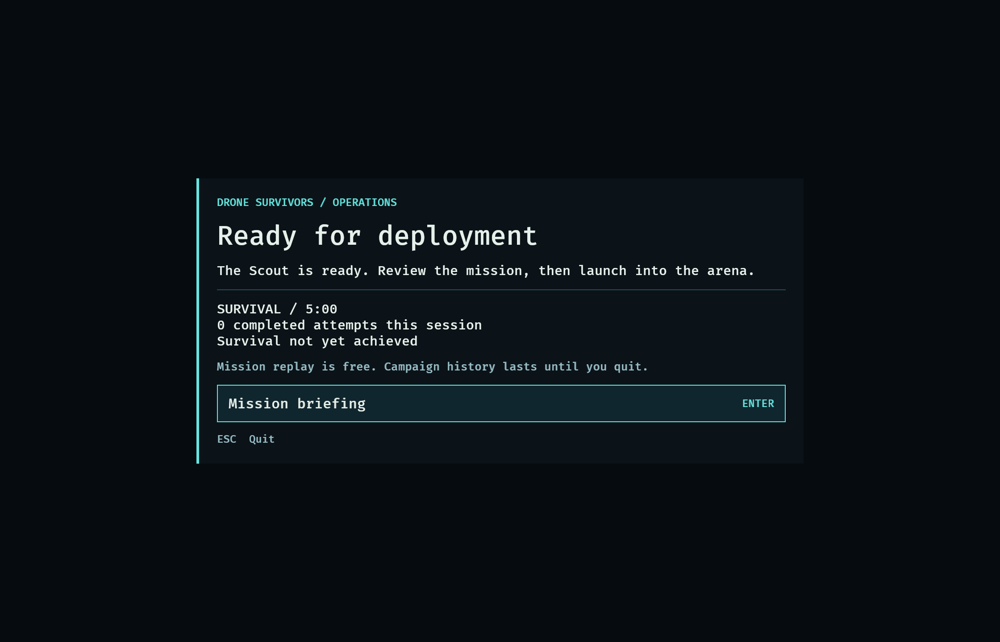
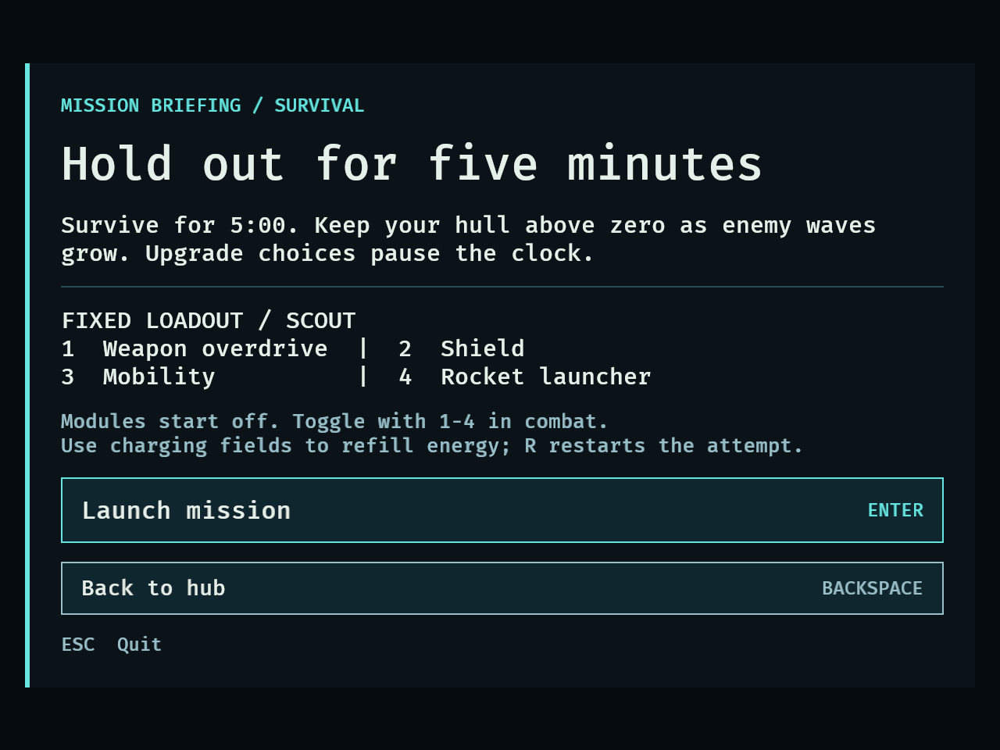
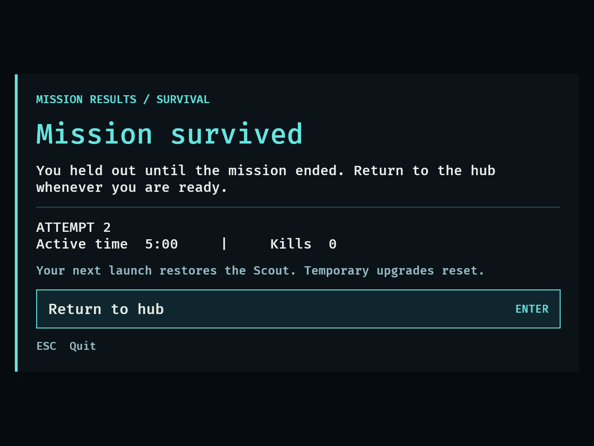
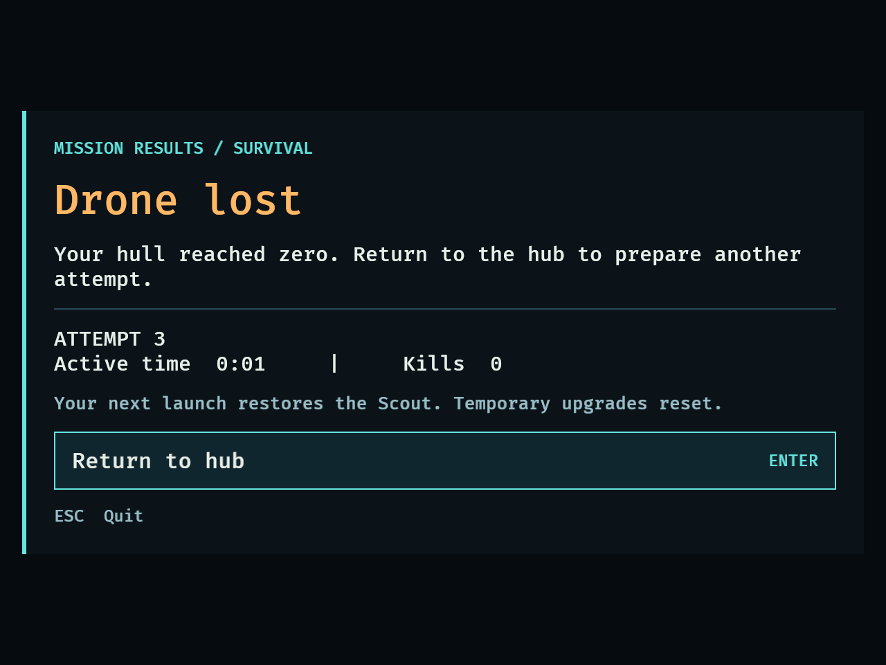

# DRO-13 — Mission lifecycle validation (September 13, 2026)

## Delivered behavior

Normal startup opens the hub. Enter/click opens briefing, with placeholder
narrative text and the fixed Scout/four-module loadout, then launches the existing
300-second survival encounter. Backspace/click returns from briefing. Success
and failure freeze the encounter and show a stable attempt/time/kill result;
Enter/click returns to the hub. Completed attempt history and prior success are
session-only. There are no rewards, save files, shops or campaign unlocks.

R restarts during combat or a choice and is ignored in hub/briefing/results.
Restart abandons the active attempt without completing it. Explicit transitions
restore all mission state and upgrade baselines without synthesizing R input.
Existing direct-combat validation modes keep their previous startup/restart flow.

## Automated validation

Baseline: **247 passed, 4 ignored**. Implementation at `5ef593e`:
**260 passed, 4 ignored**. After review corrections: **262 passed, 4 ignored**,
with formatting and strict all-target Clippy passing.
The four ignored balance diagnostics remain opt-in and unrelated to this change.

Commands (using the existing shared Cargo target cache):

```sh
cargo fmt --check
cargo test --locked
cargo clippy --all-targets --locked -- -D warnings
```

Tests exercise real gameplay plugins, including:

- Frozen hub and briefing, ignored menu R, and no stale wave bookkeeping.
- Fresh-input keyboard and mouse gating, including a reused button changing action.
- Clean launch and restart from choice; full dirty-state reset of hull/protection,
  flight/altitude/momentum/path, battery and power staging, modules/shield,
  charger reserves/recovery, weapon/rocket cooldowns, hazards, transients,
  wave/kill/timer state, XP/choices/derived stats and the exploration pickup.
- Fatal damage before simultaneous survival or pending choice; restart precedence.
- Choice pause at the deadline and resume without virtual-time catch-up.
- Exactly one result per completed identity, stable result snapshots, success
  retained after failure and no completion record for interrupted attempts.
- Menu routing, result presentation and stable menu entity counts over repeated cycles.

Initial four lifecycle tests failed before implementation. Additional regressions
caught hub wave bookkeeping advancing and zero hull opening a choice before the
terminal outcome; both were fixed and the tests passed.

## Review corrections

Independent whole-branch review found a warning-presentation edge case: a wave
warning spawned on the same frame that an earned choice opens could lose its
`Added<SpawnWarning>` visual setup while paused. Commit `b52ce61` initializes
new warning meshes/materials before the timer freeze, while preserving reset
and terminal cleanup suppression. A real-plugin regression reproduced the missing
mesh before the fix and passed afterward; it also checks a long pause/resume and
unchanged effect/protection feedback timers. All eight feedback tests pass.

The native label check was also hardened to require exactly one marked primary
label, nonempty text and visible geometry. Removing the label cannot silently
skip the assertion. The final full suite passes **262 tests**, with the same four
opt-in diagnostics ignored; formatting and strict all-target Clippy pass.

Independent focused rereview found both review items resolved with no remaining
concrete issues. Final native fixture reruns at both sizes also passed.

## Native fixture

Hardware: MacBook Pro, Apple M1 Pro, 16 GB; macOS 26.6.2. Development profile with
Bevy dynamic linking. Logical windows: **1120×720 and 640×480**; Retina captures
are 2240×1440 and 1280×960 respectively.

```sh
DRONE_CAPTURE_DIR=/tmp/dro13-normal cargo dev -- --validate missions
DRONE_CAPTURE_DIR=/tmp/dro13-compact DRONE_CAPTURE_MINIMUM=1 cargo dev -- --validate missions
```

Both complete native runs passed hub → briefing → back → briefing → launch →
choice → restart → success → hub → briefing → launch → failure → hub → briefing
→ launch. Final assertions confirmed two completed records, retained success,
and no previous result on the fresh launch. Screenshots were inspected for hub,
briefing and both outcomes, including visible primary actions at the minimum size.
Raw evidence: [normal](dro-13-normal.txt), [compact](dro-13-compact.txt).

This explicit fixture injects **50 XP**, sets encounter elapsed time to **300**,
and forces one zero-hull/Dead outcome. It tests lifecycle integration and native
presentation; **it does not demonstrate normal-play survival or balance**. Its
systems are installed only for `--validate missions`. Existing captures/environment
flags retain their opt-in semantics. Shortened runs report incomplete step counts.

The first native screenshots exposed a collapsed primary-label layout: its
computed width was zero despite correct text. A failing native width assertion
reproduced it. Giving the label its available flex space fixed the layout; both
full native runs passed with the assertion retained. Help uses supported ASCII
hyphens, and all fixed loadout entries fit without clipping at 640×480.

The existing Bevy/winit shutdown warning (`Skipped event Destroyed for unknown
winit Window Id`) appeared after successful exit. No gameplay/runtime error
occurred in the final complete fixture runs.

## Normal gameplay and mouse checks

The same development executable was copied into a temporary local macOS app
bundle for computer-use targeting, with the Rust library search path and an assets
symlink. The bundle used **no validation flags or gameplay overrides**; packaging
is not part of the repository change.

Observed at 1120×720:

1. Mouse opened briefing from hub and returned via Back to hub. R in hub did not
   launch. Enter opened briefing, and clicking Launch started clean combat.
2. Idle combat naturally earned an upgrade at about 27 active seconds, 13 kills,
   and 60 hull. R from that choice restored 300 seconds, 100 hull/energy, all
   modules off, full chargers, zero kills and all four choice opportunities.
3. The restarted attempt naturally earned the same early choice. Backspace
   skipped it and resumed. The stationary drone then naturally died: results
   displayed **attempt 2, 0:37 active time, 18 kills**.
4. R on results did nothing; the snapshot stayed unchanged. Clicking Return to
   hub showed **one completed attempt**, correctly excluding interrupted attempt 1.
5. Enter → Enter launched again with full baseline state. Pressing 1 enabled
   overdrive and drained energy normally, confirming prelaunch loadout locking
   does not disable in-combat module controls.

A natural five-minute win was not attempted for this lifecycle check. Success
transition/presentation is covered by deterministic integration tests and the
explicit native fixture; no new claim about encounter difficulty is made.

## Captures





