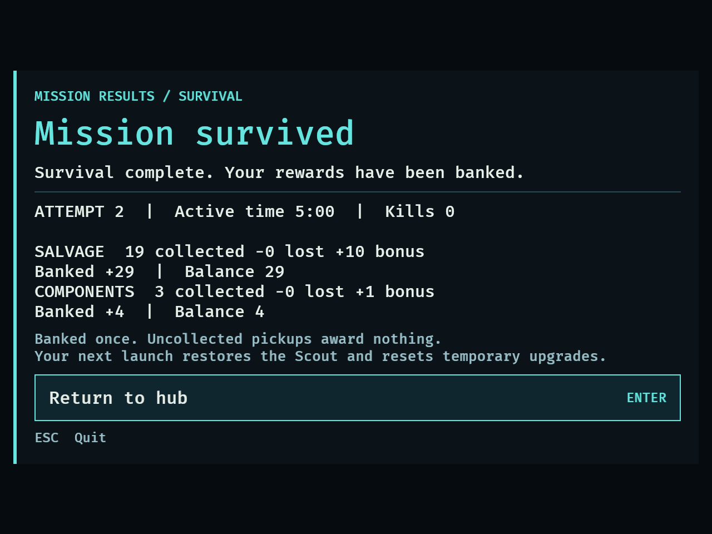
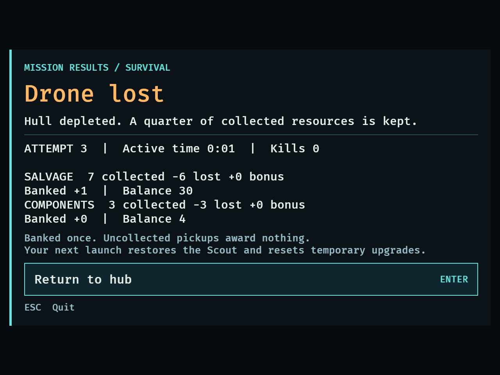
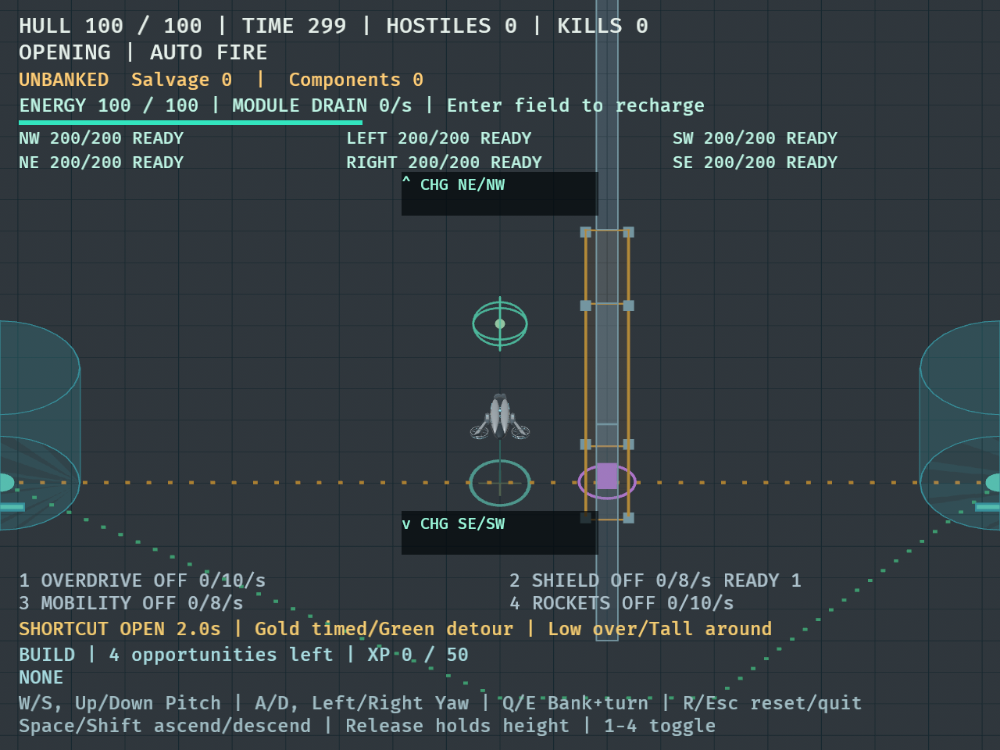
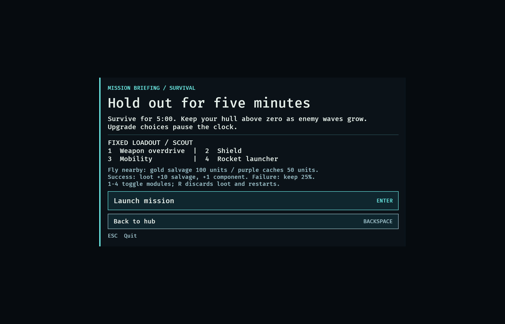

# DRO-14 resource economy — September 13, 2026

## Implemented and verified

Based on latest main `975fd8f`; implementation checkpoints `4739002`, `1e30492`,
and `19e404e`. Separate worktree/branch `codex/dro-14-resource-economy`.

- Whole-number salvage/components and a session-only bank starting at 0/0.
- Chaser 25% chance of 1 salvage, independent seeded loot RNG and per-type rules.
- Grounded, persistent salvage, 100-unit 3D attraction with solid-cover checks.
- Three once-per-attempt, 1-component caches with 50-unit 3D collection.
- Immediate once-only result banking: success collection +10/1, failure floor(collection/4).
- Replays pay normally; R discards collection; all pickups are cleaned at boundaries.
- Combat counter, hub balances, stable results breakdown, checked atomic spending.

## Automated evidence

`cargo fmt --check` passed. `cargo test --locked` passed **280 tests**, with four
existing opt-in diagnostics ignored (baseline: 262 passing). All-target locked
Clippy with `-D warnings` passed. No dependencies added.

New tests cover the 19/3 example (success 29/4, failure 4/0), zero collection and
quarter boundaries, exact/insufficient two-currency spending, credit/payout overflow
rollback and explicit receipts, duplicate settlement, multiple successful replays,
restart during choices, actual bullet/rocket/hazard death feeds, duplicate deaths,
mixed seeded drop sequences across reset, attraction and collection radii, ground
and low-cover projection, LOS, paused/terminal/reset frames, no expiry, cache
restoration, reachability and stable HUD/menu state.

The direct-combat fixture suite remains green. Economy is installed with the
mission lifecycle and does not change those legacy fixtures.

Independent accounting, runtime and whole-branch code reviews approved the work.
A minor request for a mixed seeded-sequence reset regression was implemented.

## Native environment and fixture

MacBookPro18,3, Apple M1 Pro / Metal, 16 GiB, macOS 26.6.2 (25G83), nightly Rust,
Cargo dev profile with Bevy dynamic linking. Logical sizes 1120×720 and 640×480;
Retina screenshots are 2240×1440 and 1280×960 respectively.

Commands (using a shared Cargo target directory for build reuse):

```sh
DRONE_CAPTURE_DIR=/tmp/dro14-native cargo dev -- --validate missions --seconds 40
DRONE_CAPTURE_DIR=/tmp/dro14-native DRONE_CAPTURE_MINIMUM=1 cargo dev -- --validate missions --seconds 40
```

Both fixtures passed all 32 steps: mouse-compatible/keyboard menu presentation,
launch, choice restart, success, failure, hub returns and fresh relaunch.
The success specimen used synthetic collection 19/3 and paid 29/4. The next
failure used synthetic collection 7/3 and added 1/0, leaving bank 30/4.
Relaunch retained the bank and reset unbanked collection to 0/0. These collection,
XP and outcome overrides are confined to the fixture; this is UI/lifecycle
validation, not a natural mission victory or a balance result.

Inspected hub, briefing, combat, success and failure captures at both sizes.
Text, buttons and reward lines fit at the minimum size. The purple passage cache
is visible and distinct from cyan chargers and the green XP pickup. Both runs
emitted a winit unknown-window `Destroyed` warning during clean shutdown after
PASS; no runtime panic or in-game rendering error occurred.

[Native logs](dro-14-native-results.txt)






## Ordinary mouse/keyboard smoke check

Ran the same native development executable without validation flags. A temporary
macOS app wrapper exposed it to UI automation, with `BEVY_ASSET_ROOT` explicitly
matching this worktree and the normal development Rust dylib path. The first
wrapper attempt omitted that asset root and could not load the Scout GLB; the
wrapper environment was corrected before the final ordinary-play check. No game
code change was needed (the normal `cargo dev` launch already sets the asset base).

- Mouse opened briefing; fresh Enter inputs launched the mission.
- A natural upgrade choice appeared after 13 kills around 27 active seconds.
- Backspace skipped the choice and W input approached ground loot.
- The ordinary run collected **1 salvage** and naturally failed at **0:37 / 18 kills**.
- Results showed salvage `1 collected -1 lost +0 bonus`, `Banked +0 / Balance 0`;
  components remained 0. This confirms collection plus failure rounding in native play.
- Enter returned to the hub showing exactly one completed attempt and bank 0/0.
- A further launch and R reset restored hull, time, XP, zero kills and unbanked 0/0.
- Closed the test app after the smoke check.

## Placeholder cache placement and limits

Cache centers are (-780,10,-1480), (780,10,1480), and (120,10,0).
The first two lie near the north/south spawn perimeter, far from the initial
position; the third is inside the electrical passage and requires low flight.
Whole-Scout clearance and the authored navigation graph establish connected
approaches to all three; real collection in the mission schedule grants each
once and reset restores exactly three. Their spacing and hazard/spawn exposure
are deliberate testing placeholders, not final map design.

The ordinary smoke check did not traverse both outer caches or complete a natural
five-minute victory. Full cache traversal is covered headlessly; native visual
coverage includes the passage cache. Resource/drop pacing and danger/reward
appeal remain provisional human playtest tuning. No saving, shop, passive tree,
new enemy types, or handcrafted campaign content was introduced.
