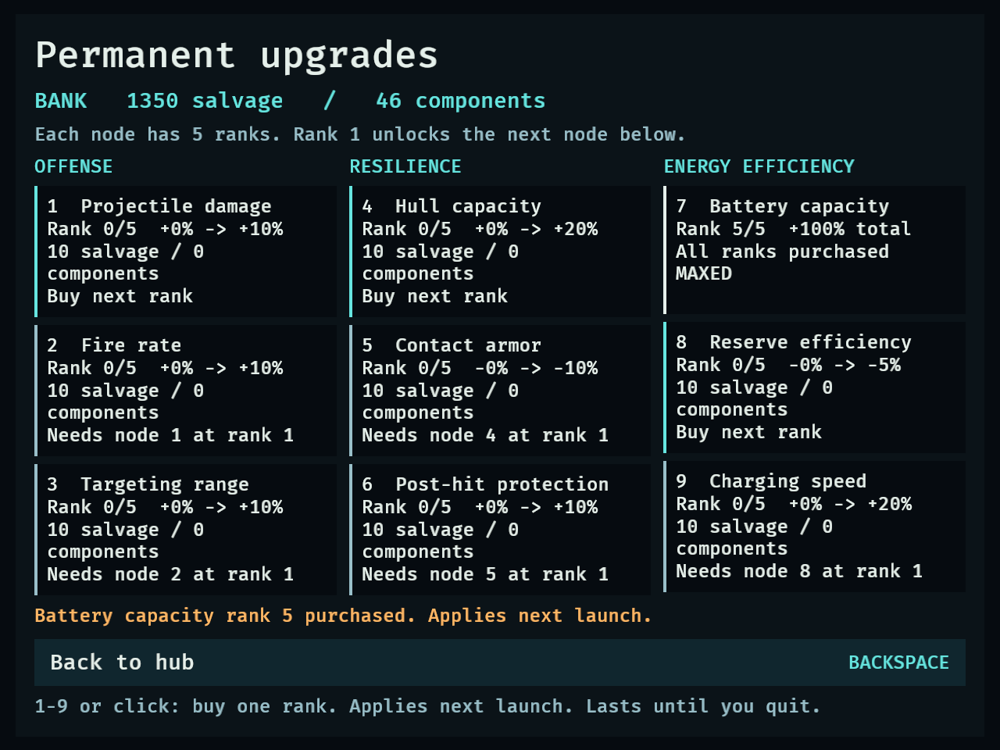
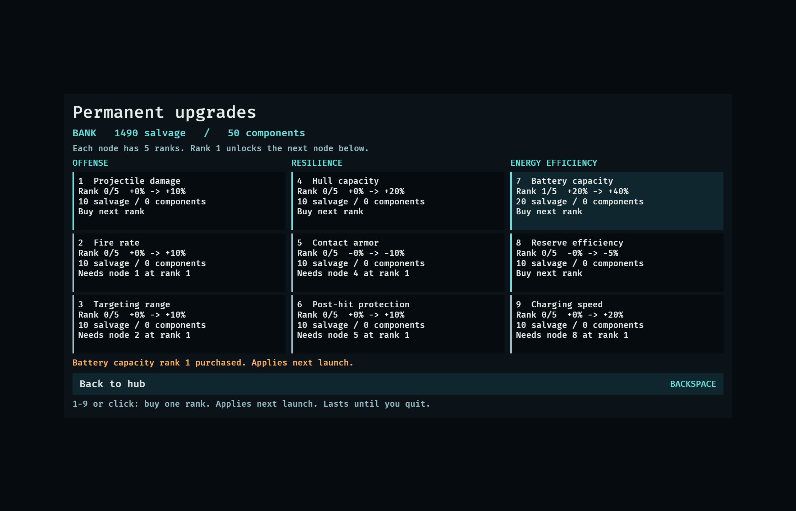
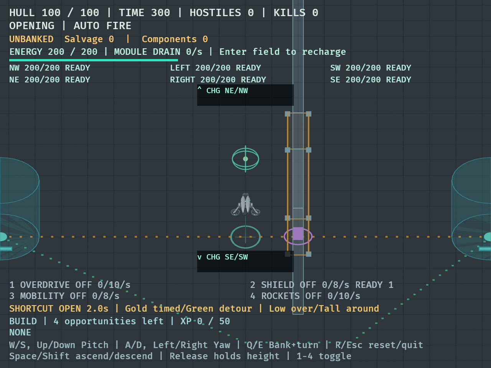

# DRO-15 permanent passive tree — September 14, 2026

## Implementation

Based on merged DRO-14 at main `41b1d10`, in isolated branch
`codex/dro-15-passive-tree`. Checkpoints: deterministic purchases `03fd20f`,
mission effects/charger efficiency `0f5295d`, purchase screen/fixture `137c9f1`,
native label correction `3b1a405`.

Nine distinct nodes have five ranks apiece. Buying rank 1 unlocks the next node
in that branch. Purchases atomically debit banked salvage/components, with
clear locked, unaffordable and maxed states. The hub exposes the screen with U;
1–9 or a mouse click buys one rank, and Backspace returns to the hub.

Permanent modifiers are derived from pristine tuning on every launch/restart;
temporary XP effects apply afterward. R clears temporary choices while owned
ranks and banked funds remain. Effects survive successful and failed attempts
and repeated launches. All nine nodes apply independently of optional loadout.

## Automated checks

Final code passed `cargo fmt --check`, `cargo test --locked --quiet` (**298 passed,
4 existing diagnostics ignored**), and `cargo clippy --all-targets -- -D warnings`.
Baseline was 280 passing tests. No dependencies were added. Independent read-only
review found no additional actionable defects; the rendering correction was
reviewed separately after native verification.

Coverage includes exact affordability, both insufficient-currency paths, missing
prerequisites, rank-one unlock, all five ranks and cap rejection with unchanged
wallets, branch independence, additive bonuses, mission reset/replay composition,
actual projectile targeting/hits, armor versus hazard damage, invulnerability,
charger conservation at depletion/full battery/overlapping source boundaries,
long versus split frames, keyboard/mouse held input and multiple simultaneous
requests, phase restrictions, and screen copy/visibility.

## Fixed encounter comparison

Command: `cargo test --locked passive_fixed_encounter -- --nocapture`.

Both drones have **no optional modules**, identical stationary enemy placements,
and a fixed 60 Hz update. These are controlled mechanical comparisons, not a
human survival/balance verdict. Offense runs for 12 seconds against six enemies
with 100 hull each; contact exposure is a separate four-second fixture.

| Measurement | Base drone | All nine nodes at rank 5 |
| --- | --- | --- |
| Enemies destroyed in 12 seconds | 2 | 5 |
| Remaining combined enemy hull | 360 | 100 |
| Hull lost during four seconds of contact | 60 | 20 |
| Player hull after contact | 40 | 180 |

The energy tests independently verify 25 energy costs 18.75 reserve at rank 5,
and 15 remaining reserve delivers exactly 20 energy before depletion. With a
full battery and an active 10 energy/s module, two seconds consume 15 reserve.

## Native evidence

Native macOS / Apple M1 Pro / Metal, using `cargo dev` with Bevy dynamic linking.
Both 1120×720 and 640×480 logical sizes passed all 38 fixture steps. Retina
captures are respectively 2240×1440 and 1280×960 pixels.

```sh
DRONE_CAPTURE_DIR=/tmp/dro15-native-final cargo dev -- --validate passives --seconds 45
DRONE_CAPTURE_DIR=/tmp/dro15-native-final DRONE_CAPTURE_MINIMUM=1 cargo dev -- --validate passives --seconds 45
```

A shared Cargo target directory was used for build reuse. The fixture explicitly
seeds 1500 salvage/50 components, injects XP/Interceptor and sets the success timer.
It covers empty/locked rejection, a synthetic mouse interaction through normal
purchase input, keyboard purchases up to rank 5, cap rejection, hub/briefing/launch,
temporary capacity stacking, R reset, success settlement and persistent ownership.
This is UI/lifecycle evidence, not naturally earned resources or mission success.

Five battery ranks spend 150 salvage/4 components, leaving 1350/46. Capacity is
100 in the hub before launch, 200 after launch, 150 with temporary Interceptor,
and 200 after restart. The synthetic success adds 10/1, leaving 1360/47 and
retaining battery rank 5 when reopening the tree.

The initial native capture caught labels with zero computed width despite valid
card geometry. A native text-size assertion reproduced it. Explicit label width
and flex growth corrected the issue; both final runs pass card and label geometry
assertions, and screenshots were inspected. Both runs report only the existing
winit unknown-window `Destroyed` warning during successful shutdown.

[Raw test and native output](dro-15-results.txt).





## Ordinary mouse/keyboard smoke check

Ran the same development executable without validation flags in a temporary
macOS app wrapper, with this worktree as BEVY_ASSET_ROOT and the Rust development
dylib path. The wrapper adds no game overrides.

- Mouse opened Permanent upgrades from the normal zero-balance hub.
- Clicking locked Fire rate displayed the Projectile damage rank-one prerequisite.
- Pressing 7 rejected the unaffordable battery purchase; bank and all ranks stayed zero.
- Backspace returned to the hub; two fresh Enter presses opened briefing and launched.
- Key 1 activated overdrive, with 10 energy/s drain visible in the HUD.
- R reset restored hull/energy to 100, zero kills, and all modules off.
- Stopped the temporary smoke-check process afterward.

## Limits and next steps

Rank prices and percentages are provisional and need natural campaign economy
playtests. The fixed encounter uses stationary targets to isolate mechanical
changes; it is not a five-minute survival comparison. Disk persistence remains
DRO-18: quitting clears ranks and balances. No refunds, module purchases or
loadout editing are included. UI purchase behavior, effect persistence and clean
temporary resets are complete for this chunk.
