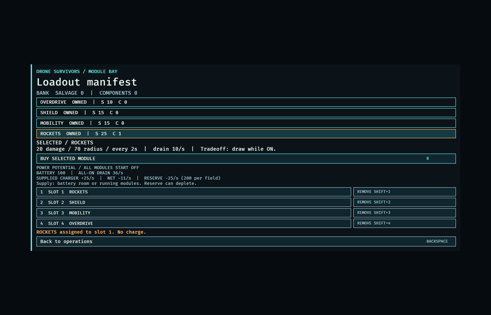
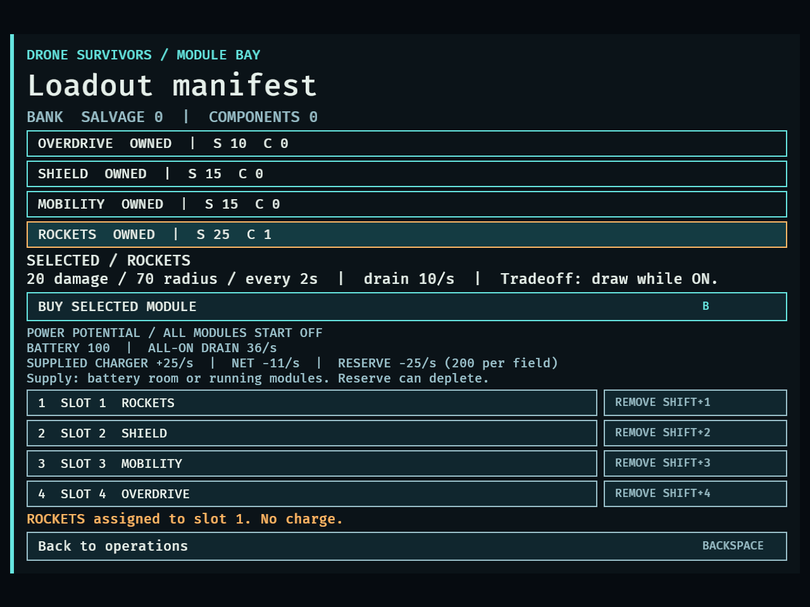
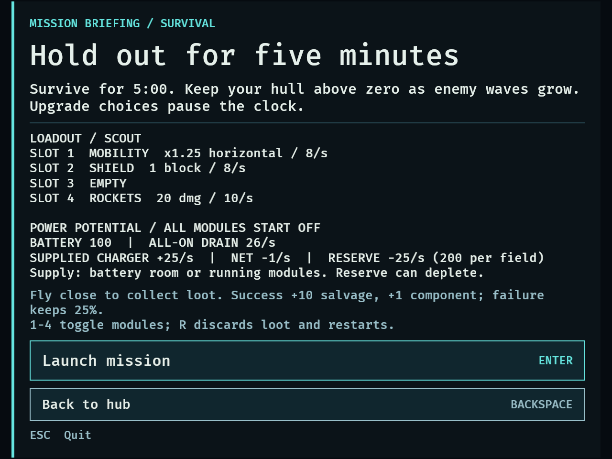
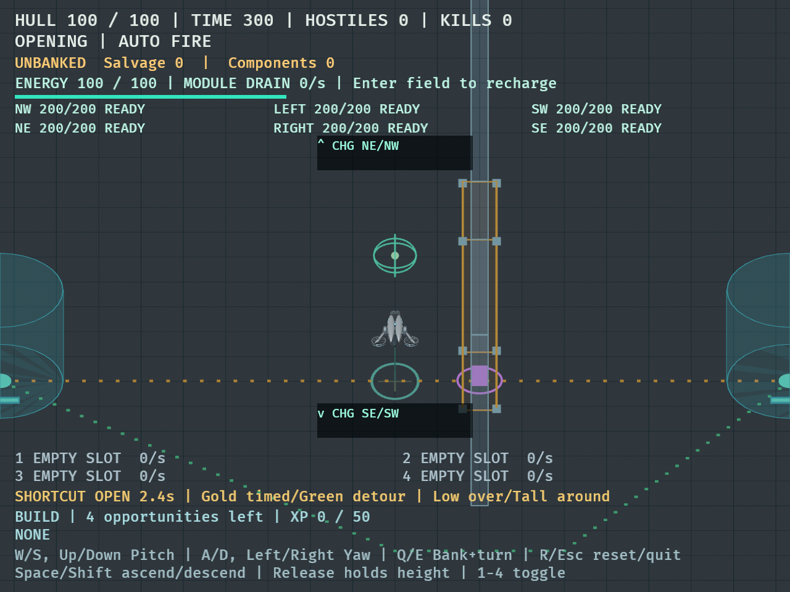

# DRO-16 module shop and loadout — September 14, 2026

New campaigns have no owned modules and four empty slots. All four existing types
are available immediately at the agreed provisional salvage/component prices:
Overdrive 10/0, Shield 15/0, Mobility 15/0, Rockets 25/1. Purchases use banked
resources atomically and do not auto-equip. Assignment, moving, replacement and
removal are free; replaced/removed modules stay owned. Empty launches are valid.

## Automated rules and integration

- `cargo fmt --all --check`: passed.
- `cargo test --locked`: **323 passed, 0 failed, 4 ignored**. The four ignored
  diagnostics predate this change. Baseline was 298 passed and 4 ignored.
- `cargo clippy --all-targets --locked -- -D warnings`: passed.
- Independent inventory, mission integration and whole-feature code reviews
  found no remaining functional issue. Native layout defects found below were
  fixed before delivery.

Tests cover exact affordability, insufficient either currency, duplicate purchase,
no automatic equip, unowned and invalid-slot rejection, all four positions,
move/replace/remove invariants and corrupted ownership validation. Mission tests
exercise held keys, simultaneous buttons, phase gating, paused XP/waves, empty
launch, reordered equipment, active-attempt snapshot through R/choice restart,
results/replay persistence, and updated equipment on the next fresh launch.

The power preview uses the captured pristine baseline plus campaign passives.
A test dirties old energy capacity/recharge and all module drains, then confirms
preview and fresh launch still agree: one rank each in Battery/Reserve/Charging
with all modules equipped gives 120 capacity, 36/s all-ON drain, 30/s charger
supply and -6/s supplied net. Existing direct-combat fixtures keep all four
prototype modules; their tests remain in the full passing suite.

## Native fixtures

Both commands completed all 47 steps, including nonzero geometry for every one
of the 16 shop control labels and viewport bounds checks for menu text:

```sh
DRONE_CAPTURE_DIR=/tmp/dro16-native-final cargo dev -- --validate shop --seconds 40
DRONE_CAPTURE_DIR=/tmp/dro16-native-final DRONE_CAPTURE_MINIMUM=1 cargo dev -- --validate shop --seconds 40
```

The validation runs used the shared Cargo target cache; that changes no game
behavior. The fixture begins at the normal hub with an empty bank, verifies a
rejected purchase, then injects **65 salvage and 1 component**. It clicks the real
Buy button's Interaction and uses the ordinary keyboard menu paths for the
remaining purchases and edits. Buying all four spends exactly 65/1; buying an
owned type changes nothing. The full arrangement is Rockets / Shield / Mobility /
Overdrive. Removing Mobility and moving Rockets into Overdrive's slot, then
equipping Mobility in slot 1, yields **Mobility / Shield / Empty / Rockets**.
The bank remains 0/0 through these edits.

Briefing shows that arrangement, 100 battery, 26/s all-ON drain and -1/s net with
25/s charger supply. Launch and R restart use exactly those slots with all modules
OFF. Synthetic completion at 300 seconds banks the normal 10/1 objective bonus;
the shop retains ownership and arrangement. Removing all modules allows another
launch with four empty slots and zero module drain.

Initial screenshots exposed collapsed button labels despite nonempty Text
components. Explicit flex widths for labels and fixed widths for shortcut labels
resolved it; the native fixture now catches collapsed labels. The compact
briefing initially extended above the window; 13px body text and shorter notes
fit the full content. ASCII `x` and `SHIFT+1` replace missing font glyphs. Both
hub shop buttons now hide outside the hub. Final screenshots were inspected:






[Raw fixture and test results](dro-16-results.txt).

## Ordinary mouse/keyboard check

The native development executable was also launched without validation flags,
using a temporary macOS app wrapper solely to expose its window to computer-use
controls. M opened the shop. Mouse selection of Shield updated its effect/price;
clicking Buy with 0/0 showed insufficient funds. Pressing 1 rejected equipping
the unowned Shield and left all slots empty. Backspace returned to the hub;
briefing displayed four empty slots, and clicking Launch entered combat.

With no modules, ordinary automatic fire earned 13 kills and the first XP choice
around 27 seconds; the HUD showed 60 hull, 100 energy and zero module drain.
R from that choice restored 100 hull and the four empty slots. Pressing 1 with an
empty slot left module drain at zero. The manual playtest was then closed.

## Limits and next steps

The native fixture's funds and success time are synthetic, so these results do
not establish a balanced earning/purchase pace or a natural mission victory.
Prices, module balance and progression pacing need later human balance
playtesting, as agreed. Ownership and loadout last for the application session;
disk saves remain DRO-18. No new module effects or mission unlock gates were added.
