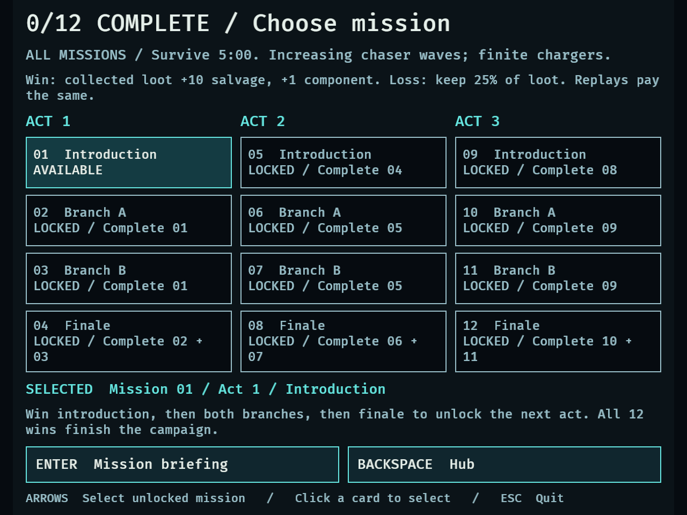
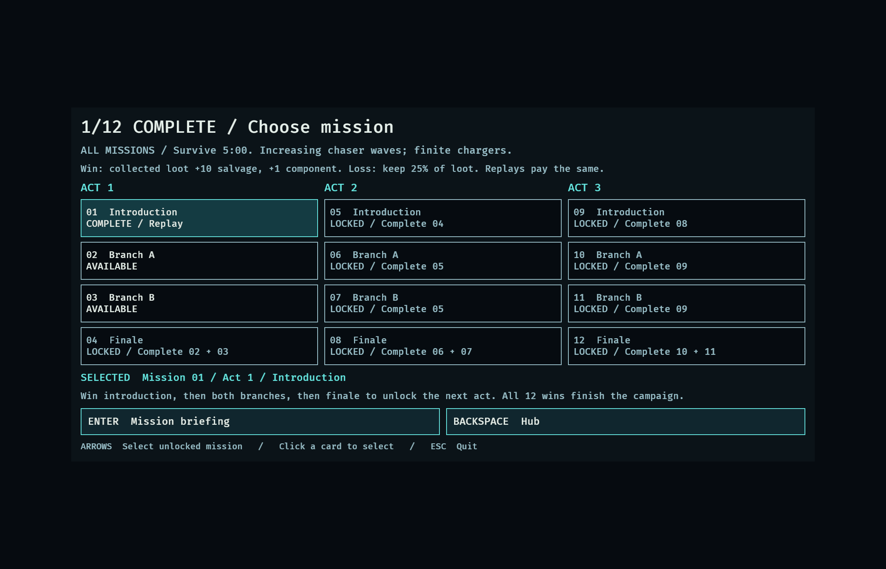
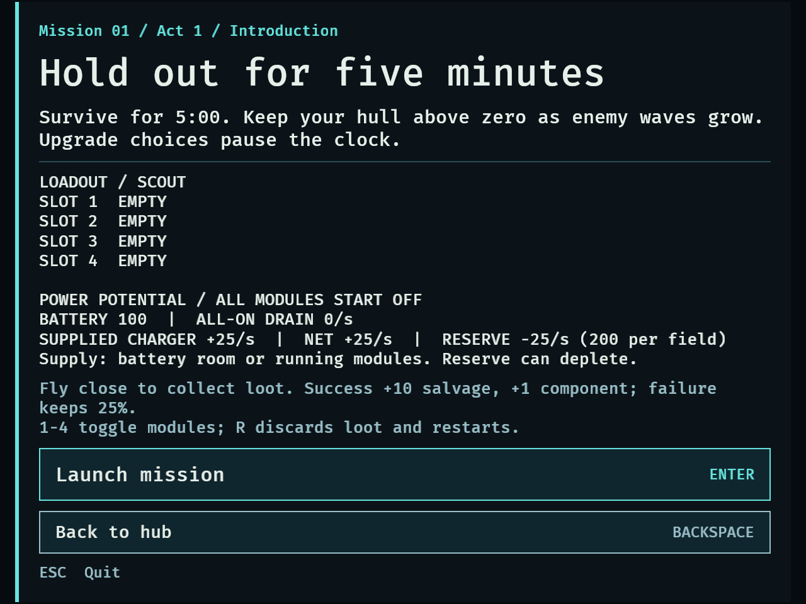
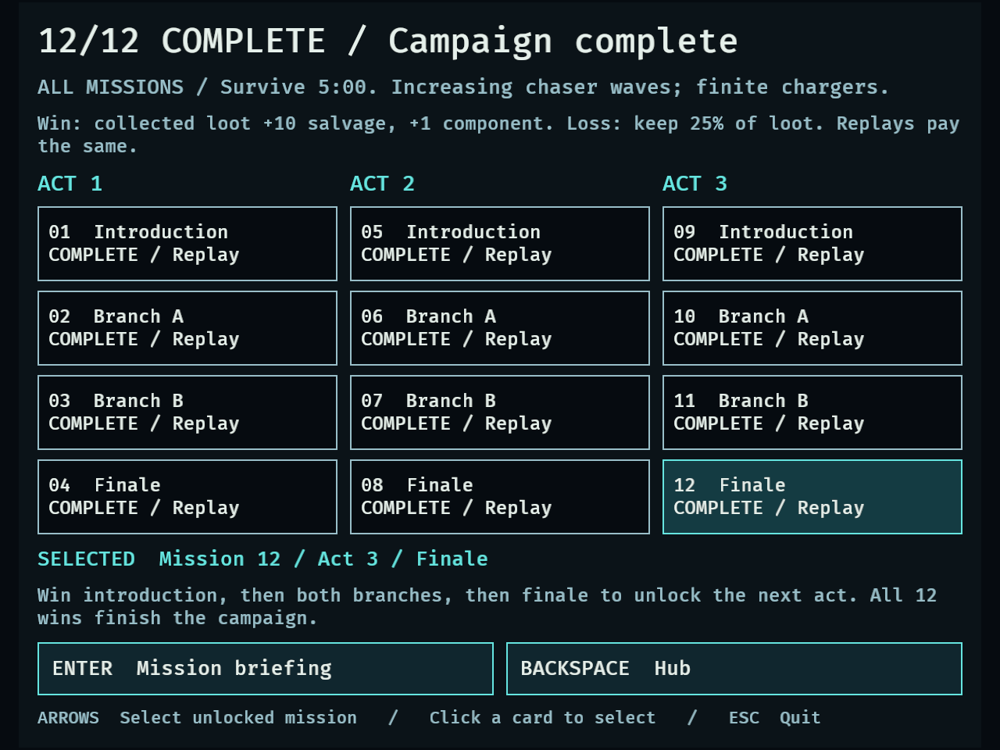
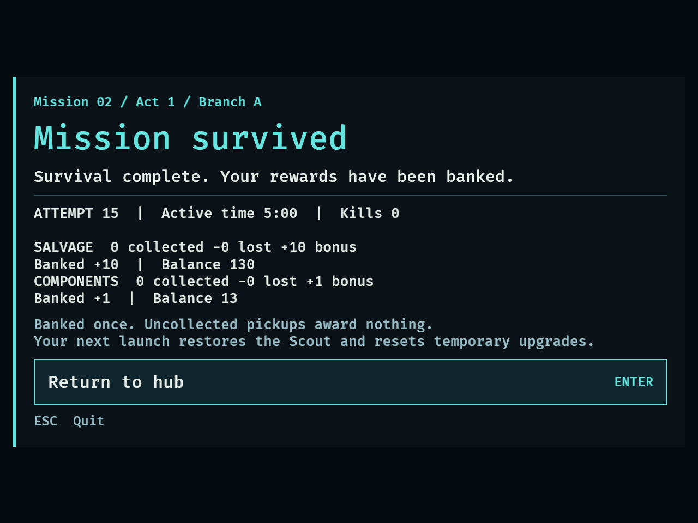

# DRO-17 campaign selection evidence — September 15, 2026

## Delivered behavior

Twelve individually identified missions share the existing arena and 300-second
survival encounter, with identical waves, hazards, chargers, XP and rewards.
Three acts follow introduction → both branches in either order → finale; the
finale opens the next introduction. Twelve distinct successes complete the
campaign. Unlocked missions remain freely replayable after completion.

Hub C / Choose mission opens the catalog; arrows cycle unlocked entries; mouse
cards select; locked cards explain prerequisites. Enter opens briefing, then
launches on a fresh press. Backspace returns to hub. Briefing/results identify
the mission. Results use active mission snapshots; R preserves mission/loadout
while creating a fresh attempt. Failures/restarts cannot unlock or erase progress.
All campaign state remains in memory until quit.

## Automated checks

- `cargo fmt --check`: passed.
- `cargo test --locked`: **330 passed, 0 failed, 4 existing opt-in diagnostics ignored**.
- `cargo clippy --all-targets --locked -- -D warnings`: passed.
- Baseline before changes: 323 passed, four ignored.

[Full test output](dro-17-tests.txt), [Clippy output](dro-17-clippy.txt).

New tests cover both branch orders in all acts, premature finale/next-act locks,
all-12 distinct completion, replay rewards, failure, interrupted attempts, active
versus selected mission identity, locked launch, held/multiple inputs, mouse
actions, menu pause and visibility, completion copy, and fixture option parsing.
Existing economy, passive, loadout, flight and combat suites remain green.

## Native fixture

```sh
DRONE_CAPTURE_DIR=/tmp/dro17-captures DRONE_CAPTURE_MINIMUM=1 DRONE_CAMPAIGN_REVERSE=1 cargo dev -- --validate campaign --seconds 100
DRONE_CAPTURE_DIR=/tmp/dro17-captures cargo dev -- --validate campaign --seconds 100
```

Both passed. Compact 640×480 uses reverse branch order in all acts; 1120×720 uses
forward order. Each traverses all 12 launches/results, exercises a rejected locked
card and initial R restart, then fails and wins a replay after campaign completion.
Both end in the hub with **12 distinct wins, 14 result records, 130 salvage and
13 components**. First result attempt ID 2 proves the interrupted attempt was not
recorded. Native checks require all 14 catalog/action labels to have nonzero
text dimensions, and keep every rendered text node inside the viewport at each
capture. Relative action timing plus explicit neutral frames prevents stalled
frames from skipping required input releases.

The first screenshot exposed collapsed button text; explicit text width fixed it.
The new native label assertion reproduced the defect before the fix. Captured
initial locks, available branches, compact briefing, completed campaign and
replay results were visually inspected. Logs contain only a macOS window teardown
warning after PASS; no gameplay or assertion failure.

[Compact native log](dro-17-native-640x480.txt),
[Standard native log](dro-17-native-1120x720.txt).







## Ordinary mouse/keyboard check

The same development binary was also opened without validation arguments through
a temporary local macOS app wrapper so computer-use tools could address its window.
The wrapper supplied the Rust dynamic runtime and repository assets; it is not
part of the game or PR. No funds, XP, outcomes or campaign progress were injected.

Verified physical mouse hit-testing on Choose mission, a locked finale, an
available mission card and Launch; C and arrow/Enter navigation; selected mission
identity in briefing; and ordinary combat with the Scout model loaded. The locked
mission 12 remained unselected and displayed Complete 10 + 11. During ordinary
combat the HUD reached 90 hull, five kills and 20 XP; R returned it to 100 hull,
zero kills/XP and approximately 299 seconds remaining at the next screenshot.
The smoke app was closed with Escape.

## Review and limits

Independent read-only review found no actionable feature defect. Fixture review
identified absolute-deadline timing and a weak restart assertion; both were
corrected and rerun. The native fixture injects success timers/fatal hull and
button Interaction values. It validates production routing/finalization and
layout, not natural combat survival or physical mouse hit-testing; the ordinary
check above covers the latter separately.

No natural 12-mission campaign completion or new balance claim is made. Identical
placeholders total 60 successful active minutes before pauses/retries; authored
maps/objectives and the eventual roughly 90-minute target remain future work.
Disk save/resume remains DRO-18. The user's identical-content direction explicitly
supersedes the original ticket's different-demands acceptance wording.
