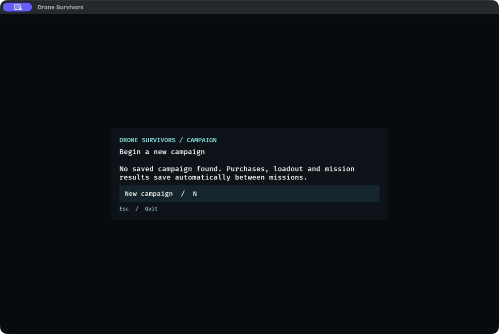
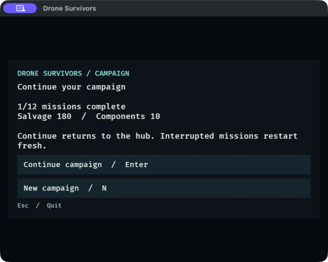
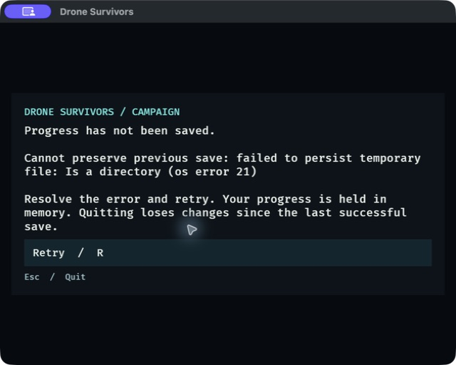
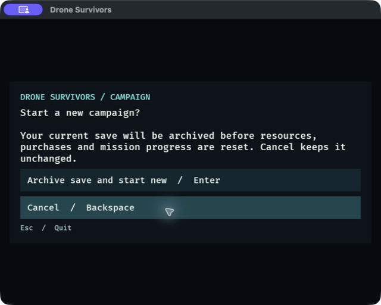
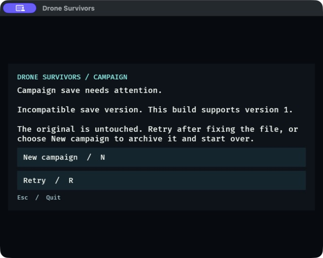

# DRO-18 campaign save/resume evidence — September 15, 2026

## Delivered behavior

One versioned JSON slot persists resources, passive ranks, owned modules,
four-slot loadout, completed missions, selected mission and settled attempt
history. Continue returns to the hub; no active result, loot, entities or
run-local upgrades are restored. Permanent changes and results autosave together.

New Campaign requires a fresh confirmation when a slot exists or is invalid.
Cancel preserves the existing bytes. Confirmed replacement archives the original
under a unique name before resetting. Ordinary writes keep the previous snapshot,
use a synced temporary file and atomic rename, and detect another instance's
changes under a filesystem lock. Invalid/unsupported saves never autosave.
Read/write errors expose retry and preserve the original; unsaved transactions
block further progression until committed. Retry does not re-run a purchase or
reward transaction.

## Automated evidence

- Baseline: 330 passed, four existing ignored diagnostics.
- `cargo fmt --check`: passed.
- `cargo test`: **343 passed, 0 failed, four existing ignored diagnostics**.
- `cargo clippy --all-targets --locked -- -D warnings`: passed.
- `git diff --check`: passed.

[Full test output](dro-18-tests.txt), [Clippy output](dro-18-clippy.txt).

Thirteen new tests cover permanent-state round trips, all missions and maximum
passive ranks, malformed/future schemas, invalid mission IDs/prerequisites,
passive prerequisites/ranks, unowned/duplicate loadouts, failed replacement,
previous-save retention, invalid-file archiving, file locking/stale readers,
mission-result reload/replay without double credit, interrupted loot, purchases,
module edits, selection, fresh confirmation, cancel, recovery and retry.

Independent read-only code review inspected the complete storage/runtime/UI diff
and reported no actionable findings. Native UI checks were performed separately.

## Native application checks

Built with `cargo dev`, using an isolated `/tmp/dro18-native/campaign.json`.
A temporary macOS app wrapper provided the same executable, Rust dynamic runtime
and repository assets so computer-use tools could address the window. The wrapper
and test saves are not shipped. Standard validation modes install no persistence.

Observed using physical mouse and keyboard input:

1. Missing slot shows New Campaign; mouse click creates the slot and opens hub.
2. Quit, then seed **200 salvage, 10 components and mission 01 complete** in the
   isolated fixture. This is synthetic setup, not combat/balance evidence.
3. Continue, purchase Damage rank 1, purchase Overdrive, equip slot 3, select
   mission 02, and quit. File inspection: **180 salvage, 10 components, Damage 1,
   owned Overdrive in slot 3, mission 01 complete, mission 02 selected**.
4. Reopen the actual application: Continue displays the persisted progress and
   balance; mouse Continue and keyboard briefing show mission 02 and slot 3.
5. Resize to **640×480 content size**. Continue, confirmation, recovery and hub
   remain legible; controls are inside the window. Images include the title bar.
6. Replace the previous-save path with a test directory to force a write error;
   purchase Damage rank 2. The error overlay blocks Enter, and the disk still has
   180 salvage/Damage 1. Remove the obstacle and click Retry: purchase screen and
   disk show **160 salvage/Damage 2**, charged exactly once.
7. Open campaign menu, request New, then click Cancel. Quit and verify the same
   160 salvage/Damage 2 save remains intact.
8. Substitute an incompatible version-99 fixture. Reopen at 640×480: a clear
   recovery message appears, Retry keeps it untouched, and New then fresh Enter
   creates an empty campaign. Verify an archive contains the **exact original
   version-99 bytes**, while the active slot has empty purchases/progress.
9. Quit the test application with Escape.

## Limits and follow-up

No mid-mission persistence, cloud sync, multiple save slots or schema migration.
The native fixture checks UI and real process restart; reward replay/deduplication
uses deterministic ECS tests with synthetic outcomes. Hard power loss and physical
disk failure were not reproduced; synced file/atomic rename plus failure tests
cover the intended storage boundary. The 16 MiB limit bounds reads; oversized or
unreadable files require manual repair/moving before recovery. Archives are kept
for the player to manage. No known blocking defect remains.
