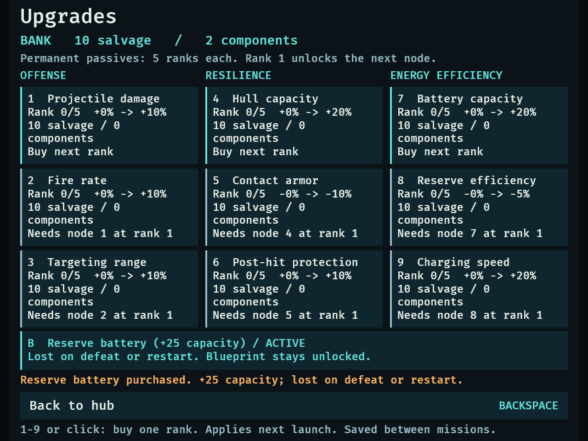
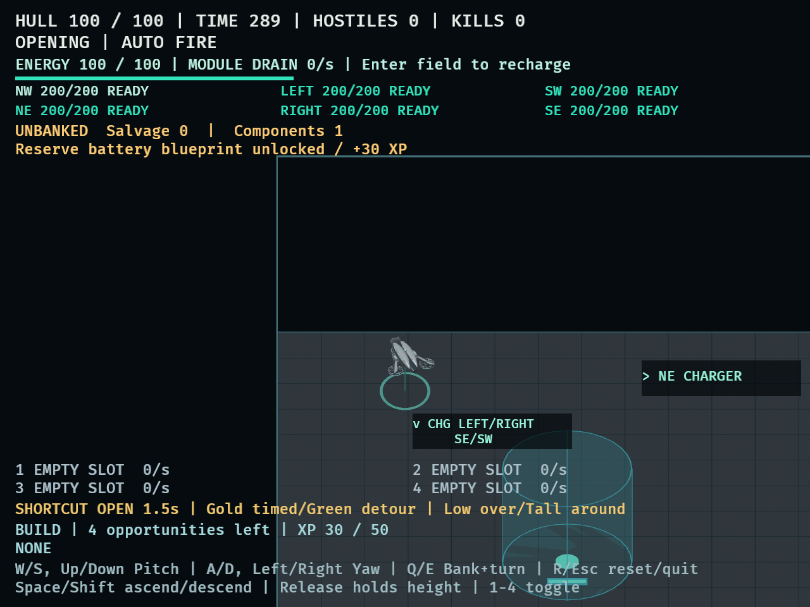
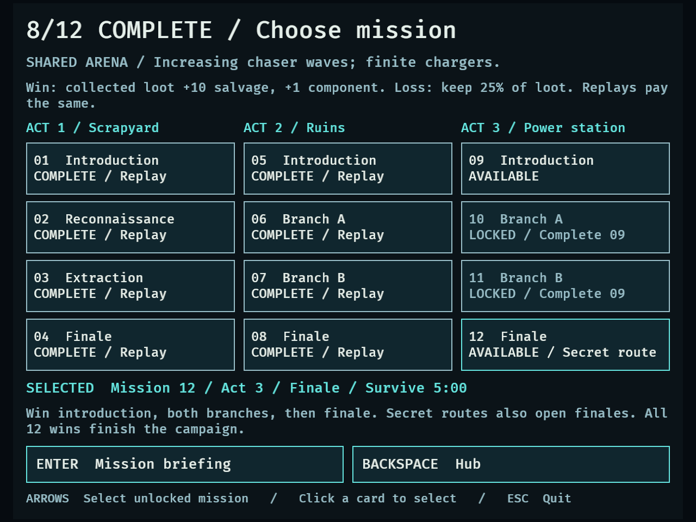
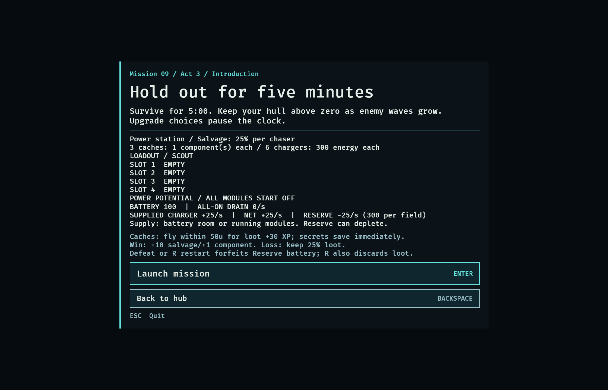
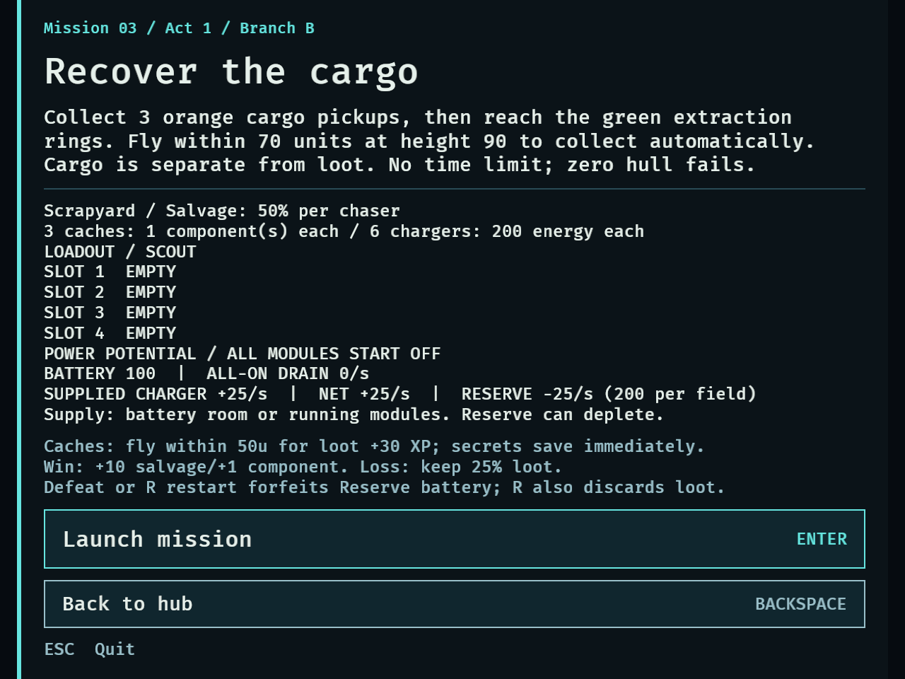

# DRO-20 — Exploration, regions, and secrets

## Delivered behavior

The arena retains its terrain, passages, objectives, six charger locations and
three cache locations. Reusable center/north/south content pieces supply the
charger pairs and cache sites. The selected act sets its resource profile:

| Region | Chaser salvage | Cache components | Charger reserve |
| --- | --- | --- | --- |
| Scrapyard | 50% chance of 1 | 1 | 200 |
| Ruins | 25% chance of 1 | 2 | 200 |
| Power station | 25% chance of 1 | 1 | 300 |

Each optional cache awards 30 XP once per attempt. Northwest discovers the
Reserve battery blueprint; southeast discovers access to that act's finale.
Both discoveries persist immediately. No mission is marked complete by a
secret, and the ordinary campaign path remains available.

Reserve battery costs 20 salvage and 1 component in Upgrades (U, then B), adds
25 battery capacity, and survives wins and application reloads. Defeat or R
restart forfeits the purchase. The blueprint remains available for repurchase;
ordinary passives and modules remain permanent. R otherwise retains the prior
abort behavior, including discarding attempt loot without recording a result.

## Automated verification

- `cargo fmt --check`: passed.
- `cargo test --locked`: 378 passed, 4 existing ignored probes, 0 failed.
- `cargo clippy --all-targets --locked -- -D warnings`: passed.
- New rules were first exercised with failing tests (region drop configuration,
  swept-cache XP, secret interfaces, and module-shop region preview), then
  verified after implementation.

Coverage includes collection/XP idempotence, swept crossings and line of sight,
paused/terminal/reset precedence, full resource counters, reachable unchanged
sites, region switching in both directions, exact payment/insufficient funds,
duplicate purchase, success retention, defeat/restart loss, repurchase, and
capacity composition. Existing normal campaign tests still cover all 12 wins.

Disk-backed integration tests collect actual caches during Playing and Choosing,
reload their blueprint/route without banking attempt loot, and exercise immediate
restart forfeiture and retry after failed writes. Legacy version-1 saves default
to undiscovered state. A separate test wins and reloads all three secret finales
without completing their branches, checks next-act access, and confirms the
campaign is still incomplete.

## Native verification

Commands (run from the feature checkout with the shared Cargo target directory):

```sh
DRONE_CAPTURE_DIR=/tmp/dro20-compact DRONE_CAPTURE_MINIMUM=1 cargo dev -- --validate exploration
DRONE_CAPTURE_DIR=/tmp/dro20-normal cargo dev -- --validate exploration
```

Both sizes passed the expanded fixture, including an actual Backspace Skip after
collecting two caches for 60 XP in one attempt. All captured text bounds stayed
inside the viewport. Native frames were visually inspected for readable menus,
region resource summaries, purchase feedback, in-world reward notices and secret
route status.

- [640x480 native output](dro-20-native-640x480.txt)
- [1120x720 native output](dro-20-native-1120x720.txt)
- [Automated tests](dro-20-tests.txt), [strict Clippy](dro-20-clippy.txt)






The additional `cargo dev -- --validate objectives` run at 640x480 exposed a
cargo-briefing overflow after the new resource text was added. Smaller menu
fonts below 600 logical pixels fixed it. The rerun passed reconnaissance and
cargo flows, including premature exits, restart, failure and success. Font
sizes restore when the window grows. [Objective output](dro-20-objectives-640x480.txt).



Independent source reviews of durable state, the whole branch, and the compact
typography correction found no actionable issues.

## Evidence limits

Native fixtures disable authored enemy waves and do not install SavePlugin or
read/write the user's campaign. The northwest discovery uses production keyboard
flight from the regular launch position, with real movement, terrain and cache
collection. Later cache positions, prior-act completions, purchase funds,
survival elapsed time and fatal hull are explicitly synthetic setup. The
fixtures exercise production input, resources, purchase, collection, results,
and rendering. Disk persistence is verified by isolated temporary-file tests.
These checks establish navigation, rules and presentation; the provisional
resource values still need human combat-balance playtesting in the vertical slice.
