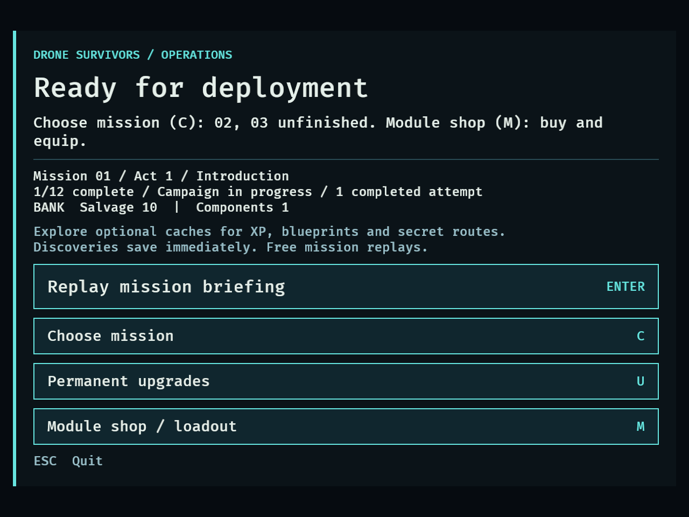
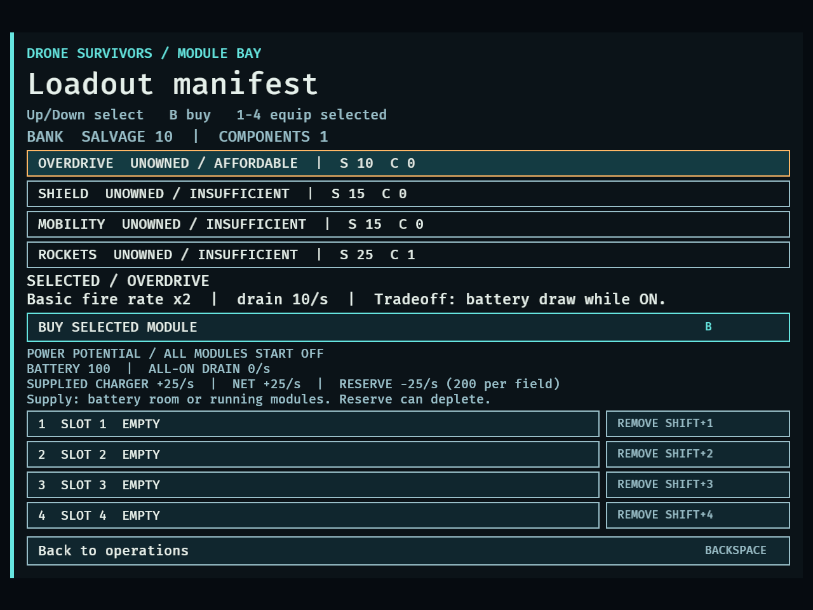
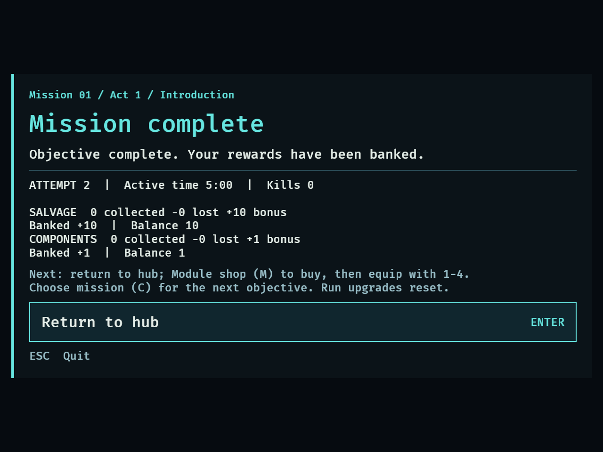
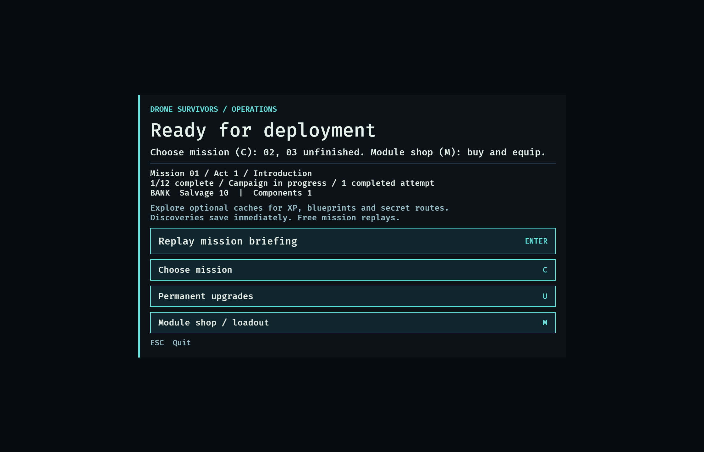

# DRO-21 — Two-mission vertical slice

## Scope and gate status

The user explicitly deferred human validation on September 15, 2026. Linear was
revised before implementation. This delivery demonstrates the existing first two
missions with production combat, rewards, purchases, loadout changes and saves.
Placeholder geometry and the bounded catalog remain in place.

**Agent implementation checks pass. Human acceptance remains pending.** Nothing
here establishes uncoached usability, enjoyment, balanced human difficulty or
perceived power. Content expansion remains gated on the later human playtests.

## Largest concrete progression issue and fix

Before this change, winning Mission 01 and following Return to hub → Enter
opened Mission 01’s briefing again. Its label did not identify it as a replay; neither
results nor the hub explained the reward → purchase → equip → next mission path.
The module shop also omitted its Up/Down selection and 1-4 equip instructions.

- The hub now names unlocked unfinished missions and points to the module shop.
- Completed selections say **Replay mission briefing**.
- Successful results direct players to buy, equip and choose their next mission.
- The module shop shows **Up/Down select · B buy · 1-4 equip selected**.

Selection, free replays and the choice between branches remain explicit. The
regression test failed on the old presentation and passed after the change.
[Before-fix failure](dro-21-regression-before.txt).

## Agent campaign runs

Run from the feature checkout:

```sh
cargo test --locked vertical_slice_probe -- --ignored --nocapture
```

The opt-in test runs three independent fresh campaigns: an empty-loadout control,
then two purchase/equip loops. Each starts at zero funds with no owned modules.
The headless app uses production world geometry, flight, waves, enemies, damage,
weapons, energy, upgrades, pickups, objectives, mission transitions and SavePlugin.
It advances fixed 1/30-second frames faster than real time and uses keyboard
press/release edges. It never sets success, funds, hull, invulnerability, XP,
objective progress, spawn configuration or player position. There is no rendering
performance measurement. The agent reads exact positions and has a planned route;
this is not an unfamiliar player discovering the controls or map.

**Mission 01:** a continuous southern circuit avoids stopping in approaching
swarms and revisits grounded loot at roughly height 60. Naturally earned choices
prioritize Heavy rounds, Heavy armor, then Interceptor; other offers are skipped.
Each final run survived **300s**, killed **385** chasers, ended with **40 hull**,
and collected **48 salvage**. The normal victory bonus produced **58 salvage and
1 component**. All three named upgrades were earned naturally.

After settlement the app is destroyed and recreated from its temporary save.
Completion, history and the exact balance are checked. The purchase runs then use
M → catalog selection → B → 1 to buy/equip, return to the hub, and select Mission
02 with C and Right. A second app recreation verifies the paid balance and loadout.
Mission 02 launches with fresh hull and no retained run upgrades.

**Mission 02:** visit northwest scan, return down the west side, take the southern
detour across the divider, visit northeast and southeast scans, then extract in
the southwest. This accepts the longer path to avoid the timed central hazard.
Overdrive is enabled when an enemy is within weapon range (400u); Shield is
reserved for threats within 180u. Both are turned off between contacts.

| Mission 02 loadout | Purchase | Time | Kills | Ending hull | Sampled enabled time | Final bank S / C |
| --- | --- | --- | --- | --- | --- | --- |
| Empty control | 0 | 27.8s | 9 | 70 | 0s | 69 / 2 |
| Overdrive | 10 salvage | 27.8s | 11 | 80 | 7.60s | 59 / 2 |
| Shield | 15 salvage | 27.8s | 9 | 80 | 3.00s | 54 / 2 |

All three scanned every site and reached extraction through physical flight.
Each collected 1 salvage and received the normal 10-salvage/1-component victory
bonus. A final app recreation confirmed exactly two results and the same bank.

**Purchase rationale and observed effect:** Overdrive trades energy for fire rate;
it produced two more kills and retained 10 more hull than the empty control on
this route. Shield trades energy for protection; it retained 10 more hull and
showed one sampled decrease in available shield charges. That counter is a lower
bound on blocks: a recharge and hit in one frame can be missed. Enabled time is
sampled at 30 Hz, not integrated powered fractions. These are whole-run comparisons,
not isolated causal measurements or evidence that one loadout is universally best.
No run upgrades were earned during these short reconnaissance runs.

[Final raw campaign output](dro-21-agent-loops.txt).

## Exploration of failed strategies

The initial probes were diagnostic agent attempts, not human observations:

- [Central charger camp](dro-21-camp-attempt.txt): died at 239.37s, 270 kills,
  2 collected salvage and 0 retained after defeat.
- [Slow north/south patrol](dro-21-patrol-attempt.txt): died at 243.73s, 278 kills,
  48 collected salvage and 12 retained. This demonstrates a funded retry path.
- [Faster patrol with endpoint stops](dro-21-fast-patrol-attempt.txt): died at
  150.50s, 124 kills, 24 collected salvage and 6 retained.

The navigation fixture's 180u/s target is slower than the chasers' 260u/s cap,
and reversing at endpoints creates vulnerable stops. A continuous circuit
completed the mission without changing game balance. Different upgrade priorities
also contributed; these attempts are not a controlled speed-only experiment.

An [initial always-on comparison](dro-21-always-on-comparison.txt) depleted Shield
before contact and matched the empty loadout's 70 hull with no sampled blocks.
The final pilot conserves power until threats approach. Preliminary probes reset
input each frame; the final driver preserves held keys and press/release edges,
a correction from independent review.

The 300s introduction versus a 27.8s known-route reconnaissance run is a remaining
pacing question for human testing. This demonstrates a traversable loop, not the
90-minute campaign target or final mission duration balance.

## Native presentation and verification

```sh
DRONE_CAPTURE_DIR=/tmp/dro21-native-compact DRONE_CAPTURE_MINIMUM=1 cargo dev -- --validate campaign
DRONE_CAPTURE_DIR=/tmp/dro21-native-normal cargo dev -- --validate campaign
cargo fmt --check
cargo test --locked
cargo clippy --all-targets --locked -- -D warnings
```

Both native fixtures passed all 12 mission transitions, replay/failure checks,
and text-bounds assertions. The new first-win result, hub and shop screenshots
were visually inspected at 640×480 and 1120×720. Overdrive is visibly affordable
from the guaranteed 10-salvage first-win bonus even without collected loot.
These native fixtures use synthetic completion timers/objective progress, have
no SavePlugin, and support presentation evidence only. They do not replace the
natural gameplay or disk-backed checks above. Both logged a Bevy window-destruction
warning during successful shutdown.

- [640×480 native log](dro-21-native-640x480.txt)
- [1120×720 native log](dro-21-native-1120x720.txt)
- [Baseline: 378 passed, 4 ignored](dro-21-baseline.txt)
- [Final suite: 379 passed, 5 ignored](dro-21-tests.txt)
- [Strict Clippy](dro-21-clippy.txt); formatting passed.

The fifth ignored test is the explicit campaign probe; it was run separately and
passed. Independent review found no production correctness issue and prompted the
input-edge correction and qualified shield counter above.






## Deferred human gate

- [ ] Observe two short human playtests, including an unfamiliar player.
- [ ] Player completes mission → reward → meaningful purchase → loadout change →
  next mission without coaching and resumes across an application restart.
- [ ] Player explains an upgrade/route choice and how the drone became stronger.
- [ ] Compare at least two loadouts; assess introduction/recon pacing and fix the
  largest remaining human-observed issue before expanding content.
