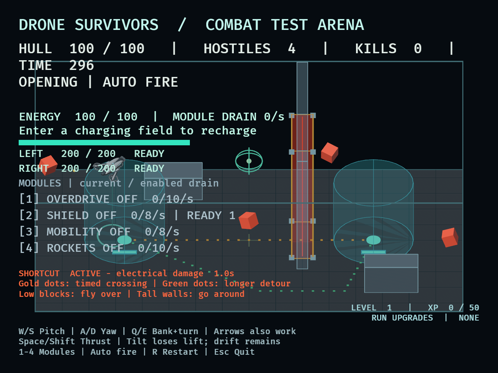

# DRO-29 — coordinated scout handling

September 12, 2026. The user approved Q/E banking that gradually turns the nose
into the curve, with A/D retained as direct yaw. This is the handling step before
DRO-30 settles arena dimensions. Human handling acceptance remains pending.

## Implemented behavior

Q/E directs rotor thrust sideways and automatically turns heading in the same
direction, in proportion to visible bank. Full bank gives 90 degrees/second;
diagonal pitch/bank shares the existing 30-degree tilt limit. A/D overrides
assisted yaw while held. Releasing Q/E levels the drone at 300 degrees/second,
fading assistance to zero; heading then stays fixed while velocity coasts.
Changing heading never rotates or replaces world velocity. Counter-bank therefore
changes the turning direction before it finishes redirecting existing momentum.

Horizontal rotor acceleration is 2.5 times the previous scout profile. Tilt
response is 480 degrees/second (previously 240): full tilt from level takes
0.0625 seconds and full opposite tilt takes 0.125 seconds. Direct yaw remains
240 degrees/second. Passive drag, vertical flight and 420-unit/s horizontal cap
are preserved. Faster attitude response naturally changes the timing of tilt's
lift loss; vertical force at a given attitude is unchanged.

Mobility and Interceptor multiply horizontal thrust/cap normally. Armor/rounds
still reduce all net translational acceleration. Agile frame improves bank yaw,
direct yaw, tilt and leveling by 40%. Enemies explicitly retain their original
thrust multiplier and unassisted heading control. All handling works without
energy. Terrain, waves, damage, chargers and upgrade costs are unchanged.

## Automated response measurements

`cargo test --locked handling -- --nocapture`

The fixture uses the production keyboard adapter and rotor integration in a large
unobstructed test arena. Launch holds W for 0.5 seconds. Braking starts from full
forward tilt at 300 units/s, then holds S until forward velocity crosses zero.
Distance is measured at that crossing, with frame-sized timing granularity.
Build multipliers are applied in the fixture; separate existing ECS tests cover
real mobility/upgrade application, and a new Agile regression covers assisted
turn improvement and restart.

| Build | Speed after 0.5 s | Stop time at 30 / 60 / 120 Hz | Stop distance range |
| --- | ---: | --- | ---: |
| Baseline | 200.94 | 0.733 / 0.717 / 0.717 s | 120.50–120.57 |
| Mobility | 251.17 | 0.633 / 0.617 / 0.608 s | 104.82–105.07 |
| Armor + rounds | 138.23 | 1.033 / 1.017 / 1.017 s | 163.75–163.81 |
| Mobility + armor + rounds | 172.78 | 0.867 / 0.850 / 0.850 s | 140.17–140.26 |

All four builds reduce forward velocity within 0.1 seconds of opposite input.
Full tilt reversal is observed at 0.133 / 0.133 / 0.125 seconds at the three
sampling rates. The pre-change baseline launched at 75.48 units/s after 0.5 s,
and the new banking, counter-yaw, reversal and response tests failed against it.

Other assertions cover mirrored Q/E curves, immediate direct counter-yaw,
continuous momentum, automatic leveling, bank reversal and comparable paths at
30/60/120/144 Hz. Existing tests retain speed caps, rotated bounds, terrain,
empty-battery routes/charger access, pause/reset and enemy flight.

Independent review found the old curved-path padding too small for boosted
Mobility + Interceptor (975 horizontal acceleration versus the previous 840
bound). A settled 1-degree heading reproduced the miss. Padding now includes
horizontal and overall acceleration modifiers; the regression checks all 360
integer headings. Unit multipliers preserve the enemy's previous padding.

## Native checks

- `cargo dev -- --validate routes --seconds 40`: both shortcut directions and
  both detour directions completed with 100 hull and no powered modules. Trip
  times were 5.025, 6.259, 6.067 and 6.083 seconds; the first two include hazard
  waits of 0.667 and 2.508 seconds. Median/p95 frame times: 8.337/8.715 ms,
  zero hitches over 33.3 ms, 2240×1440 physical resolution.
- `cargo dev -- --validate survival --seconds 15`: normal authored opening with
  a keyboard pilot, ordinary health/damage and automatically skipped choices.
  At the sampling end it was still playing: 80 hull, 9 kills, 4 live enemies.
  Median/p95: 8.341/8.693 ms, no hitches. This is a 20-second smoke check
  including warm-up, not a complete survival or human playtest.
- Engine captures at 1120×720 logical resolution showed the tilted scout, enemy
  models, active hazard, chargers and complete controls including Q/E Bank + turn.
  Native automation cannot attach to this bare executable as a macOS app, so
  screenshots use the existing opt-in engine capture system.

- After the collision-padding fix, the same native pilot ran at 640×480 logical
  (1280×960 physical) resolution: 80 hull, 6 kills, still playing after the
  15-second warm-up plus sampling run. Median/p95: 8.324/8.747 ms; no hitches.
  The compact controls are complete and readable. The existing HUD overlays
  much of the small arena; this task does not redesign that layout.
- Native runs exited successfully. Bevy logged its existing teardown warning
  about a Destroyed event for an unknown window ID after the validation result.
- Final checks: `cargo fmt --check`, `cargo test --locked` (217 passed, 2 opt-in
  balance probes ignored), `cargo clippy --locked --all-targets -- -D warnings`.
  Independent review has no remaining code blockers after the padding correction.

## Human acceptance checklist — pending

Run `cargo dev -- --validate manual --seconds 600` from this worktree. This records
normal human play without selecting upgrades, granting XP or controlling flight.

1. Accelerate with W, then hold W+Q and W+E for repeated banked evasive curves.
   Record whether the nose and flight path agree clearly enough to predict turns.
2. While banked, press opposite A/D to counter-steer. Reverse Q/E and W/S; record
   any apparent dead-input interval, overshoot or unwanted heading change.
3. Repeat with Mobility, Agile frame, and naturally earned armor/rounds. Record
   whether heavier stopping still feels intentional and the mobility benefit is
   useful. Do not call the experience accepted from fixture timing alone.
4. Separate contacts caused by delayed controls from the arena's short flight
   lanes. Baseline stopping from 300 units/s needs about 121 clear units; the
   heavy build needs about 164. Record turning paths and contact locations for
   DRO-30 without expanding this task into an arena redesign.
5. Release controls, deplete energy, pause for an upgrade choice and restart.
   Confirm free handling, predictable drift and full reset.

The PR delivers implementation and repeatable evidence. DRO-29's human
observations and enjoyable-handling gate must be resolved before declaring the
Linear acceptance criteria fully satisfied.
