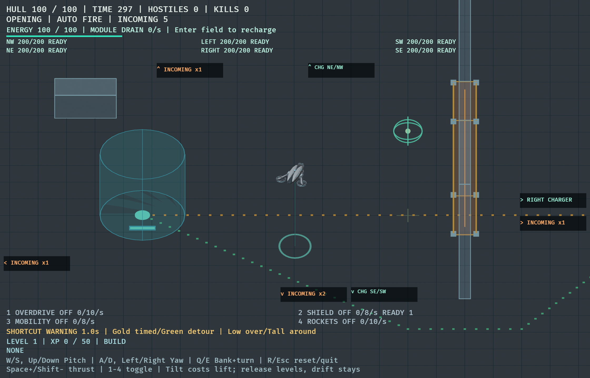
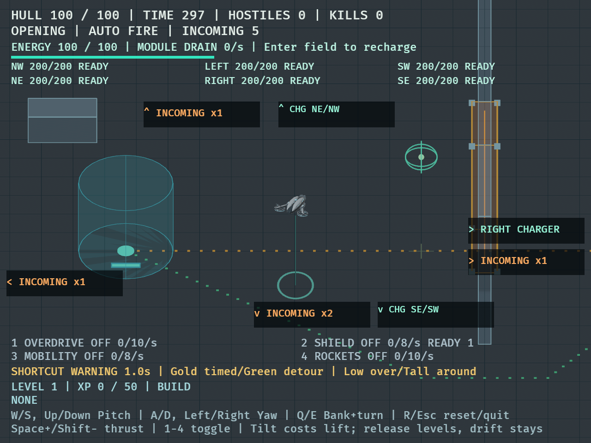
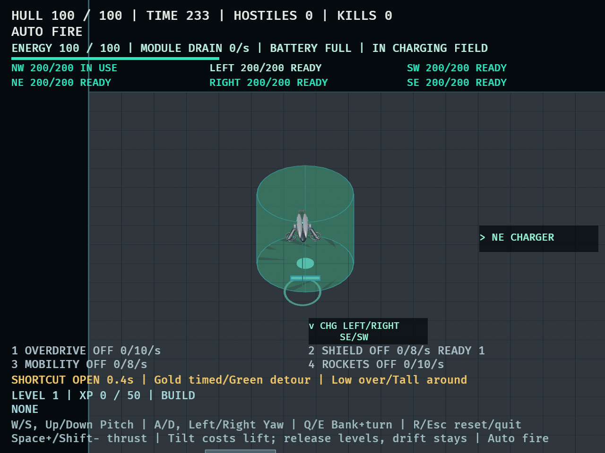
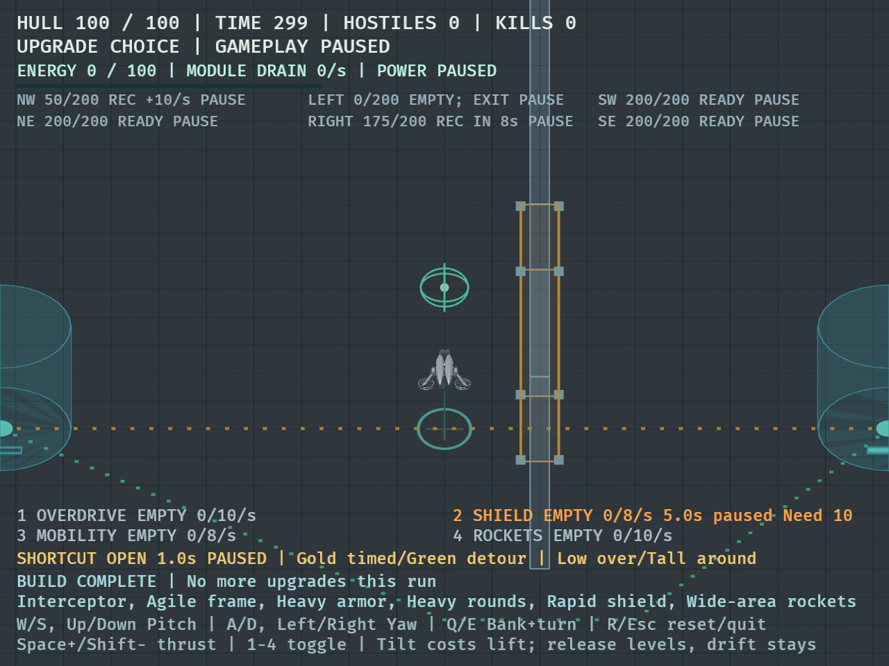

# DRO-30 — larger arena and following camera

September 13, 2026. Base: `4495ced` (merged scout handling). Final approved floor:
**1920×3240**, ceiling **300**. The user's north–south ×3 refinement supersedes
the initially approved 1920×1080 layout.

## Result and limits

The scout has longer clear lanes at its existing speed and follows the same
fixed-scale, fixed-heading camera. Six independently depleted chargers occupy
x=±560 at z=-1080, 0, +1080 (NW/NE, LEFT/RIGHT, SW/SE). The central electrical
shortcut and south detour remain; the north divider reaches the extended floor
boundary. Perimeter sampling now offers 120 distinct positions: 15 offsets per
long side, five per end, at the three existing spawn heights. Safety checks,
warning timing, wave counts/cap, enemy behavior, weapons, XP and physical tuning
are unchanged.

Automated flight, routing, pressure, native rendering and lifecycle checks pass.
**Human judgments of enjoyable sustained flight and whole-arena sparsity remain
pending.** The implementation is ready for review; these measurements do not
close that experiential acceptance gate or justify a scout damage change.

## Flight and routes

The production-flight test compares each real-arena trajectory against the same
trajectory with horizontal boundaries/obstacles removed. No horizontal contact
occurs along either 5.4-second lane or either 1.4-second banked curve, including
mobility and heavy armor/rounds builds, at 30/60/120 Hz. The original arena fails
this clearance test. Representative extents are identical at these frame rates:

| Build | 5.4s lane distance | Lane end speed | 1.4s curve X×Z span | Curve end speed |
| --- | ---: | ---: | ---: | ---: |
| Base | 2209.3 | 409.0 | 350.0×359.2 | 406.5 |
| Mobility | 2761.6 | 511.2 | 448.7×405.8 | 508.3 |
| Heavy armor + rounds | 2209.7 | 409.0 | 286.9×418.2 | 402.8 |

Units are world units and units/second. Lanes start with established fast flight;
these are clearance measurements, not acceleration-from-rest times. Curve spans
are bounding rectangles, not turn radii. The 300-unit ceiling still applies.

Empty-battery shortcut and detour tests traverse both directions at 30/60/144 Hz,
using ordinary keyboard flight and no hazard damage. The native six-charger tour
uses ordinary flight/energy, with authored waves disabled: it empties LEFT,
waits two seconds, takes the central detour, then visits the outer pairs. It
visited all six named entities and ended with 100 hull over 115 active seconds.
The integrated six-visit test repeats this route without rendering.

A native route rerun on final geometry completed all four legs with 100 hull:
shortcut LEFT→RIGHT 10.050s (2.800s waiting), return 11.309s (4.008s waiting),
and detour directions 9.733s/9.750s with no waiting. These are no-wave fixtures.

## Ordinary encounter comparison

The same 30 Hz diagnostic was run against the original 960×540 floor on main and
the final 1920×3240 floor. Camping starts at the corresponding central charger;
the fixed moving pilot stays central and the relay follows the central detour.
Naturally earned upgrade offers are skipped through ordinary input. No health,
damage or XP is granted. Every recorded run ended in death.

| Tactic | Death time old →  final | Kills old →  final | Peak enemies old →  final | Mean nearest threat old →  final |
| --- | ---: | ---: | ---: | ---: |
| LEFT camp | 48.97 → 66.47s | 31 → 44 | 7 → 10 | 207.4 → 391.0 |
| RIGHT camp | 58.03 → 65.80s | 39 → 42 | 7 → 11 | 196.5 → 417.4 |
| Moving | 64.00 → 47.00s | 43 → 24 | 7 → 12 | 222.5 → 430.8 |
| Relay | 108.97 → 131.93s | 78 → 105 | 8 → 16 | 235.4 → 368.2 |

Final average live populations are 4.77, 4.88, 4.61, 6.08 respectively, compared
with 2.01, 2.14, 2.38, 2.17. Time with no live enemies falls from 22–50 seconds to
3.8–4.6 seconds. Enemies travel farther but more remain alive concurrently;
central pressure is still present. This is not evidence that every outer-charger
strategy avoids sparse encounters. The moving pilot is not a whole-map sweep.
Damage positions are recorded, but do not identify hazard versus contact causes;
the fixed moving pilot frequently occupies the divider/shortcut area. Human
contact attribution and outer-lane combat observations are still needed.

[Raw baseline/final pressure and final charger diagnostics](dro-30-measurements.txt)
retain outcomes, choice times, damage positions and spawn accounting.

## Finite reserve comparison

The existing ten-scenario charger diagnostic was repeated on final geometry.
The four unlimited-reserve control camps survive 300 seconds with 440–442 kills.
Finite central camps consume exactly 200 reserve and die at 241.3s (LEFT) or
244.7s (RIGHT); overdrive remains powered about 30s alone or 16.7s with shield.

The conservation relay dies at 262.8s with 332 kills in both finite and unlimited
configurations, with equal choices, hull, visits and supply. It visits each
central field 12 times. The old relay-survival assertion was therefore replaced
with equal finite/control outcomes; unconditional survival is still required for
the unlimited camps. This retains the reserve comparison without claiming the
old geometry's relay outcome survives the arena change.

## Native presentation

Captures use the Bevy window screenshot path on the unlocked Mac at 1120×720 and
640×480 logical pixels (Retina output is twice that resolution). The normal-size
capture found bottom indicators overlapping the module row: the original fixed
115px exclusion only accommodated compact typography. The fix shares the 800px
font breakpoint and reserves top/bottom 110/125px compact or 120/145px regular.
A new regression checks full-card clearance at 640, 800 and 1120px widths. Updated
captures confirm separated charger/warning groups and footer text at both sizes.





The charger tour verifies camera travel to the NW field and grouped navigation
back to the other fields. This earlier tour capture precedes the final margin
increase and explicit 1–4 control-copy restoration; the final capture above shows
those small presentation changes.



A temporary render-only state fixture exercised the longest six-upgrade build
line, paused depleted/recovering chargers and shield activation failure at 640×480.
Text fits the columns/footer without clipping. It is synthetic UI evidence, not
an earned build or survival result; the temporary fixture was removed from source.



The unlocked 110-second charger sample measured median 8.338ms, p95 8.771ms,
p99 10.055ms, with one frame above 33.3ms. This no-wave fixture is not a loaded
combat benchmark. Camera freeze/restart, projection at different aspect ratios,
warning expiration and UI reset have automated coverage. Physical-key desktop
restart and a human-controlled full encounter were not performed here.

## Reproduction and review

```sh
cargo fmt --check
cargo test --locked
cargo clippy --locked --all-targets -- -D warnings
cargo test --locked arena_room -- --nocapture
cargo test --locked arena_pressure_probe -- --ignored --nocapture
cargo test --locked charger_depletion_probe -- --ignored --nocapture
cargo dev -- --validate routes --seconds 55
DRONE_CAPTURE_DIR=/tmp/arena-tour DRONE_CAPTURE_MINIMUM=1 cargo dev -- --validate chargers --seconds 110
DRONE_CAPTURE_DIR=/tmp/arena-large cargo dev -- --validate survival --seconds 15
DRONE_CAPTURE_DIR=/tmp/arena-small DRONE_CAPTURE_MINIMUM=1 cargo dev -- --validate survival --seconds 15
```

Final locked suite: 233 passed, 0 failed, 3 opt-in diagnostics ignored by default.
The pressure and charger-depletion diagnostics were run explicitly and passed.
Formatting and strict all-target Clippy pass. Independent review covered layout,
spawn indexing/search, six identities/reserves, camera ordering, UI and fixture
limits. Its Clippy fixture finding was fixed; the native footer overlap was also
fixed and covered by the additional regression.

## Pending human checklist

- Fly sustained fast lanes and evasive curves with base, mobility and heavy builds;
  record intentional turns versus boundary-driven braking and contact causes.
- Fight while moving among north, central and south chargers; assess pursuit,
  sparse intervals and whether long travel creates useful decisions.
- Read incoming directions, reserves/recovery and module failures at both sizes,
  and exercise choice pause and physical-key restart.
- Judge scout mobility/damage identity from those observations before proposing
  damage or enemy tuning.

DRO-31 remains a separate [unapproved progression proposal](../superpowers/specs/2026-09-13-progression-refinement-proposal.md).
