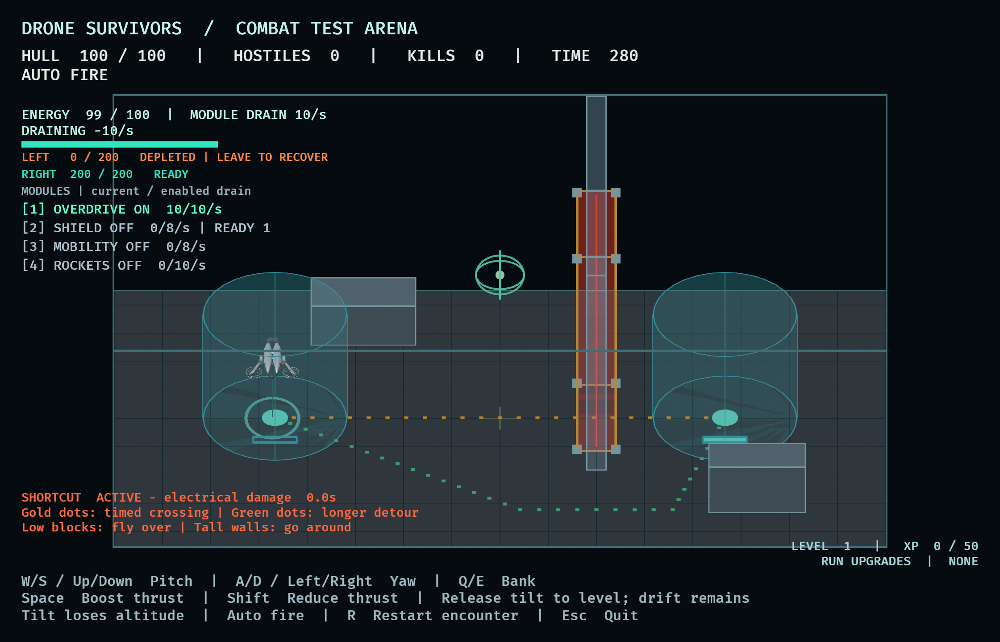
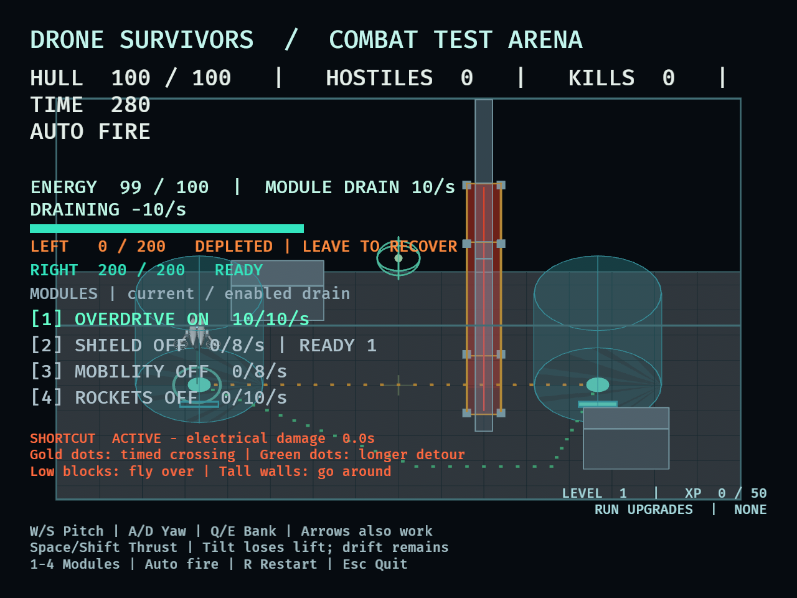
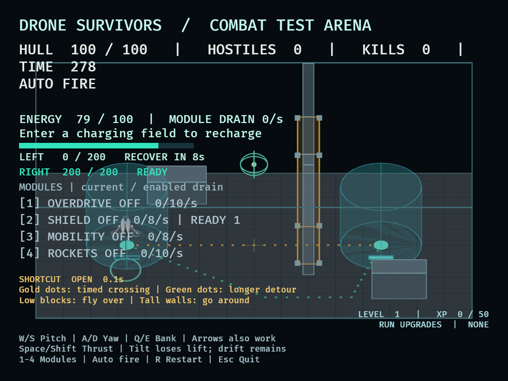
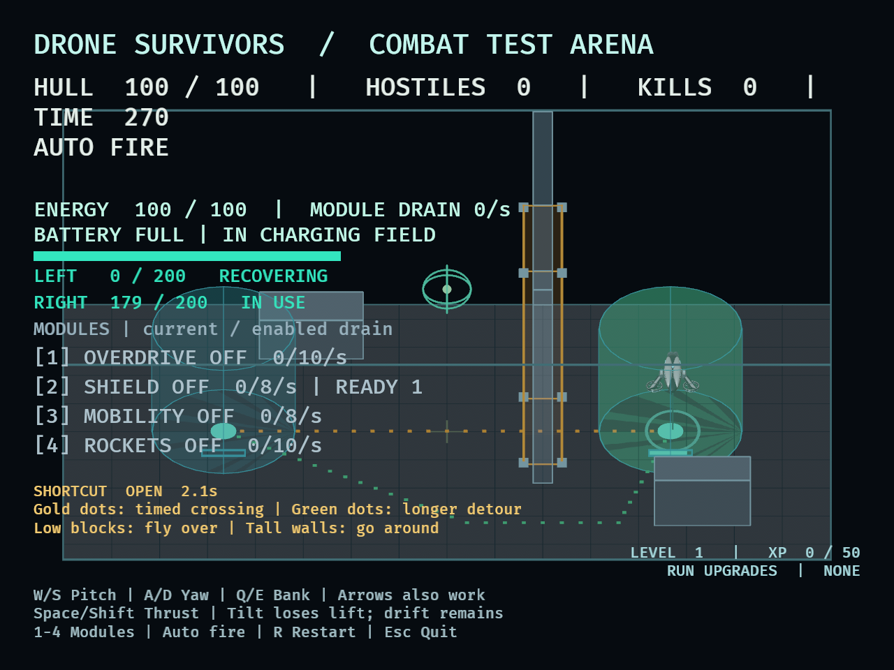

# DRO-32 charger depletion evidence

September 10, 2026. Rules approved before implementation: 200 reserve per field,
25/s maximum delivery, recovery at 10/s after eight uninterrupted seconds outside.
The starting tuning was retained after the comparison below.

## Reproduction and baseline

```sh
cargo test --locked camping_balance_probe -- --ignored --nocapture
cargo test --locked charger_depletion_probe -- --ignored --nocapture
DRONE_CAPTURE_DIR=/tmp/dro32-captures cargo dev -- --validate chargers --seconds 60
DRONE_CAPTURE_DIR=/tmp/dro32-captures DRONE_CAPTURE_MINIMUM=1 cargo dev -- --validate chargers --seconds 60
```

Before changing gameplay, the historical ten-run diagnostic was rerun at main
`2012fc3`: all four current-wave camps survived 300 seconds, killed all 447
requested enemies, and ended at 130 hull / 75 energy. All enemies were admitted;
there were no cap/space rejections or skipped spawns. That agrees with the DRO-12
baseline recorded in docs/playtests.md. The historical diagnostic now explicitly
uses a test-only million-energy reserve so the earlier wave/XP comparison remains
reproducible after the production chargers become finite. Its ten outcome/choice/spawn
rows were rerun after the change and matched the saved baseline exactly.

## Charger-only encounter comparison

Accounting source: `baae173`; diagnostic source: `7da4f78`.

All profiles use the current 447-enemy schedule and 4 XP per kill, real terrain,
hazards, ordinary physical flight, damage, module costs, and naturally earned
upgrade choices. The control uses a test-only million-energy reserve per field;
the candidate uses production defaults. No health, invulnerability, XP, weapon,
or enemy overrides. Stationary fixtures are placed at their charger once and
never held or repositioned. The moving pilot starts at the normal arena center.

The harness steps at 30 Hz. Delivered energy sums actual decreases in each
reserve and excludes recovery. Powered seconds sample overdrive state before each update whose starting phase
is Playing. They can differ by a frame around toggles, choices and outcomes; a
Playing-to-terminal update is counted if overdrive was enabled at its start.
Visits count occupancy transitions, not full stops.

| Reserve | Tactic | Outcome / active time | Hull | Kills | Delivered energy | Powered seconds | Visits L, R |
|---|---|---|---:|---:|---:|---:|---|
| unlimited | left-overdrive | Survived, 300.000s | 130 | 447 | 2997.667 | 299.800 | 1, 0 |
| unlimited | right-overdrive | Survived, 300.000s | 130 | 447 | 2997.667 | 299.800 | 0, 1 |
| unlimited | left-overdrive-shield | Survived, 300.000s | 130 | 447 | 6402.867 | 299.800 | 1, 0 |
| unlimited | right-overdrive-shield | Survived, 300.000s | 130 | 447 | 6402.867 | 299.800 | 0, 1 |
| unlimited | alternating pilot | Survived, 300.000s | 100 | 430 | 1872.667 | 191.533 | 19, 19 |
| depleting | left-overdrive | Dead, 241.100s | 0 | 280 | 200.000 | 29.967 | 1, 0 |
| depleting | right-overdrive | Dead, 240.300s | 0 | 279 | 200.000 | 29.967 | 0, 1 |
| depleting | left-overdrive-shield | Dead, 241.100s | 0 | 280 | 200.000 | 16.667 | 1, 0 |
| depleting | right-overdrive-shield | Dead, 239.533s | 0 | 277 | 200.000 | 16.667 | 0, 1 |
| depleting | alternating pilot | Survived, 300.000s | 100 | 430 | 1872.667 | 191.533 | 19, 19 |

All four finite camps use exactly their field's 200 energy and cannot recover
while remaining inside. Overdrive is powered for about 30 seconds, or about
16.7 seconds alongside shield. Free basic fire then keeps them alive for several
minutes, but all four die before completion. The ticket's powered-sustain problem
is resolved by accounting and departure requirements rather than stronger enemies.

The alternating pilot completes the same run with either reserve configuration:
100 hull, 430 kills, 57.667 battery, 19 visits to each field. All 447 requests are
admitted, 430 activate and 17 warnings are cancelled after positions become unsafe;
there are no cap/space rejections or skipped bursts. Peak living enemies: 14.
It takes the authored detour, turns overdrive off while approaching/charging,
uses it on travel legs above half battery, and leaves at 90% battery, empty field,
or eight seconds. Typical successive stops are about eight seconds apart,
so each field gets a substantial absence before the next visit. It supplies
902 energy from the left field and 970.667 from the right over the run.
This supports retaining useful repeated visits without unlimited stationary power.

Both relay configurations earn the same choices at 22.967 / 49.967 / 79.467 /
113.667 / 142.100 / 178.267 active seconds: Heavy rounds, Rapid shield,
Heavy armor, Interceptor, Agile frame, Wide-area rockets. They do not collect the
exploration pickup. The fixture uses the same guarded offer selection as the
camping diagnostic; no choice or benefit is granted outside normal eligibility.

The full compact diagnostic rows, including each camp's choice timings and
spawn accounting, are retained in [the raw results](dro-32-charger-results.txt).

## Native fixture and acceptance limits

The opt-in chargers fixture disables authored waves only. It uses keyboard flight
to reach the left charger, leaves two seconds after depletion, then takes the
detour to the right charger while conserving power. It does not write transforms,
velocity, battery, reserves, hull or XP. The headless integration check observes
occupied depletion, an away-delay interval, recovery, right-field arrival, and
complete reset. It remains Playing with 100 hull and no spawned enemies.

Hardware: Apple M1 Pro (10 cores), 16 GB memory, macOS 26.6.2 (25G83).
Native build: nightly Rust, development profile with Bevy dynamic linking.
The minimum-size run at `07ab391` completed 65 active seconds with 100 hull,
full battery on the right field and zero damage. Its 59.999-second post-warmup
sample included 7,182 frames, median 8.329 ms, p95 9.027 ms, p99 16.529 ms, and
one hitch above 33.3 ms at 1280×960 physical / 640×480 logical resolution.
These are empty-encounter UI-fixture measurements, not swarm performance evidence.
The first normal-size run captured all four charger states; it exposed an
unsupported em-dash glyph in the depleted label. `07ab391` replaces it with
ASCII `|`, matching the existing HUD separators. The refreshed normal-size run
at that commit exited successfully after 40.007 active seconds; its 35.004-second
sample at 2240×1440 physical / 1120×720 logical resolution reported median
8.319 ms, p95 8.994 ms, p99 15.494 ms and no hitches above 33.3 ms. Both native
runs remained at 100 hull and ended with a full battery on the right charger.
The corrected separator was visually verified at both sizes.

Inspected native depleted, recovery-delay and recovering captures at 640×480:
charger rows fit above the module list, with no overlap into the hazard or
control footer. Both world gauges keep their outlines when empty. Normal-size
captures show the same states with more space. Reset, paused text, and frozen
clocks are verified by the ECS/input and scene regressions; direct physical-key
native reset was not exercised in this run.







## Verification

At initial implementation commit `07ab391`: formatting passes, the locked suite reports
**209 passed / 0 failed / 2 ignored**, and strict all-targets Clippy passes. Both
ignored diagnostics were explicitly run successfully (20 scenarios total).
Core accounting and the whole branch received independent review with no open
Critical or Important findings. Native QA's unsupported-glyph issue and the
reviewer's sampling-description correction were both resolved.

Human tactical acceptance remains pending. A deterministic pilot's success
cannot establish whether players understand reserve/status cues before arrival,
find charging stops useful, or enjoy the relocation pressure. Human checks should
compare stationary power, brief exits, partially recovered returns, and sustained
alternating visits at both window sizes. Scout handling and arena-size refinements
remain separate DRO-29/DRO-30 work.


## Review follow-up: enforce outcomes and isolate captures

Both review findings were confirmed. The charger diagnostic now requires finite
camps to consume all 200 reserve, finish with an empty field/battery, receive the
expected powered time, and die before the encounter ends. Control camps and both
relay runs must survive. Finite/control relays must agree on hull, kills, earned
choices and their timing, progression, visits, stops, final battery, powered time,
and delivered energy (with tolerance for floating-point totals).

Charger screenshot requests are now restricted to `--validate chargers`.
A regression test reproduced all four charger requests leaking into Manual mode
before the fix. It now checks every validation mode, verifies other modes retain
hazard screenshots without charger requests, and verifies repeated frames cannot
duplicate those captures.

Verification: 210 tests pass, 2 diagnostics remain opt-in; the strengthened
10-scenario charger diagnostic was explicitly rerun and passes. Formatting and
strict all-targets Clippy pass. Gameplay tuning and rendering are unchanged.
