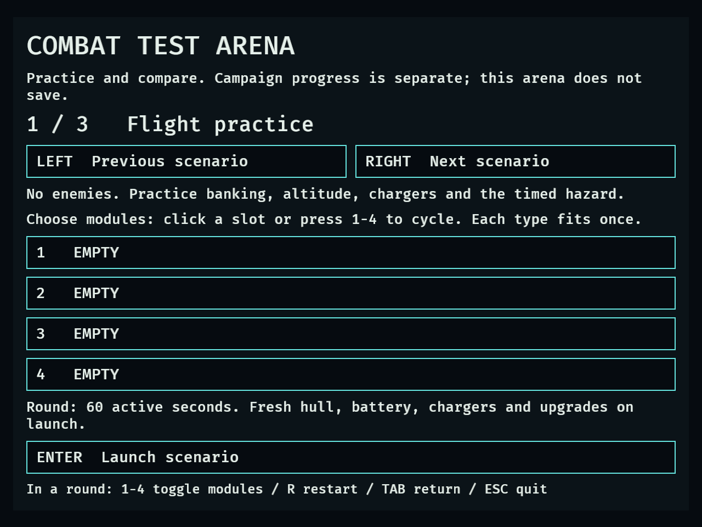
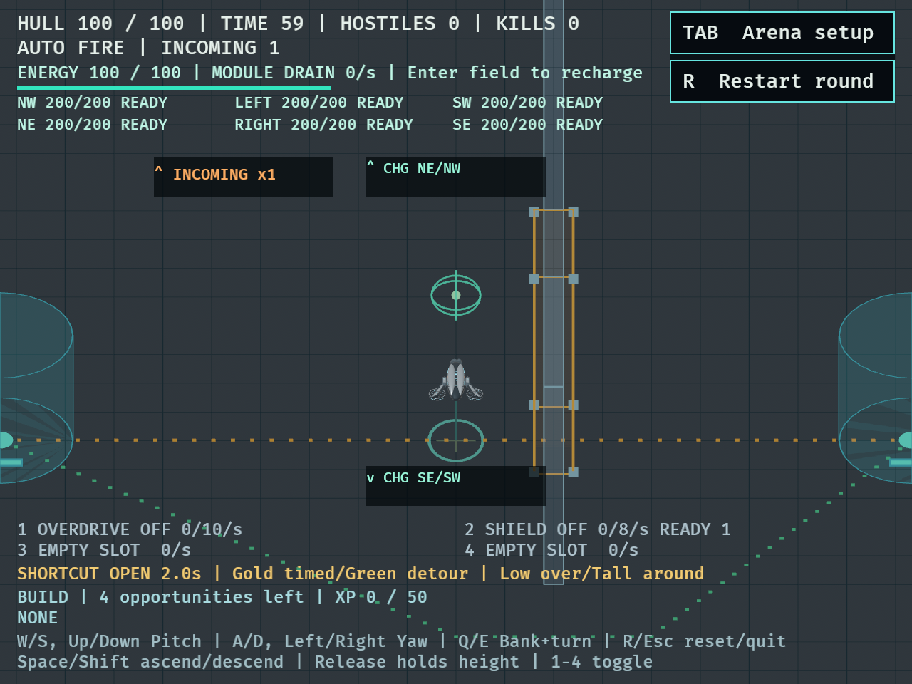
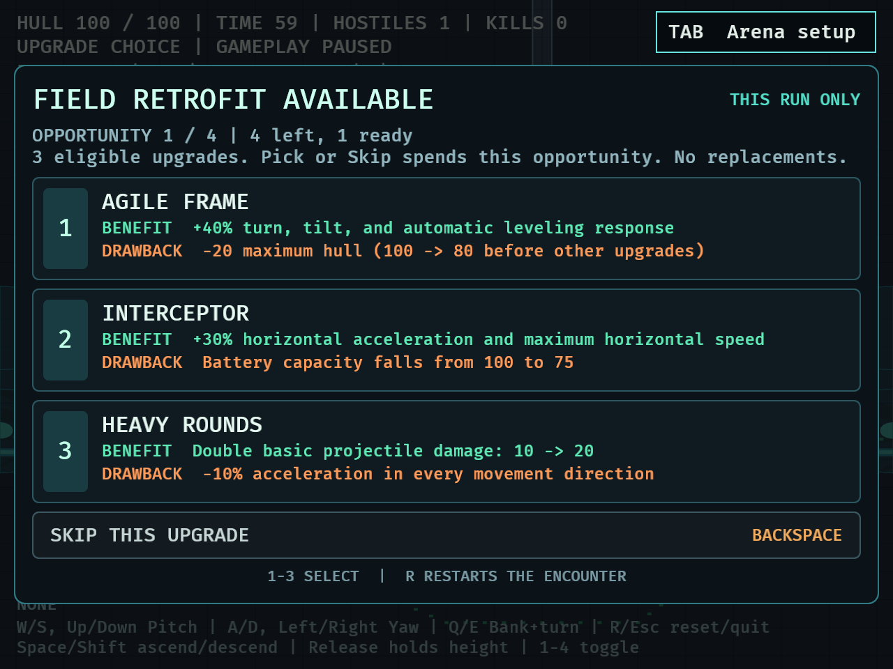
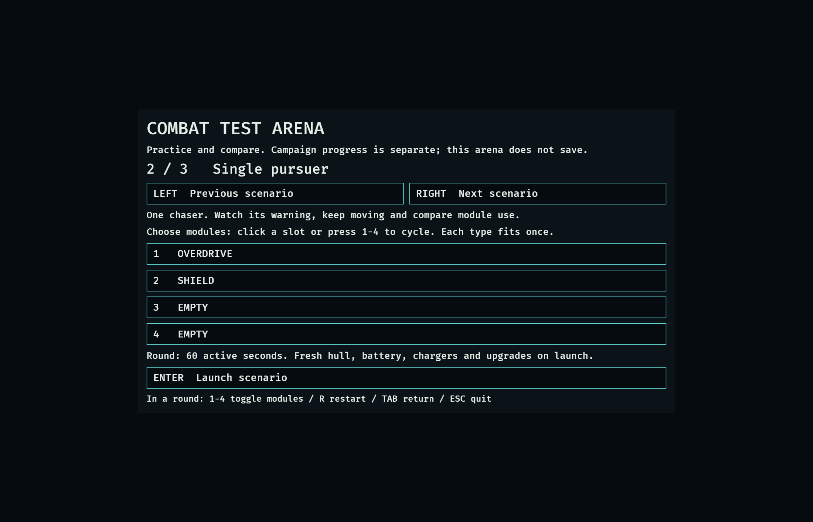

# DRO-34 — Isolated catalog arena

## Scope

First of eight PR-sized children of DRO-22. The user explicitly allowed new
content to be implemented in an isolated test arena while keeping campaign
introduction gated on the deferred DRO-21 human playtests.

This PR adds the selector and lifecycle using existing content: Flight practice,
Single pursuer and Small swarm; editable four-slot loadouts; normal combat,
power, upgrade choices and resets. It installs no campaign, settlement or save
plugins. New enemy types, environmental fields, Repair/Repulsor modules, six
additional upgrades and balance comparisons remain in DRO-35 through DRO-41.

## Verification

- Baseline: 379 passed, 5 ignored.
- [Final suite](dro-34-tests.txt): 386 passed, 0 failed, 5 ignored. The ignored
  tests are existing opt-in probes. Seven new tests cover the catalog route,
  selection pause/isolation, unique loadouts, real warning/spawn activation,
  paused-choice reset/relaunch, mouse actions/terminal restart, held input and
  the choice-panel layout regression.
- `cargo fmt --check`: passed.
- [Strict Clippy](dro-34-clippy.txt): passed with `--all-targets --locked -- -D warnings`.
- Independent read-only review of the main implementation and final fixture/layout
  diff found no actionable issues.

The initial CLI test failed because `catalog` was not recognized, then passed
after routing was added. The native screenshot check found the Restart button
overlapping the upgrade modal heading at 640x480. A [regression test failed](dro-34-choice-regression.txt)
on that presentation; the fix hides this redundant button while Choosing. R
still restarts and the Arena setup button remains visible. The final test and
native screenshots verify that the heading is clear.

## Native checks

```sh
DRONE_CATALOG_SMOKE=1 DRONE_CAPTURE_MINIMUM=1 DRONE_CAPTURE_DIR=/tmp/dro34-native cargo dev -- --validate catalog
DRONE_CATALOG_SMOKE=1 DRONE_CAPTURE_DIR=/tmp/dro34-native cargo dev -- --validate catalog
```

Both the [640x480](dro-34-native-640x480.txt) and
[1120x720](dro-34-native-1120x720.txt) fixtures passed selector, slot edits,
launch, return from a paused upgrade choice, relaunch and restart. Text viewport
bounds passed. Selector, loadout, round and choice screenshots were inspected;
the compact choice screenshot confirms the overlap fix. Both runs logged the
existing Bevy unknown-window Destroyed warning during successful shutdown.

The fixture uses synthetic keyboard input and grants 50 XP to expose an upgrade
panel. It does not grant hull, funds, damage immunity, rewards or mission wins.
Mouse actions are exercised through the real button Interaction components in
headless integration tests. The desktop control tool could not attach to the
standalone game executable; these are internal native fixtures, not an OS-level
mouse automation pass. Ordinary catalog mode installs no fixture systems.

These checks validate rendering and lifecycle, not encounter balance, uncoached
usability, enjoyment or human acceptance. The campaign content gate stays pending.






## Next steps

Merge the arena foundation before dependent PRs target main. The split and
dependencies are recorded in Linear. Confirmed downstream decisions: repeat-impact
enemies retreat and warn before the second hit; directional effects stop on exit;
the new modules are Repair and Repulsor; Repulsor can dislodge attached bombs;
the six proposed upgrades are approved and the four-opportunity run limit stays.
