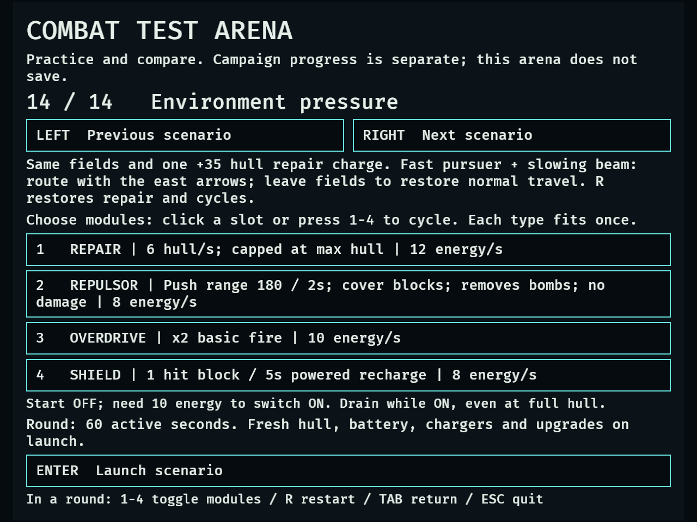
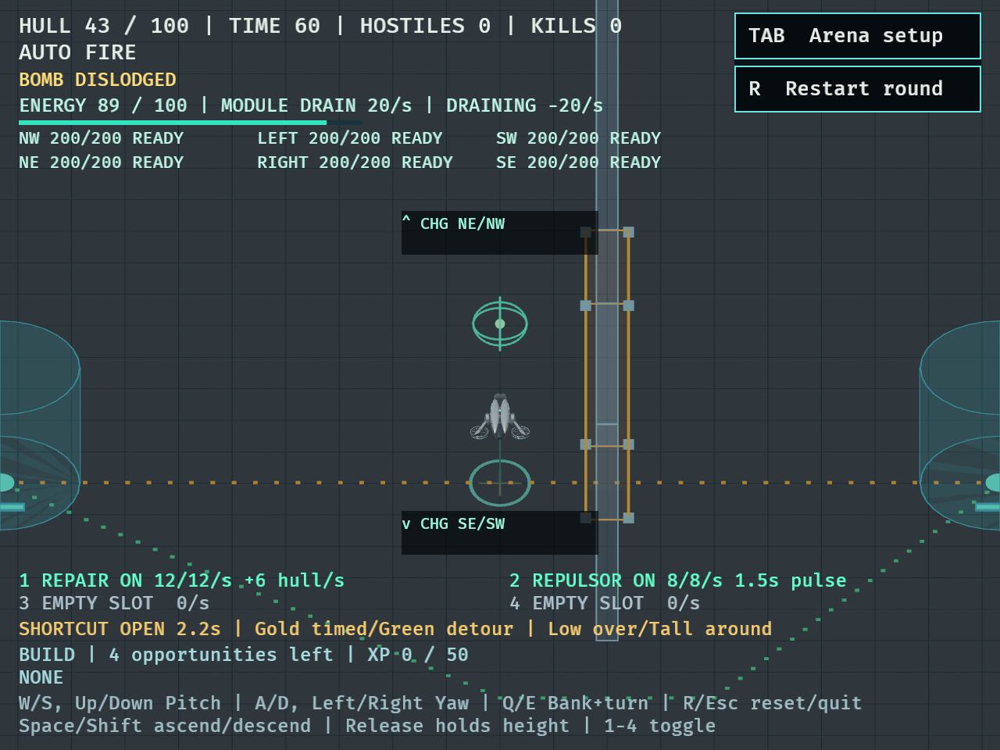
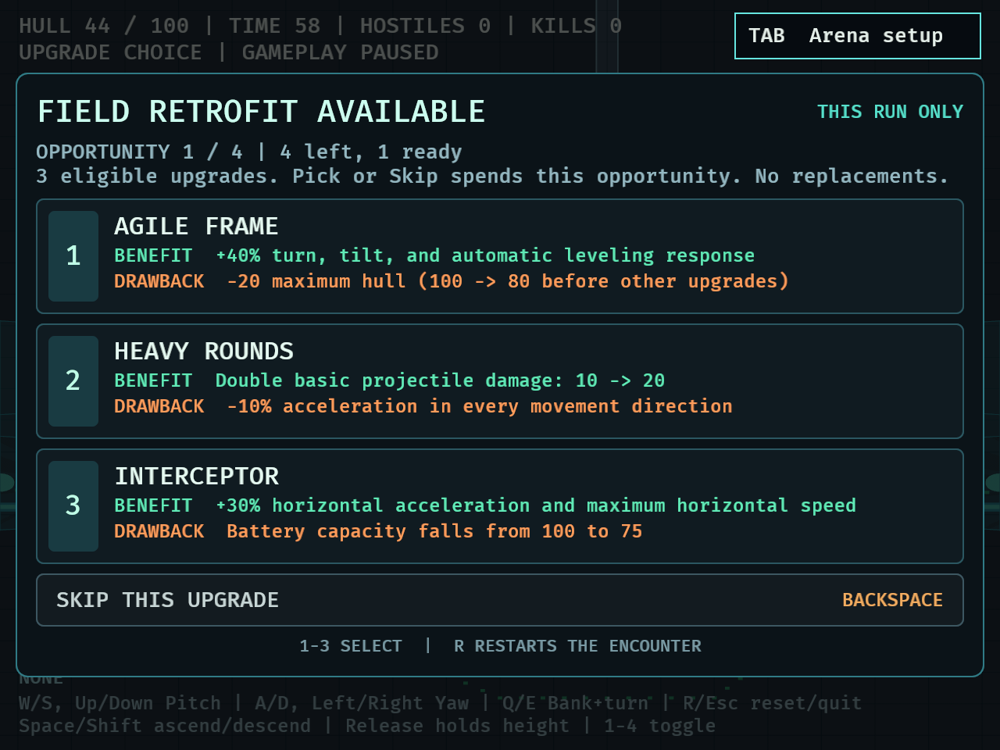
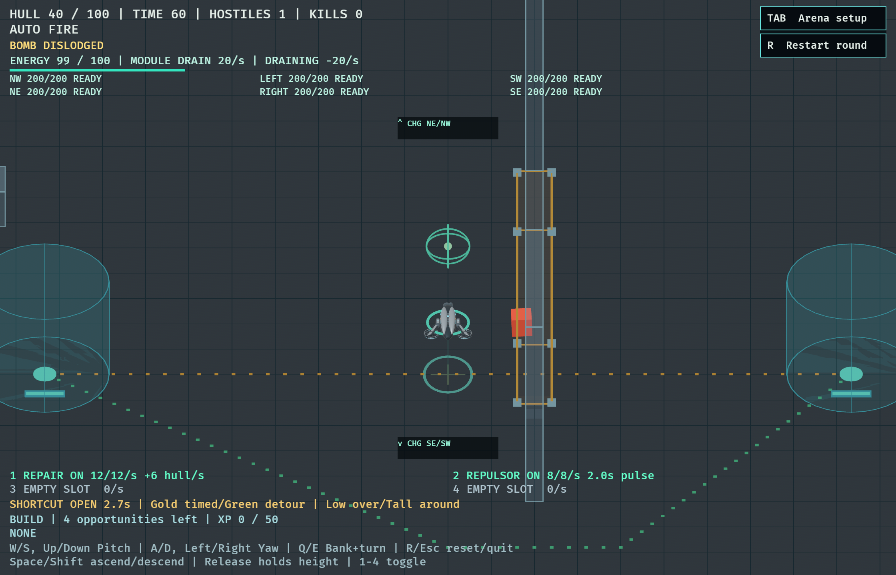

# DRO-39 — Repair and Repulsor catalog modules

September 18, 2026. Implemented on `codex/dro-39-repair-repulsor` in its own worktree from `9708c5e` (`origin/main`). This is agent rule and presentation evidence, not human acceptance or catalog-wide balance validation.

## Delivered behavior

All six module designs can be selected in any of the four isolated arena slots, with duplicate types skipped. The selector names benefit, power drain and limits; the HUD shows Repair rate/FULL and Repulsor cooldown.

| Module | Initial tuning | Operational limits |
| --- | --- | --- |
| Repair | 6 hull/s of paid power time; 12 energy/s | Fractional progress survives ordinary frames/pauses; actual partial-depletion supply heals; clamp at effective maximum; discard credit at full hull; no revival |
| Repulsor | 180-unit 3D range; 2s interval; 8 energy/s | At least 260 units/s outward radial velocity, preserving tangent without stacking pulse speed; no damage/reward; solid cover blocks enemy reach; same pulse dislodges a bomb |

Existing activation requires 10 energy without a separate activation debit. Full hull or empty surroundings still consume power while ON. Brownout switches modules off. Jammed slots block effects and need manual reactivation after recovery. Repulsor cooldown continues while OFF during active play; choosing an upgrade freezes it. Restart, launch and return clear transients.

Campaign `ModuleKind::ALL` remains the original four. Both support modules are rejected by inventory purchase/assignment/restoration and serde serialization/deserialization. Campaign save schema, shops, waves and upgrade offers remain compatible. The four-upgrade opportunity budget is unchanged.

## Rule checks

Baseline: **459 passed, 5 existing probes ignored**. Final implementation: **478 passed, 5 ignored**, clean `cargo fmt --check` and `cargo clippy --locked --all-targets -- -D warnings`. [Full tests](dro-39-tests.txt), [strict Clippy](dro-39-clippy.txt).

The 17 gameplay regressions cover paid time at 30/60/144 Hz; partial depletion with shared drain and charger supply; caps and full-hull credit; off/empty/locked/paused effects; lethal/nonlethal bomb ordering; actual jammer delivery and manual recovery; activation in every slot; resets; campaign/save exclusion; 3D pulse range/cover; coincident centers; collision-aware displacement; incoming velocity reversal and no outward-speed stacking; configurable radius/interval/drain and a single pulse per hitch. Existing bomb, energy and module regressions also pass.

Test-first observations: the selector previously cycled back to EMPTY instead of Repair ([failure](dro-39-selector-red.txt), [pass](dro-39-selector-green.txt)); Repair initially left hull 50 instead of 56 and 53 for full and half-second supply; the old Repulsor left enemy velocity zero. A follow-up incoming-velocity regression caught additive impulse cancelling inward speed instead of reversing it, and the corrected radial-speed rule passed.

## Review follow-up

Independent review identified a full-hull credit edge: environmental healing runs after the module effect, so a repair site could cap hull at 100 while leaving 0.9 paid fractional credit. Next-frame damage could spend that old credit. An actual catalog environment regression [reproduced the failure](dro-39-repair-credit-red.txt). Cleanup now clears credit at effective maximum hull after all healing/progression systems, and the [environment regressions pass](dro-39-repair-credit-green.txt). Independent re-review approved the fix with no remaining actionable findings.

## Native evidence

```sh
DRONE_MODULE_SMOKE=1 DRONE_CAPTURE_DIR=/tmp/dro39-native cargo dev -- --validate catalog
DRONE_MODULE_SMOKE=1 DRONE_CAPTURE_MINIMUM=1 DRONE_CAPTURE_DIR=/tmp/dro39-native cargo dev -- --validate catalog
```

Both **1120×720** and **640×480** runs passed. The [640×480 fixture passed again after the review fix](dro-39-native-640x480-final.txt). The fixture drives synthetic keyboard events, sets hull damage, spawns one target, attaches one bomb and grants 50 XP; it suppresses auto-fire. It uses production power, healing, enemy flight, pulse, locks, choices and lifecycle. It does not claim naturally earned XP, a natural enemy encounter, difficulty, frame performance or player enjoyment.

Observed at both sizes: Repair restored 40→43 hull over about half a second with both modules ON; battery fell to about 89.67. Repulsion moved the live target from 100 to about 213 units away without changing its 20 hull, and the bomb disappeared. A Repair lock held hull at 44; upgrade selection froze hull, battery and cooldown. Full hull capped at 100 while drain continued; empty battery left hull at 50 and switched modules off. Restart restored 100 hull/energy, OFF modules and zero cooldown. Return paused selection. The fixture then swept all 14 scenario descriptions with four filled slots and checked visible text bounds.

Logs: [1120×720](dro-39-native-1120x720.txt), [640×480](dro-39-native-640x480.txt). Selected screenshots were inspected for readability and overlap. Both processes emitted a `bevy_winit` “Skipped event Destroyed for unknown winit Window Id” warning during successful shutdown; there were no gameplay assertion failures.






## Limits and next checks

Numeric tuning remains provisional. Repulsion changes velocity; ordinary pursuit resumes and terrain constrains actual displacement. Repair is gradual and consumes finite power. Human counterplay/readability and contrasting-loadout balance still need playtesting, followed by DRO-41's combination comparisons. DRO-40 owns the six additional temporary upgrades. Neither this issue nor its automated evidence lifts the campaign introduction gate.
