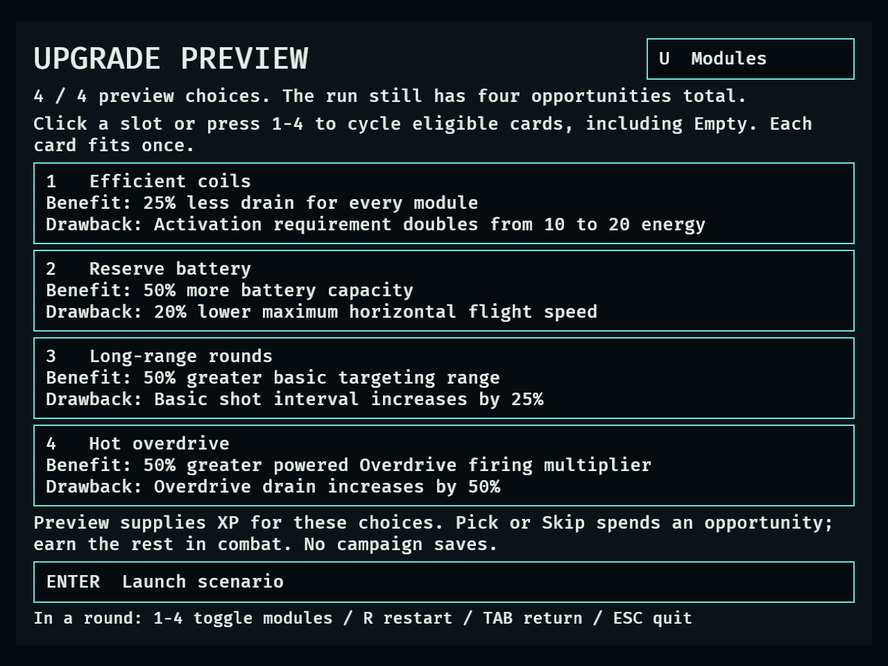
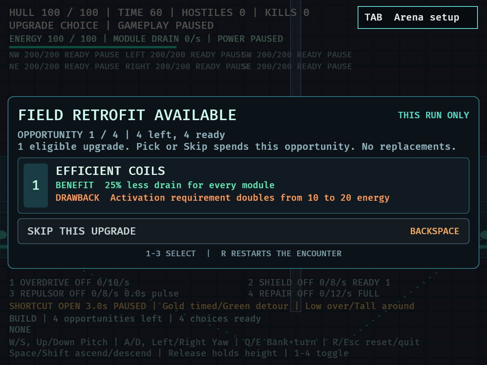
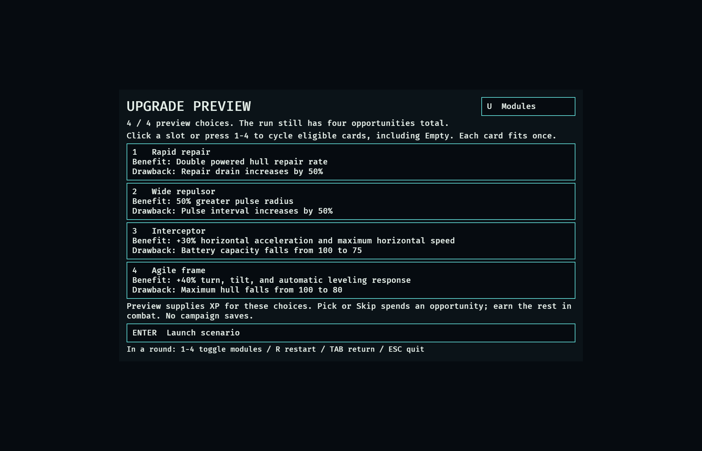
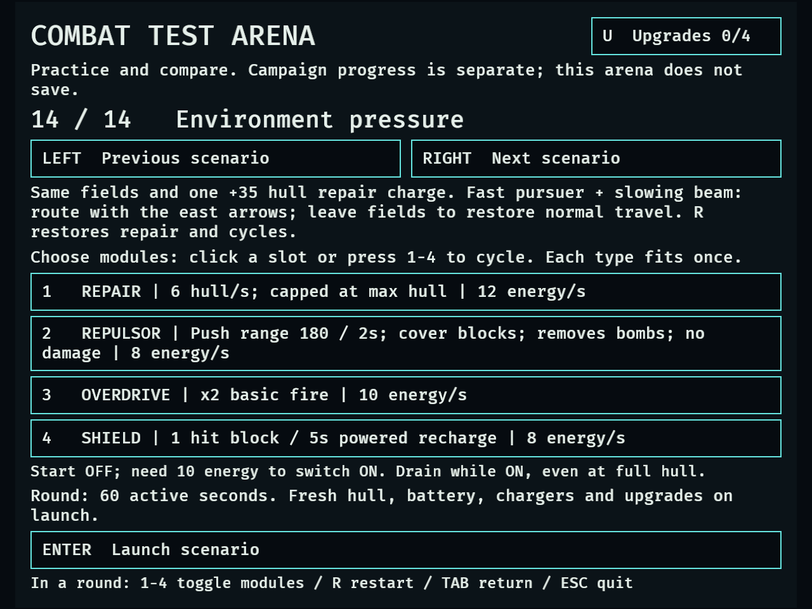
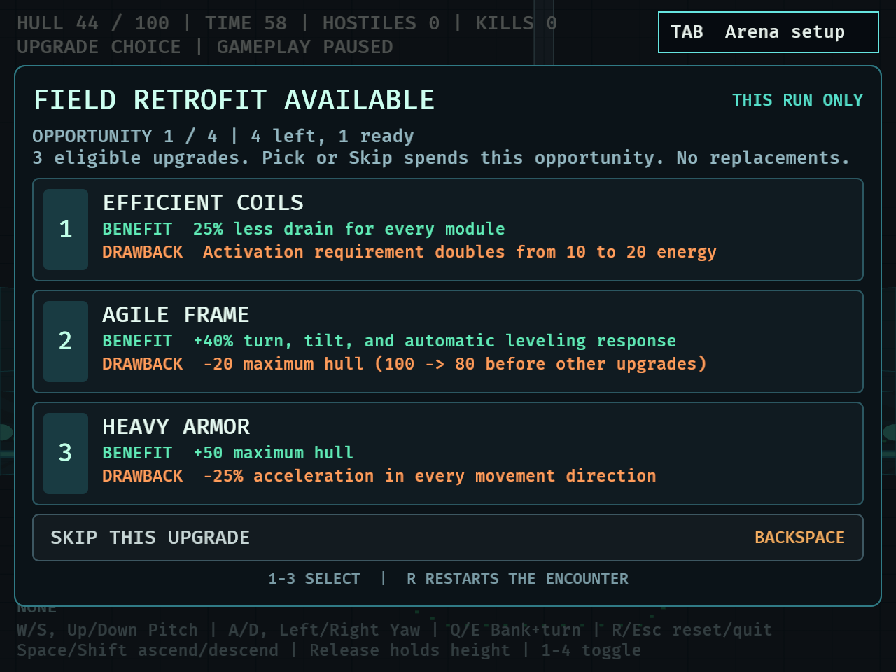

# DRO-40 — Twelve temporary upgrades

September 18, 2026. Agent implementation and native UI checks, not human balance
acceptance. The six additions implement the September 15 user-approved Linear
scope. All new offers remain isolated to `--validate catalog`; campaign saves,
shops, spawns and the original six-card offer pool retain their existing scope.

## Interaction and costs

U / Upgrades opens four preview slots. Each cycles eligible, distinct cards or
Empty with a click or 1–4. Module-specific cards require the equipped module,
regardless of slot or power state; Efficient coils requires any equipped module.
Removing a prerequisite clears its preview. All cards display benefit/drawback
copy. Empty slots retain normal progression.

Launching with N selected previews grants the normal cumulative XP cost for N
opportunities (50, 200, 500 or 1,000). Each chosen preview is offered once through
the normal modal. Pick **or Skip** spends one of the same four opportunities.
No preview XP is supplied for an empty configuration. Later earned offers use
the twelve-card eligible pool; four previews leave no later choices. R resets
all effects and replays the same configuration. Tab returns to setup, clearing
active effects while retaining the configured preview.

| Addition | Benefit | Drawback |
| --- | --- | --- |
| Efficient coils | Every module drains 25% less | Activation requirement doubles to 20 energy |
| Reserve battery | Battery capacity ×1.5 | Maximum horizontal speed ×0.8 |
| Long-range rounds | Basic targeting range ×1.5 | Basic shot interval ×1.25 |
| Hot overdrive | Powered firing multiplier ×1.5 | Overdrive drain ×1.5 |
| Rapid repair | Powered hull repair rate ×2 | Repair drain ×1.5 |
| Wide repulsor | Pulse radius ×1.5 | Pulse interval ×1.5 |

The activation requirement is the existing energy threshold, not a debit.
Capacity growth does not grant energy. All selected effects rebuild from the
captured baseline, and repeated definitions cannot compound twice. Coil savings
multiply the module-specific drain penalties. Existing projectiles retain their
payload. Shield, rocket and Repulsor cooldown fractions survive choices; basic
fire retimes on the first resumed frame. Pause freezes gameplay.

## Automated verification

- `cargo fmt --check`: passed.
- `cargo test --locked`: **495 passed, 0 failed, 5 existing opt-in probes ignored**.
- `cargo clippy --locked --all-targets -- -D warnings`: passed.
- `git diff --check`: passed.

The baseline was 478 passed / 5 ignored. Seventeen new behavioral regressions cover
campaign/catalog offer isolation, prerequisites, preview filtering/budget/Skip,
modifier composition and defensive deduplication, actual long-range targeting,
actual wider Repulsor reach, paid Repair healing/drain, the 20-energy activation
requirement, capacity without refill, cooldown continuity and reset of all new
stat families. Selector integration covers click/keyboard parity, fixed preview
slots, empty-preview no-XP behavior, prerequisite removal and restart/return.

[Full test output](evidence/dro-40/cargo-test.log) and
[strict Clippy output](evidence/dro-40/clippy.log). The shared build target was
`/Users/shooshte/projects/drone-survivors/target`; commands ran from the isolated
DRO-40 worktree.

## Native evidence

Both commands completed with `UPGRADE FIXTURE PASS`:

```sh
DRONE_UPGRADE_SMOKE=1 DRONE_CAPTURE_DIR=/tmp/dro40-native-large cargo dev --locked -- --validate catalog
DRONE_UPGRADE_SMOKE=1 DRONE_CAPTURE_MINIMUM=1 DRONE_CAPTURE_DIR=/tmp/dro40-native-small cargo dev --locked -- --validate catalog
```

The fixture uses synthetic keyboard input and the documented preview XP. It
chooses all twelve cards through the actual modal across three four-card builds,
asserts the four-choice budget and reset/return, and checks visible text bounds
at 1120×720 and 640×480. It captures all twelve one-card dialogs plus each build's
setup and active HUD. Screenshots are rendered at Retina physical resolution.

Measured effective configuration after each four-card build was identical at
both window sizes:

| Build | Cards | Observed configuration |
| --- | --- | --- |
| 1 | Efficient coils, Reserve battery, Long-range rounds, Hot overdrive | Capacity 150; activation 20; target range 600; basic interval 0.625s; Overdrive ×3 at 11.25 energy/s; Shield/Mobility 6/s, Rockets 7.5/s, Repair 9/s, Repulsor 6/s |
| 2 | Rapid repair, Wide repulsor, Interceptor, Agile frame | Capacity 75; Repair 12 hull/s at 18 energy/s; Repulsor radius 270 and interval 3s at 8 energy/s |
| 3 | Heavy armor, Heavy rounds, Rapid shield, Wide-area rockets | Original modifiers remain available; native log shows Shield drain 12/s and unchanged support-module baseline |

These are modifier/readability measurements, not combat performance comparisons.
All sampled text stayed within each viewport, and visual inspection found the
four-card pages and normal choice dialogs readable. An existing Bevy window
cleanup warning appeared after successful fixture exit; there were no fixture
assertion failures.

- [640×480 log](evidence/dro-40/native-640x480.log)
- [1120×720 log](evidence/dro-40/native-1120x720.log)





## Remaining human and combination checks

DRO-41 owns broader enemy/environment/loadout comparisons and tuning for dominant
or redundant choices. Human handling/readability and the deferred DRO-21 campaign
gate remain open. Test whether higher activation requirements create useful
conservation decisions, extra range offsets slower fire, Repair cost remains
meaningful, and the larger/slower Repulsor has distinct counterplay. No conclusion
about human balance or campaign readiness is drawn from these fixtures.

## Existing selector regression

The existing `DRONE_MODULE_SMOKE=1` native fixture initially caught a layout
regression: the new page-switch control enlarged the header and pushed controls
outside 640×480 for longer scenario copy. Constraining the header to a 30-unit
row and keeping the page-switch label on one line resolved it. The repeated
fixture passed all fourteen scenario descriptions with four modules equipped,
plus normal three-card choice rendering, Repair/Repulsor, jam, pause, depletion
and reset checks. The three-card capture includes the new Efficient coils card.

[Module regression log](evidence/dro-40/module-regression-640x480.log).





## Independent review follow-up

Review found that the first configured preview opened after one gameplay update.
A nonzero-time failing regression reproduced the timing error. The opener now
runs after reset and before choice input/movement/combat, so previews consume no
scenario time. The regression verifies reset power/position/projectiles and
paused time; the native fixture now asserts zero encounter time at every queued
preview. Both native sizes were rerun successfully after the fix. Task and
whole-branch re-review found no remaining actionable findings.

Delivered as [PR #32](https://github.com/Shooshte/drone-survivors/pull/32) against main.
