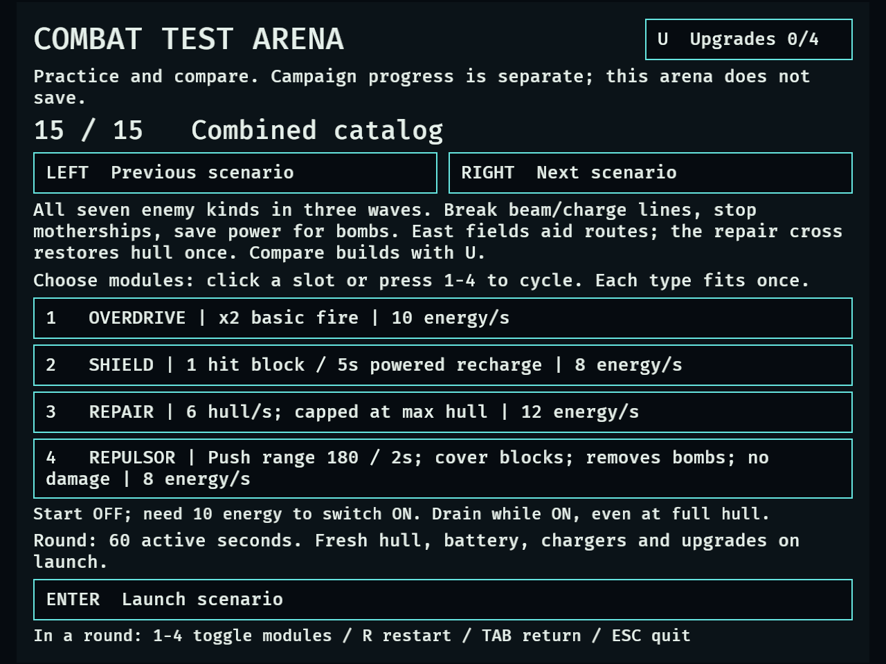
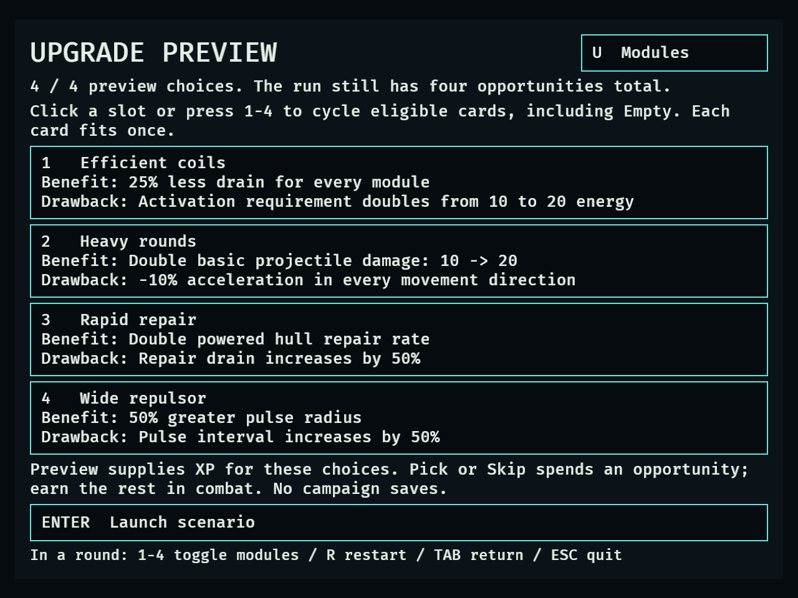
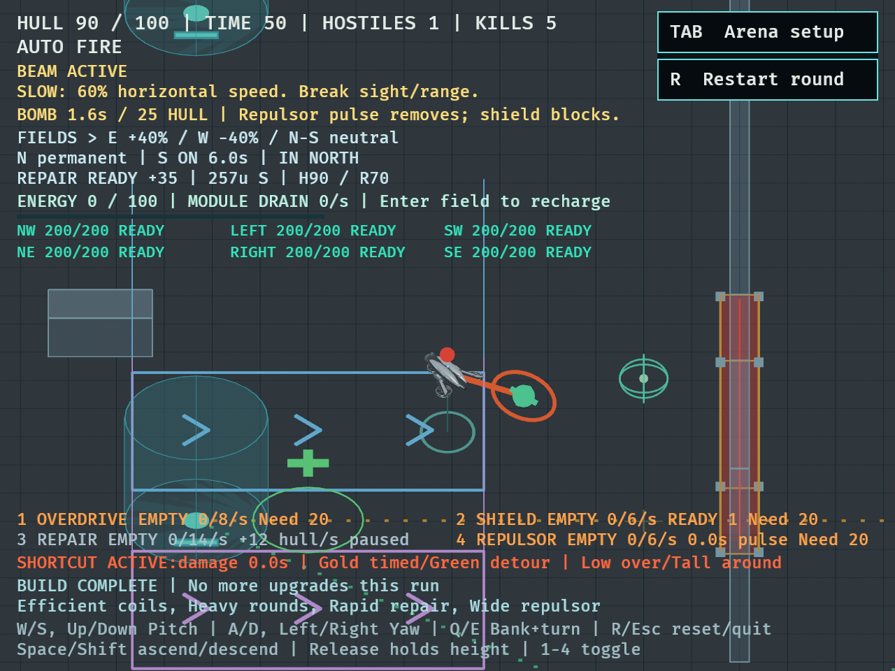
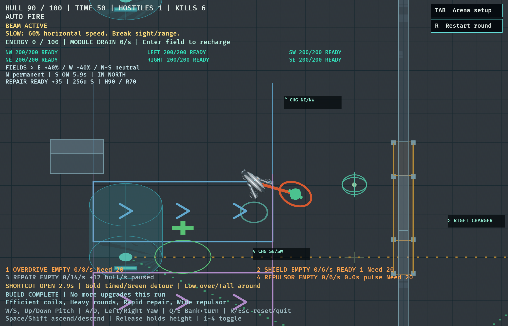

# DRO-41 — Bounded catalog combinations

September 18, 2026. Agent validation of the isolated arena, **not human
acceptance**. The campaign gate from DRO-21 remains deferred. Campaign saves,
spawns, shops and upgrade offers are unchanged.

## Reproduce a combined round

```sh
cargo dev --locked -- --validate catalog
```

From initial Flight practice, press Left once for **Combined catalog** (15/15).
Choose modules with 1–4; U opens upgrade previews. Enter starts the round.
The three waves at 1/16/31 seconds each request all seven enemy kinds. Spawn
safety and the shared 30-enemy cap still apply, including mothership launches.
Both directional fields and the single +35 hull repair site are enabled. The
default 60-second duration includes no time spent in upgrade choices.

The new scenario leaves each focused drill intact. No numeric balance changes
are bundled merely to make the validation pass. Results below distinguish
observations from evidence sufficient to change tuning.

## Controlled 30 Hz comparison

```sh
cargo test --locked catalog_combination_probe -- --ignored --nocapture
```

[Raw measurements](evidence/dro-41/combination-probe.log) include fourteen full
rounds, each observed enemy kind, choices, power time by module, activation counts,
active field occupancy, repair crossings/delivery, charger visits and route progress.
All runs use the real catalog installation, geometry, hazard, finite chargers,
spawn safety, health and damage. No combat health/energy is granted. Preview XP
is the normal selector feature. Later naturally earned choices are **Skipped**
through normal input to keep each measured build fixed; seven such offers opened.

Every moving row uses the same scripted route: north field → west charger →
south detour at z=410 → east charger → return via the detour → repair cross →
south field. Charger arrivals dwell for 1.5 seconds. The existing waypoint pilot
limits desired travel speed to 180; it is a repeatable route, not skilled maximum-
speed evasion. The stationary control remains at the normal spawn. All rows saw
all seven enemy kinds; every equipped module was powered during its run.

Single modules are requested while power permits. Four-slot builds rotate one
requested slot every four active seconds in slot order. All use the same
conservation policy: switch off at 6 energy, request restart at 20. This avoids
confounding different activation policies, but underuses baseline's 10-energy
threshold. The controlled activation check below tests that separate drawback.
Power and field durations are 30 Hz samples, not exact integrated energy audits.

| Case | Outcome | Active seconds | Hull | Kills | Final energy |
| --- | --- | ---: | ---: | ---: | ---: |
| empty-stationary | Dead | 29.47 | 0 | 10 | 100.0 |
| empty-route | Dead | 39.50 | 0 | 18 | 100.0 |
| overdrive-control | Survived | 60.00 | 25 | 26 | 5.7 |
| overdrive-route | Survived | 60.00 | 70 | 26 | 5.8 |
| rockets-control | Survived | 60.00 | 25 | 26 | 5.7 |
| rockets-route | Dead | 50.57 | 0 | 24 | 44.5 |
| repulsor-control | Survived | 60.00 | 5 | 26 | 5.9 |
| repulsor-route | Dead | 49.20 | 0 | 19 | 58.9 |
| repair-control | Survived | 60.00 | 37 | 25 | 5.7 |
| repair-route | Survived | 60.00 | 64 | 28 | 5.7 |
| offense-control | Survived | 60.00 | 25 | 25 | 5.9 |
| offense-four | Survived | 60.00 | 110 | 26 | 5.9 |
| support-control | Survived | 60.00 | 74 | 27 | 5.6 |
| support-four | Survived | 60.00 | 28 | 25 | 5.8 |

`*-control` has no preview cards. `overdrive-route` adds Hot overdrive;
`rockets-route` adds Wide-area rockets; `repulsor-route` adds Wide repulsor;
`repair-route` adds Rapid repair. The four-slot builds are:

- **Offense:** Overdrive / Shield / Mobility / Rockets. Preview cards: Interceptor,
  Agile frame, Heavy armor, Heavy rounds. Effective maximum hull is 130; its
  unupgraded control has 100. The 110 versus 25 final hull is not an 85-point
  reduction in damage: maximum/current starting hull also changed.
- **Support:** Repulsor / Repair / Shield / Mobility. Preview cards: Rapid shield,
  Efficient coils, Reserve battery, Long-range rounds. Maximum hull stays 100.

The empty route lasted 10.03 seconds longer and killed eight more enemies than
standing still; it also received the single 35-hull site repair. This comparison
includes the route's resource access, not movement alone. All equipped moving
rows visited chargers four times; site delivery ranged from 3 to 35 hull because
it clamps to missing hull. The single-module Hot Overdrive run powered the module
for 25.67 sampled seconds versus 38.87 without the card, yet finished at 70 rather
than 25 hull with the same 26 kills. Rapid Repair similarly powered for 21.70
versus 32.20 seconds, finishing at 64 rather than 37 hull.

Wide-area Rockets and Wide Repulsor were not unconditional improvements: their
runs died at 50.57 and 49.20 seconds, while their controls survived. Their slower
cadences are plausible contributors; the aggregate run does not isolate every
collision, spawn cancellation or target decision. The support preview finished
with more total sampled powered time but lower hull (28 versus 74) and fewer
kills (25 versus 27). Multiple selected effects prevent attributing that change
to one card.

**Tuning decision:** retain current values. These observations establish distinct
uses and costs, and reject an assumption that larger-radius/support previews
always improve this route. They do not demonstrate catalog-wide dominance or
redundancy sufficient to remove/nerf a choice. Heavy rounds/armor and Rapid repair
remain candidates for human comparison, as do crowded-route benefits of wider
Rockets/Repulsor. One route, one deterministic spawn schedule and a mechanical
module policy are insufficient for a general ranking.

## Controlled card measurements

The same probe selects each card alone through the production preview/choice
flow and records effective configuration against an identically equipped control.
All twelve benefits and drawbacks in the table below were observed in those
configurations. These are runtime configuration measurements, not twelve separate
claims about combat performance.

Four additional short fixtures exercise behavior directly. Unlike full rounds,
these explicitly set initial battery/hull or insert a target, before authored
waves activate:

| Controlled setup | Without card | With card |
| --- | --- | --- |
| 15 battery, request Overdrive | Activates | Efficient coils rejects activation below 20 |
| Target 500 units away | No shot; 400 range, 0.5s interval | Long-range rounds fires; 600 range, 0.625s interval |
| Start at 50 hull, one paid second of Repair | +6 hull / −12 energy | Rapid repair: +12 hull / −18 energy |
| Target 220 units away, powered Repulsor | No push; next pulse in 2s | Wide repulsor pushes; next pulse in 3s |

The range/Repulsor fixtures demonstrate reach and record the configured cadence;
they do not measure a long-run shot/pulse rate. Existing cooldown-preservation
and targeting tests cover continuity, repeated choices and reset behavior.

## Native presentation and lifecycle

```sh
DRONE_COMBINATION_SMOKE=1 DRONE_CAPTURE_DIR=/tmp/dro41-native-large cargo dev --locked -- --validate catalog
DRONE_COMBINATION_SMOKE=1 DRONE_CAPTURE_MINIMUM=1 DRONE_CAPTURE_DIR=/tmp/dro41-native-small cargo dev --locked -- --validate catalog
```

Both fixtures passed. Synthetic keyboard input selects Overdrive, Shield, Repair
and Repulsor, then Efficient coils, Heavy rounds, Rapid repair and Wide repulsor.
The normal preview XP opens the four ordinary one-card choices before encounter
time advances. The pilot follows a west-side field loop, powers offense/shield/
Repulsor and requests Repair below 85 hull. It supplies no health, energy,
enemies, kills or wins. It samples 3/10/20 active seconds and then tests R/Tab.

All seven kinds were observed at both window sizes. At 20 seconds the compact
run had 65 hull and six kills; the large run had 90 hull and seven kills. Native
variable frame timing and waypoint timing make these presentation samples,
not controlled performance comparisons. Both depleted the initial battery;
free basic fire and flight continued. Restart restored hull, disabled modules,
repair availability and preview budget; return removed active environment/effects.

Visible text bounds passed at setup, preview, all four choices, three combat
samples and return. Captures were inspected for wrapping, silhouettes, beam/bomb
cues and combined HUD readability. The compact capture simultaneously shows an
active beam, attached bomb, field/repair guidance, empty battery and four modules.
The existing environment fixture also passed at 640×480 after updating its
wraparound through the added scenario. Each successful process emitted the
existing Bevy winit shutdown warning; no fixture assertion failed.

- [1120×720 log](evidence/dro-41/native-1120x720.log)
- [640×480 log](evidence/dro-41/native-640x480.log)
- [Environment regression](evidence/dro-41/environment-640x480.log)






## Demonstrated enemy responses

These are production-system agent checks. Controlled fixture setup is used for
individual attack timing; they do not establish that a human will notice or
successfully execute the response under mixed pressure.

| Enemy | Response and supporting check |
| --- | --- |
| Chaser | Shoot while moving; the combined round uses ordinary auto-fire, contacts and navigation. Empty-loadout controls retain viable free flight/fire. |
| Fast pursuer | Change heading/altitude and use solid cover rather than matching a straight chase; variant flight regressions verify faster pursuit and solid geometry. Mixed rounds exercise it with ordinary shots, Mobility and Repulsor. |
| Double-impact rammer | Leave the warned line or use cover. `missed_charge_retreats_without_spending_budget_and_terminal_states_freeze_flight` verifies a committed miss retreats; `rammer_shield_blocks_spend_hits_but_invulnerability_does_not` verifies Shield as an alternative. Two actual impacts remain separately warned at 30/60/144 Hz. |
| Slowing beam | Break sight/range during windup or kill the source. `control_keyboard_escape_breaks_attacks_in_both_isolated_scenarios` compares stationary and keyboard escape at 30/60/144 Hz; escape avoids the slow. Cover and lethal-source tests also pass. |
| Module jammer | Same escape/source response; after a hit, re-enable the announced slot after its lock expires. The keyboard escape comparison avoids locks, and module recovery tests verify OFF until a fresh toggle. |
| Collision bomber | Kill before contact, or reserve powered Repulsor/Shield for attachment. `bomb_carrier_destroyed_before_contact_awards_one_typed_kill_and_never_attaches`, `bomb_powered_repulsor_removes_bomb_and_wins_deadline_tie` and shield/block tests exercise each response. Jam, brownout and cooldown prevent free removal. |
| Mothership | Destroy the parent to stop its launch stream. `parent_death_cancels_warning_before_its_delivery_deadline` and `ordnance_lethal_projectile_cancels_parent_delivery_at_every_frame_rate` exercise cancellation, including lethal-frame ordering; delivered children remain threats. |

The counterplay regression suite also covers source death, overlapping locks,
shield/invulnerability, terrain, finite power and terminal-outcome ordering.
Human checks should test whether these responses stay legible during all-seven
pressure, particularly bomb removal while Repulsor is jammed or depleted.

## Six module roles and limits

| Module | Distinct use | Cost or counterexample |
| --- | --- | --- |
| Overdrive | Faster basic shots against individual targets, including killing a control source or parent before another attack | Consumes 10 energy/s while ON; no area effect or healing; does nothing useful without a shootable target |
| Shield | One ready hit block, including bomb detonation; powered recharge allows another block | 8 energy/s and five powered seconds per recharge; does not restore lost hull or prevent a module lock |
| Mobility | Higher powered flight acceleration/speed supports escaping range, charges and bad routes | 8 energy/s; no damage/block; route control and braking still matter |
| Rockets | Splash damages clustered enemies using a separate weapon cadence | 10 energy/s; range, terrain and the two-second launch interval limit use; cannot heal or remove bombs |
| Repair | Restore hull after surviving damage, without returning to the one-use map repair | 12 energy/s for 6 hull/s; cannot prevent lethal damage, and full hull still drains while ON |
| Repulsor | Push nearby threats away without damage and dislodge an attached bomb | 8 energy/s, 180-unit reach, two-second interval; cover blocks pushes; jam/brownout prevents a pulse |

Repair and the site are complementary: the site is one free, bounded burst;
Repair spends finite battery over time. Shield prevents a hit, whereas Repair
requires surviving it. Rockets kill crowds, whereas Repulsor buys separation and
handles attachments. These behavioral distinctions are exercised by the support,
projectile, bomb and environment regressions, in addition to the round matrix.

## Twelve upgrade decisions

The four-opportunity budget forces combinations rather than collecting all cards.
The following tradeoffs are useful interpretation targets for the controlled
measurements; they are not claims about human preference or overall dominance.

| Upgrade | Benefit | Drawback / decision |
| --- | --- | --- |
| Interceptor | Horizontal acceleration/speed ×1.3 | Capacity ×0.75 reduces powered endurance; speed does not remove the need to brake |
| Agile frame | Turn, tilt and leveling response ×1.4 | −20 maximum hull reduces the damage margin |
| Heavy armor | +50 maximum hull | Acceleration ×0.75 in every direction; less responsive pursuit escape and braking |
| Heavy rounds | Basic projectile damage ×2 | Acceleration ×0.9 in every direction; stronger fire trades against movement |
| Rapid shield | Powered recharge 5 → 2.5s | Drain 8 → 12/s; faster repeat protection costs battery even while a block is ready |
| Wide-area rockets | Splash radius 70 → 105 | Launch interval 2 → 3s; wider clusters versus fewer launches at isolated targets |
| Efficient coils | All drains ×0.75 | Activation threshold 10 → 20; helps sustained use but delays reactivation after depletion |
| Reserve battery | Capacity 100 → 150 | Maximum horizontal speed ×0.8; no immediate energy refill, so a charger is needed to realize extra storage |
| Long-range rounds | Basic range 400 → 600 | Shot interval 0.5 → 0.625s; early reach versus lower close-range cadence |
| Hot overdrive | Powered multiplier 2 → 3 | Overdrive drain 10 → 15/s; more burst output but shorter powered time |
| Rapid repair | Repair 6 → 12 hull/s | Drain 12 → 18/s; faster recovery has higher instantaneous power demand |
| Wide repulsor | Reach 180 → 270 | Interval 2 → 3s; reach versus longer vulnerability between pulses |

A numeric benefit is not automatically a universally better choice. Rapid repair
also improves hull per energy (0.5 → 0.667), but the steeper instantaneous drain
competes with other modules and can cause earlier shared brownout. Hot overdrive
raises total powered cadence and drain by the same ratio; free basic fire remains
available after depletion. Efficient coils increases nominal endurance by one
third while doubling the threshold for restarting a module. These are arithmetic
interpretations of production values, distinct from observed round outcomes.

## Verification and remaining work

- `cargo fmt --check` and `git diff --check`: passed.
- `cargo test --locked`: **499 passed, 0 failed, 6 ignored**. The six ignored tests
  are the five existing opt-in probes plus this new combination probe.
- `cargo clippy --locked --all-targets -- -D warnings`: passed.
- The opt-in combination probe passed twice, with identical runtime, outcome,
  choice, duration and delta measurement lines. [Repeat log](evidence/dro-41/combination-probe-repeat.log).
- Both new native sizes and the affected compact environment fixture passed.

[Full suite](evidence/dro-41/cargo-test.log), [strict Clippy](evidence/dro-41/clippy.log).
The baseline was 495 passed / 5 ignored. The new selector regression first failed
because the combined scenario did not exist ([red](evidence/dro-41/scenario-red.log));
after implementation all 24 catalog tests passed ([green](evidence/dro-41/scenario-green.log)).
The comparison probe is opt-in to keep measured evidence out of ordinary test
output. Its duration accounting uses actual encounter advancement, so paused
upgrade input frames do not count as time in a field or time powering a module.

The scenario/native increment and final branch received independent reviews with
no remaining actionable findings. Probe review tightened handling/drain coverage,
choice-budget assertions and XP/pickup logging before the final repeated run.
All commands ran from the separate DRO-41 worktree with the shared build cache
`CARGO_TARGET_DIR=/Users/shooshte/projects/drone-survivors/target`.

Remaining human work: run contrasting loadouts with self-chosen routes/module
schedules; test clustered targets for wider-radius cards; compare low-battery
reactivation and longer charger stays for Coils/Reserve battery; confirm simultaneous
warning/status cues are understood without coaching. Repeat at both supported
window sizes. This delivery completes the scoped agent comparison work; it does
not complete the deferred human gate or authorize campaign expansion.

Delivered as [PR #33](https://github.com/Shooshte/drone-survivors/pull/33) against main.
The branch and separate worktree are retained for review follow-up.

## PR review follow-up: premature death cannot skip captures

The review finding was valid: `Dead` acted as both a capture trigger and an early
transition to lifecycle checks. After all seven kinds appeared, a death could
therefore bypass the remaining 10/20-second HUD samples and still report PASS.
The fixture now requires `Playing` until all three 3/10/20-second samples have
been captured, and independently checks the capture count before restarting.
Premature death or an early terminal survival result fails validation.

Three headless regressions invoke the actual native `drive` system: terminal
states before each checkpoint reject without advancing; the full checkpoint
sequence reaches lifecycle validation; and an incomplete count cannot enter
restart checks. The first and third failed before the fix
([red](evidence/dro-41/early-death-red.log)); all three pass afterward
([green](evidence/dro-41/early-death-green.log)). Full suite: **499 passed, 6 ignored**;
formatting and strict Clippy pass. Independent follow-up review found no issues.
Both native sizes passed again, and all six required checkpoint PNGs were verified:
[640×480](evidence/dro-41/early-death-native-640x480.log),
[1120×720](evidence/dro-41/early-death-native-1120x720.log).
